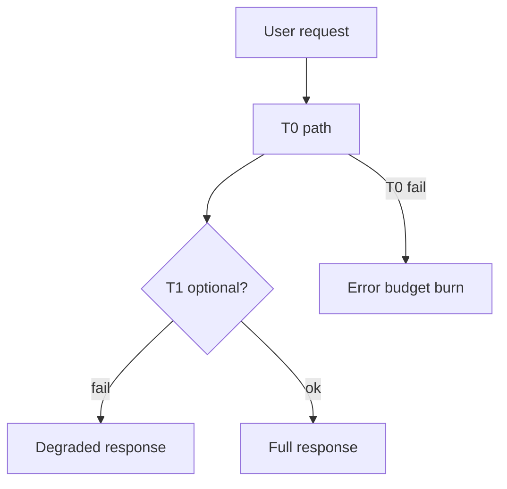

# Failure Domains

Blast radius, dependency tiers, and how architecture decisions contain (or amplify) outages.

> **Related:** Resilience patterns → [resilience-patterns](../../resilience-patterns/README.md) · Incident response → [sre-and-incidents](../../sre-and-incidents/README.md) · Backpressure → [HTS §9](../../high-throughput-systems/includes/09-backpressure-and-limits.md)

---

## At a glance

| Term | Meaning |
|------|---------|
| **Failure domain** | Unit that can fail together (AZ, cluster, service, tenant cell) |
| **Blast radius** | How much user impact one failure causes |
| **Dependency tier** | Criticality class of a dependency to the user journey |

**Rule of thumb:** Design so that a **single dependency failure** cannot take down the entire product — degrade, shed, or isolate.

---

## Dependency tiers

| Tier | Definition | Example | Policy |
|------|------------|---------|--------|
| **T0** | User journey fails without it | Checkout payment auth | Hard dependency; highest SLO(Service Level Objective) |
| **T1** | Core degraded but possible | Recommendations, ratings | Timeout fast; degrade UI |
| **T2** | Nice-to-have | Analytics beacon, email receipt async | Best-effort; queue |
| **T3** | Offline / batch | Warehouse sync | No sync path on request |

Document tiers in the service README; enforce with bulkheads and deadlines — [resilience-patterns](../../resilience-patterns/README.md).

---

## Blast radius controls

| Control | Effect |
|---------|--------|
| **Cells / shards** | Limit tenants or keys affected |
| **Bulkheads** | Separate thread/pool/queues per dependency |
| **Circuit breakers** | Stop calling a sick dependency |
| **Load shedding** | Protect T0 under overload |
| **Multi-AZ / region** | Survive infrastructure domains |
| **Data ownership** | Avoid shared-DB cascade — [§8](08-data-ownership.md) |

---

## Mapping domains

1. List user journeys and their T0 dependencies.
2. Draw sync call graphs; mark cycles and deep chains.
3. Identify shared infrastructure (one Redis, one Kafka cluster, one PG).
4. Ask: “If X dies, who else dies?” Shrink that set.
5. Validate with game days — [resilience §10](../../resilience-patterns/includes/10-chaos-and-failure-injection.md).

---

## Architecture implications

| Decision | Blast radius impact |
|----------|---------------------|
| Microservices with sync mesh | Larger unless tiers enforced |
| Modular monolith | One deploy domain; still module bulkheads |
| Shared DB across services | Maximum coupling under lock/load |
| Per-tenant cells | Smaller customer blast radius |
| Single global rate-limit Redis | Edge failure can fail-open/closed globally — design deliberately |

---

## Common mistakes

| Mistake | Fix |
|---------|-----|
| All dependencies treated equal | Tier and degrade |
| No deadline budget on fan-out | End-to-end timeout |
| Retry storms across domains | Jitter + breaker — [resilience §2–3](../../resilience-patterns/includes/02-retries-backoff-jitter.md) |
| Ignoring shared infra as a domain | Diagram platforms too |

## Pros and cons

| Stance | Pros | Cons |
|--------|------|------|
| Aggressive isolation | Smaller outages | More cost/complexity |
| Shared everything | Cheap | Large blast radius |
| Tiered degradation (recommended) | UX survives partial failure | Needs product agreement |