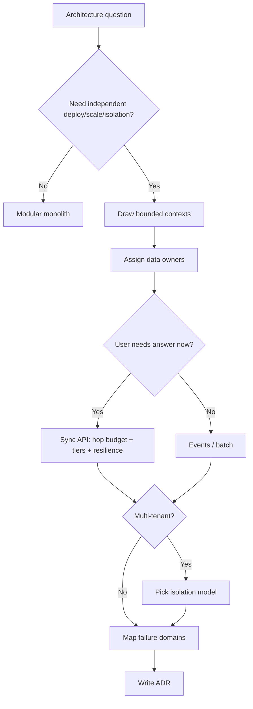

# Decision Guide — Architecture

When to choose what — system shape, boundaries, integration, tenancy — and common mistakes across this guide.

> **Related:** Overview → [00-overview.md](00-overview.md) · Failure domains → [§11](11-failure-domains.md) · Resilience decisions → [resilience-patterns §16](../../resilience-patterns/includes/16-decision-guide.md) · Checkout stack example → [resilience §12](../../resilience-patterns/includes/12-worked-example-checkout.md) · Throughput decisions → [HTS §12](../../high-throughput-systems/includes/12-decision-guide-and-common-mistakes.md) · Numbers before you decide → [§13 Capacity estimation](13-capacity-estimation.md)

---

## Master decision flow

**Sync path means:** stay within the [hop budget](02-service-boundaries-and-decomposition.md#sync-dependency-budget), map T0/T1/T2 — [§11](11-failure-domains.md), and apply the resilience stack (timeouts, bulkheads, one retry owner, fallback contracts) — [resilience §12](../../resilience-patterns/includes/12-worked-example-checkout.md) · [§16](../../resilience-patterns/includes/16-decision-guide.md).

---

## Scenario recommendations

| Scenario | Recommended approach |
|----------|----------------------|
| Early product, 1–2 teams | Modular monolith; ADR only for irreversible choices |
| One module needs 10× scale | Extract that capability; keep rest modular |
| Legacy core blocking delivery | Strangler facade + one slice — [§4](04-strangler-and-modernization.md) |
| Mobile + web chatty backends | BFF(Backend for Frontend) composition — [§9](09-bff-and-api-composition.md) |
| BFF fans out to 5+ sync deps | Parallelize under hop budget; bulkhead each dep; omit/degrade T1 — [§9](09-bff-and-api-composition.md), [resilience §4–5](../../resilience-patterns/includes/04-bulkheads.md) |
| Payments + social feed | Tiered consistency — [§6](06-tradeoff-frameworks.md) |
| SaaS SMB → enterprise tier | Pool default; silo premium tenants — [§10](10-multi-tenant-system-models.md), [PG §17](../../postgresql-performance/includes/17-row-level-security-multi-tenant.md)/[§18](../../postgresql-performance/includes/18-schema-and-database-per-tenant.md) |
| Tenant needs dedicated DB mid-flight | Pool → silo export/CDC/cutover — [§10 migration](10-multi-tenant-system-models.md#migration-between-models), [PG §18](../../postgresql-performance/includes/18-schema-and-database-per-tenant.md#pool--silo-migration) |
| Cross-team “shared tables” request | Deny; offer API(Application Programming Interface)/events — [§8](08-data-ownership.md) |
| Cascading timeouts in prod | Dependency tiers + resilience stack — [§11](11-failure-domains.md), [resilience §16](../../resilience-patterns/includes/16-decision-guide.md) |
| Audit/history as product | Consider ES/CQRS(Command Query Responsibility Segregation) — [event-sourcing-and-cqrs](../../event-sourcing-and-cqrs/README.md) |
| High event fan-out | Async + Kafka — [§7](07-integration-styles.md) |

---

## Priority checklist

- [ ] Problem and non-goals written
- [ ] Rough capacity numbers stated (QPS(Queries Per Second), storage, instances) — [§13](13-capacity-estimation.md)
- [ ] Options include “do nothing / stay modular”
- [ ] Team topology can support the shape — [§1](01-monolith-modular-microservices.md)
- [ ] Bounded contexts and language checked — [§3](03-domain-driven-design.md)
- [ ] Data ownership explicit — [§8](08-data-ownership.md)
- [ ] Integration style matches UX — [§7](07-integration-styles.md)
- [ ] Consistency tier named — [§6](06-tradeoff-frameworks.md) + [PG §14](../../postgresql-performance/includes/14-consistency-promises-and-costs.md)
- [ ] Failure domains and T0/T1/T2 mapped — [§11](11-failure-domains.md)
- [ ] Sync hop budget respected (or fan-out made parallel/async) — [§2](02-service-boundaries-and-decomposition.md#sync-dependency-budget)
- [ ] Fallback contract per T1/T2 agreed with product — [resilience §5](../../resilience-patterns/includes/05-load-shedding-and-degradation.md)
- [ ] Retry/timeout **owner** named (app vs mesh vs gateway) — [resilience §11](../../resilience-patterns/includes/11-policy-placement.md)
- [ ] Critical journey has a chaos/game-day plan — [resilience §10](../../resilience-patterns/includes/10-chaos-and-failure-injection.md)
- [ ] Deploy/drain plan linked — [resilience §14](../../resilience-patterns/includes/14-graceful-shutdown-and-drain.md), [deployment-strategies](../../deployment-strategies/README.md)
- [ ] Tenancy model chosen if SaaS — [§10](10-multi-tenant-system-models.md)
- [ ] Tenant restore drill path matches the model — [§10 restore](10-multi-tenant-system-models.md#tenant-restore-drill)
- [ ] ADR recorded — [§5](05-adrs-and-design-docs.md)

---

## Common mistakes

| Mistake | Why it hurts | Fix |
|---------|--------------|-----|
| Microservices without platform | Toil and outages | Paved road first |
| Shared DB across “services” | Lockstep deploys | Single writer |
| Sync mesh without tiers | Cascading failure | Bulkheads + degrade + [§11](11-failure-domains.md) |
| BFF serial fan-out to many deps | Latency and cascade risk | Parallel + hop budget + omit T1 |
| “Resilience later” after extract | First outage teaches the hard way | Stack before/at extract — [resilience §16](../../resilience-patterns/includes/16-decision-guide.md) |
| Big-bang rewrite | Long risk window | Strangler |
| No ADR on tenancy/isolation | Expensive reverse later | Decide and record |
| BFF owning business invariants | Inconsistent writes | Domain services own rules |
| One global consistency mode | Overpay or under-protect | Tier by journey |
| Ignoring cost of distribution | Surprise FinOps(Cloud Financial Operations) | Price hops and regions |

---

## Quick decision summary

| Question | Default answer |
|----------|----------------|
| Starting shape? | Modular monolith |
| When to extract a service? | Clear context + measured need + ownership |
| Sync or async? | Sync for answers; async for notifications |
| Sync fan-out? | Parallel under hop budget; tier + degrade |
| Shared DB? | No across deployables |
| Multi-tenant start? | Pooled + strong checks |
| Need BFF? | When channels need different composition |
| Resilience before ship? | Timeouts, bulkheads, retry owner, T0/T1 map |
| Document how? | RFC → ADR for irreversible calls |

---

## See also

| Guide | Topics |
|-------|--------|
| [resilience-patterns](../../resilience-patterns/README.md) | Timeouts, retries, breakers, placement, [checkout example](../../resilience-patterns/includes/12-worked-example-checkout.md), [observability](../../resilience-patterns/includes/13-observability-for-resilience.md), [§16 decisions](../../resilience-patterns/includes/16-decision-guide.md) |
| [api-design-and-protection](../../api-design-and-protection/README.md) | Contracts, gateway, multi-tenant APIs |
| [high-throughput-systems](../../high-throughput-systems/README.md) | Scale and overload |
| [event-sourcing-and-cqrs](../../event-sourcing-and-cqrs/README.md) | When history is the model |
| [tech-lead-practice](../../tech-lead-practice/README.md) | Facilitation and ownership |
| [finops-and-cost](../../finops-and-cost/README.md) | Cost of architectural options |
