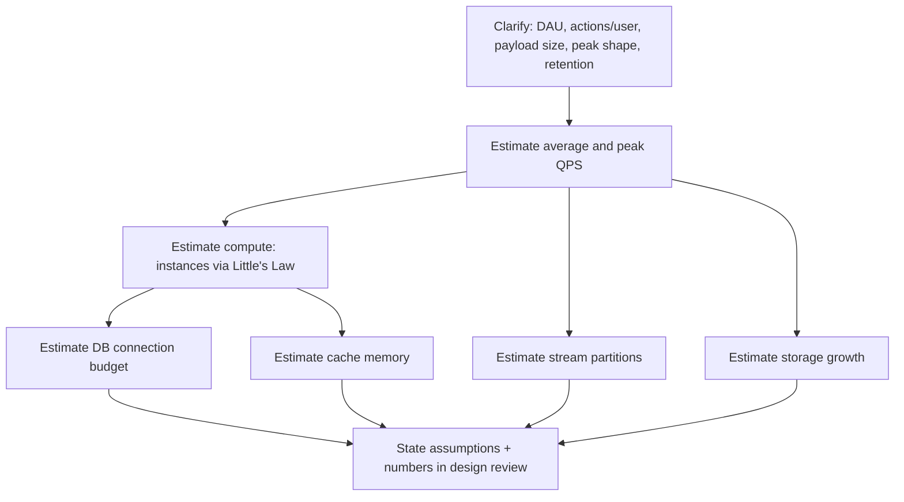

# Capacity Estimation

Before a design review approves an architecture, put rough numbers on it. Back-of-envelope math catches "this cannot possibly work at that scale" problems in minutes — far cheaper than discovering them in a load test or, worse, in production.

> **Scope:** **Pre-build estimation lens** — rough numbers for a design review, before anything is measured. Actual load testing, profiling, and SLO(Service Level Objective) validation of a running system → [HTS §1 Measurement and SLOs](../../high-throughput-systems/includes/01-measurement-and-slo.md).
>
> **Related:** Little's Law for concurrency → [HTS §1 Little's Law in practice](../../high-throughput-systems/includes/01-measurement-and-slo.md#littles-law-in-practice) · Connection pool sizing → [postgresql-performance §7 Connection management](../../postgresql-performance/includes/07-connection-management.md) · Kafka partition sizing → [apache-kafka §2 Partition count planning](../../apache-kafka/includes/02-topics-partitions-and-replication.md#partition-count-planning) · Capstone checklist → [§12 Decision guide](12-decision-guide.md)

---

## At a glance

| Estimate | Rough formula | Feeds into |
|----------|----------------|------------|
| **QPS(Queries Per Second) / RPS** | `daily_actions ÷ 86,400 × peak_multiplier` | Instance count, DB load |
| **Instance count** | Little's Law: `L = λ × W`, then `instances = L ÷ concurrency_per_instance` | Compute budget |
| **DB connection budget** | `instances × pool_size_per_instance` vs `max_connections` | Pooling strategy |
| **Cache memory** | `num_keys × avg_entry_size × replication_factor` | Redis instance sizing |
| **Kafka partitions** | `peak_MB_s ÷ per_partition_MB_s` | Topic configuration |
| **Storage growth** | `rows_per_day × row_size × index_overhead × retention_days` | Disk/volume provisioning |

**Rule of thumb:** A rough estimate within an order of magnitude, done in ten minutes with stated assumptions, beats no estimate. The goal is catching a wrong assumption before you build — not a precise forecast.

---

## Back-of-envelope method



1. **Clarify inputs out loud** — daily active users (DAU), actions per user per day, average payload size, peak-to-average ratio, data retention window. Wrong or missing inputs are the most common estimation failure, not bad math.
2. **State assumptions explicitly** — "assume 5× peak multiplier, 150ms average handler latency" — so reviewers can challenge the assumption, not just the arithmetic.
3. **Compute in round numbers** — powers of ten and simple multipliers; precision beyond one significant figure is false confidence.
4. **Sanity-check against a known system** — "does this match what we see for a similar existing service?"

---

## Worked example: DAU → RPS, peak multipliers

Assume a product with:

| Input | Value |
|-------|-------|
| Daily active users (DAU) | 2,000,000 |
| Actions per user per day | 20 |
| Peak-to-average multiplier | 5× (typical diurnal consumer traffic) |

| Step | Calculation | Result |
|------|--------------|--------|
| Total daily actions | `2,000,000 × 20` | 40,000,000 actions/day |
| Average RPS | `40,000,000 ÷ 86,400` | ≈ 463 RPS |
| **Peak RPS** | `463 × 5` | **≈ 2,315 RPS** |

| Peak shape | Typical multiplier |
|-------------|---------------------|
| B2B(Business-to-Business) / business hours only | 2–3× |
| Consumer, single time zone | 4–6× |
| Consumer, global, plus a launch/marketing spike | 8–10×+ |

Design and provision for **peak**, not average — average RPS tells you almost nothing about whether the system survives Tuesday at 8pm.

---

## Instance count from Little's Law

**L = λ × W** — see [HTS §1 Little's Law in practice](../../high-throughput-systems/includes/01-measurement-and-slo.md#littles-law-in-practice) for the underlying formula.

| Symbol | Meaning | This example |
|--------|---------|----------------|
| **λ (lambda)** | Arrival rate (peak RPS) | 2,315 RPS |
| **W** | Average time in system per request | 150ms (0.15s) |
| **L** | Concurrent in-flight requests needed | `2,315 × 0.15 ≈ 347` |

| Step | Calculation | Result |
|------|--------------|--------|
| Concurrency needed (L) | `2,315 × 0.15` | ≈ 347 concurrent requests |
| Concurrency per instance (assumed) | e.g. 50 concurrent requests/instance | — |
| Instances needed | `347 ÷ 50` | ≈ 7, round up |
| **+ headroom** for rolling deploys and one instance loss | `+1` | **8 instances at peak** |

| Lever | Effect on instance count |
|-------|-----------------------------|
| Reduce **W** (latency) via caching, faster queries | Fewer instances for the same λ |
| Increase concurrency per instance (async I/O, more threads) | Fewer instances, if CPU/memory allow |
| Under-estimate the peak multiplier | Instances saturate at the first real spike |

---

## DB connection budget

Every instance opens some pool of database connections — the total must stay under the database's connection ceiling with headroom for admin work and migrations.

| Step | Calculation | Result |
|------|--------------|--------|
| Instances at peak | (from above) | 8 |
| Pool size per instance | e.g. 20 connections | — |
| Total app connections | `8 × 20` | 160 |
| Reserved for admin/migrations | e.g. 20 | — |
| **Required `max_connections`** | `160 + 20` | **≥ 180** |

Compare against the pool-sizing guidance in [postgresql-performance §7 Connection management](../../postgresql-performance/includes/07-connection-management.md): keep `max_connections` in the 100–300 range and put a pooler (PgBouncer) in front rather than raising it past that — if the required total exceeds a sane `max_connections`, that is a signal to add PgBouncer, not to keep raising the ceiling.

**Common trap:** sizing the per-instance pool to thread count instead of expected concurrent queries. `replicas × pool_size` grows linearly with every autoscale event — model it before autoscaling, not after a "too many connections" incident.

---

## Redis memory estimate

| Step | Calculation | Result |
|------|--------------|--------|
| Cached entries (e.g. user session/profile cache) | 5,000,000 keys | — |
| Average key size | 40 bytes | — |
| Average value size | 500 bytes | — |
| Per-key overhead (Redis object/struct overhead) | ~70 bytes | — |
| Raw memory | `5,000,000 × (40 + 500 + 70)` | ≈ 3.05GB |
| Replication factor (primary + 1 replica) | `× 2` | ≈ 6.1GB |
| Headroom for fragmentation and growth (~30%) | `× 1.3` | **≈ 7.9GB → provision an 8GB+ instance** |

| Input to get right | Why it is easy to underestimate |
|----------------------|----------------------------------|
| Per-key overhead | Small structs add up fast at millions of keys — do not assume `key + value` size alone |
| Eviction policy headroom | Cache should not run at 100% memory; leave room before `maxmemory-policy` starts evicting the wrong keys |
| TTL(Time To Live) distribution | If most keys never expire, memory only grows — plan a TTL or eviction policy from day one, not after the first OOM |

---

## Kafka partition rough sizing

Full partition planning guidance → [apache-kafka §2 Partition count planning](../../apache-kafka/includes/02-topics-partitions-and-replication.md#partition-count-planning). The rough sizing formula:

```text
partitions ≈ expected_peak_throughput_MB_s ÷ per_partition_throughput_MB_s
```

| Step | Calculation | Result |
|------|--------------|--------|
| Expected peak event throughput | 50 MB/s | — |
| Assumed safe per-partition throughput | ~10 MB/s | — |
| Rough partition count | `50 ÷ 10` | 5 |
| Headroom for consumer group growth | round up | **8 partitions** |

Round **up**, not down — increasing partitions later is supported, but the useful consumer count in a group is capped at the partition count, and shrinking partitions is not supported at all.

---

## Storage growth

| Step | Calculation | Result |
|------|--------------|--------|
| Write events per day (from RPS example) | 40,000,000 rows/day | — |
| Average row size | 200 bytes | — |
| Index overhead multiplier | `× 1.5` | — |
| Raw daily growth | `40,000,000 × 200 × 1.5` | ≈ 11.2GB/day |
| Retention window | 730 days (2 years) | — |
| Raw growth over retention | `11.2GB × 730` | ≈ 8.2TB |
| Backup/replica multiplier (RF=3 + nightly snapshots) | `× 3` | **≈ 24.5TB provisioned** |

Storage estimates without a **retention** and **backup multiplier** are the most common way a capacity plan is wrong by 3–5×. Pair with the tiering and retention defaults in [finops-and-cost §4](../../finops-and-cost/includes/04-storage-and-retention-cost.md) once the design moves past the estimation stage.

---

## Checklist template for design reviews

- [ ] DAU, actions/user/day, and peak multiplier stated with source or assumption noted
- [ ] Peak RPS calculated — design reviewed against **peak**, not average
- [ ] Instance count derived via Little's Law with stated average latency (**W**) and concurrency per instance
- [ ] DB connection budget checked against `max_connections` with pooling headroom
- [ ] Cache memory estimated including per-key overhead and replication factor
- [ ] Stream/queue partition or shard count estimated with headroom for consumer growth
- [ ] Storage growth includes index overhead, retention window, and backup/replica multiplier
- [ ] All assumptions written down — so the estimate can be revisited when real numbers arrive

---

## Common mistakes

| Mistake | Fix |
|---------|-----|
| Sizing for average load, not peak | Apply a peak multiplier appropriate to the traffic shape |
| Forgetting the DB connection ceiling when planning autoscale | Compute `replicas × pool_size` before setting max replica count |
| Redis memory estimate ignoring per-key overhead | Include struct/object overhead, not just key + value bytes |
| Kafka partition count picked arbitrarily ("just use 6") | Derive from peak throughput ÷ per-partition throughput, then round up |
| Storage estimate without retention or backup multiplier | Multiply by retention days and replica/backup factor |
| Treating the estimate as final and never revisiting it | Compare against real measurements once load-tested — [HTS §1](../../high-throughput-systems/includes/01-measurement-and-slo.md) |
| No stated assumptions in the design doc | Write down every input number so a reviewer can challenge it directly |

---

## Pros and cons

### Estimating before building

**Pros:** Catches order-of-magnitude mistakes cheaply; gives reviewers concrete numbers to challenge instead of vague confidence; sets a baseline to compare against real measurements later.

**Cons:** A rough estimate can be mistaken for a precise guarantee if assumptions are not stated; garbage inputs (wrong DAU, wrong peak multiplier) still produce garbage outputs — the math does not fix a bad assumption.