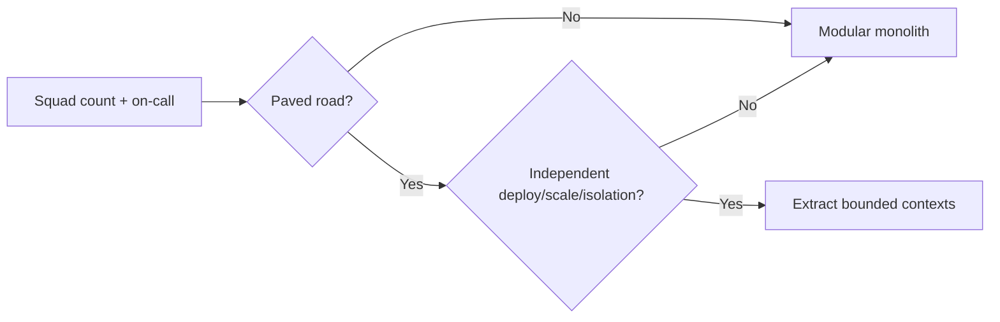

# Org, Stage, and Pricing Fit

Choose architecture defaults from **people, company stage, go-to-market, and pricing** — not only from technical elegance.

> **Scope:** Decision matrix for Tech Leads / Solution Architects: team size, platform maturity, B2B(Business-to-Business) vs B2C, pricing tiers, stage → default system shape. Technical shape details → [§1](01-monolith-modular-microservices.md) · [§12](12-decision-guide.md). Cost curves → [finops §7](../../finops-and-cost/includes/07-architecture-cost-tradeoffs.md). Build vs buy → [tech-lead §9](../../tech-lead-practice/includes/09-build-vs-buy.md). Tenancy → [§10](10-multi-tenant-system-models.md).
>
> **Related:** Team Topologies → [§1A](01A-team-topologies.md) · Capacity → [§13](13-capacity-estimation.md) · Tradeoffs → [§6](06-tradeoff-frameworks.md) · Debt/CX pressure → [tech-lead §5A](../../tech-lead-practice/includes/05A-debt-business-cx-balance.md) · API tiers → [api-design §5](../../api-design-and-protection/includes/05-rate-limit-tiers.md)

---

## At a glance

| Lens | Ask | Architecture implication |
|------|-----|--------------------------|
| **People** | How many squads? Shared on-call? Platform paved road? | Monolith ↔ extract only what you can staff |
| **Stage** | Pre-PMF, scale-up, or enterprise? | Optimize for learning vs isolation vs compliance |
| **GTM(Go-To-Market)** | B2C, B2B SMB(Small and Medium Business), or enterprise B2B? | Auth, tenancy, support, SLA(Service Level Agreement) shape |
| **Pricing** | Free tier, usage, seats, or enterprise contracts? | Quotas, silos, cost-per-unit, noisy-neighbor |

**Rule of thumb:** A “correct” microservice design that your org cannot operate is the wrong design. Match [team topology](01-monolith-modular-microservices.md#team-topology) before distribution.

---

## NFR(Non-Functional Requirement) sheet (fill before shape debate)

Capture ceilings once; reuse in ADRs and design reviews.

| NFR | Target / constraint | Owner |
|-----|---------------------|-------|
| Latency (p95/p99) journeys | e.g. checkout p99 under 800 ms | Product + eng |
| Availability SLO(Service Level Objective) | e.g. 99.9% monthly | SRE / TL |
| RPO(Recovery Point Objective) / RTO(Recovery Time Objective) | e.g. 5 min / 1 h | Eng + business |
| Tenancy / residency | Pool / silo / cells; regions | Security + sales eng |
| Compliance | PCI / SOC2 / GDPR scope | Security |
| Cost ceiling | $/active user or $/1k requests | FinOps + TL |
| Team ops budget | On-call hours; services per squad | EM / TL |

Capacity math → [§13](13-capacity-estimation.md). Record irreversible picks as ADR — [§5](05-adrs-and-design-docs.md).

---

## People and platform maturity

| Signal | Prefer | Avoid |
|--------|--------|-------|
| 1–2 squads, shared on-call | Modular monolith | Many services |
| Clear domains, still thin platform | Modular + extract 1 hot path | Full mesh |
| Platform team + paved road (CI, auth, obs, deploy) | Services at seams | DIY per squad |
| No platform, many product teams | Stay modular or buy managed | “Microservices for autonomy” |
| Outsourced shared platform without product ownership | Simplify ownership | Tickets-as-architecture |

---

## Company stage

| Stage | Default architecture | Why |
|-------|----------------------|-----|
| **Pre-PMF / early** | Modular monolith; managed DB; buy auth/payments if possible | Maximize learning speed; minimize ops |
| **Scale-up** | Modular + extract proven bottlenecks; add cells only if residency/blast radius demands | Pay distribution where measured |
| **Multi-product / platform org** | Clear data ownership; BFF(Backend for Frontend) per channel; platform baselines | Autonomy without shared DB |
| **Enterprise-regulated** | Isolation, audit, residency first; slower extract with compliance gates | Contract and audit dominate taste |

Strangler when modernizing legacy → [§4](04-strangler-and-modernization.md).

---

## B2B vs B2C (and hybrids)

| GTM | Architecture lean | Watch-outs |
|-----|-------------------|------------|
| **B2C** | Edge/CDN(Content Delivery Network), cache-heavy reads, strong rate limits, simple tenancy | Viral spikes; abuse; CX latency |
| **B2B SMB** | Pooled multi-tenant + strong `tenant_id`; self-serve SSO later | Noisy neighbor; cheap tier cost |
| **Enterprise B2B** | SSO/SCIM, optional silo/cell, audit, support impersonation | Sales-driven exceptions; restore drills |
| **Hybrid** | One product, tiered isolation | Don’t invent a second architecture per deal — [§10](10-multi-tenant-system-models.md) |

Auth / SSO depth → [auth §2d](../../auth-oauth-oidc-and-login-security/includes/02D-multi-tenant-oidc-and-b2b-sso.md) · SCIM → [api-design §12C](../../api-design-and-protection/includes/12C-scim-and-jml-provisioning.md).

---

## Pricing model → system defaults

| Pricing | System defaults | FinOps / fairness |
|---------|-----------------|-------------------|
| **Free / freemium** | Hard quotas, shed free first, cheap path | Unit economics — [finops §1](../../finops-and-cost/includes/01-unit-economics.md) |
| **Usage / metered** | Accurate metering, idempotent billable events | Cost per request visible to design |
| **Seat / subscription** | Entitlements in AuthZ; soft abuse caps | Seat ≠ unlimited API fan-out |
| **Enterprise contract** | SLA, silo/cell option, audit export | Price isolation; don’t custom-fork core |
| **Tiered API** | Gateway quotas by plan — [api-design §5](../../api-design-and-protection/includes/05-rate-limit-tiers.md) | Fail-open vs fail-closed by tier |

**Rule of thumb:** Pricing that promises “unlimited” without architecture quotas becomes an incident.

---

## Scenario matrix (defaults)

| Situation | Default approach |
|-----------|------------------|
| Startup, 8 engineers, B2C MVP | Modular monolith + managed Postgres + buy auth |
| Scale-up, 4 squads, no platform team yet | Stay modular; extract one measured bottleneck; invest in paved road before more services |
| B2B SaaS(Software as a Service) SMB → first enterprise deal | Pool + RLS; offer silo/cell for premium — [§10](10-multi-tenant-system-models.md) · [§10A](10A-regional-cells-and-residency.md) |
| Usage-priced API, thin margins | Cache, async non-critical work, FinOps in every ADR — [finops §7](../../finops-and-cost/includes/07-architecture-cost-tradeoffs.md) |
| Small platform team, Kafka pitch | Prefer managed queue/bus until staffing supports ops — [tech-lead §9](../../tech-lead-practice/includes/09-build-vs-buy.md) |
| Regulated multi-region | Residency pins before active-active — [§10A](10A-regional-cells-and-residency.md) |

---

## When org should override “technically better”

| Technically attractive | Override when |
|------------------------|---------------|
| Microservices everywhere | Cannot staff on-call or paved road |
| Active-active multi-region | Traffic/revenue does not pay 2×; residency forbids |
| Event-sourced core | Team lacks ops skill and product needs no history |
| Build custom IdP | B2B needs SSO fast — buy/integrate |
| Shared DB for “speed” | Cross-team lockstep already hurts — [§8](08-data-ownership.md) |

---

## Decision checklist

- [ ] NFR sheet filled (latency, SLO, RPO/RTO, tenancy, compliance, cost, ops budget)
- [ ] Squad count and on-call model named
- [ ] Platform paved-road maturity honest (CI, auth, obs, deploy)
- [ ] GTM and pricing model named (and who pays for isolation)
- [ ] Default shape matches [§1](01-monolith-modular-microservices.md) + [§12](12-decision-guide.md)
- [ ] Cost curve checked — [finops §7](../../finops-and-cost/includes/07-architecture-cost-tradeoffs.md)
- [ ] ADR records org constraints, not only tech options — [§5](05-adrs-and-design-docs.md)

---

## Common mistakes

| Mistake | Why it hurts | Fix |
|---------|--------------|-----|
| Copying BigCo architecture | Ops cost without BigCo staffing | Stage + people matrix |
| Enterprise fork per deal | Unmaintainable variants | Tiered isolation on one core |
| Ignoring free-tier cost | Margin death / noisy neighbor | Quotas + unit economics |
| Autonomy via shared DB | Coupled deploys | Data ownership — [§8](08-data-ownership.md) |
| Buy vs build on hype | Lock-in without exit | [tech-lead §9](../../tech-lead-practice/includes/09-build-vs-buy.md) |
| NFR debate after code | Rework | Fill NFR sheet first |

---

## Pros and cons

| Approach | Pros | Cons |
|----------|------|------|
| **Org-fit defaults** | Survivable ops; faster delivery | May defer “ideal” purity |
| **Tech-max defaults** | Elegant at slide level | Fails when people/pricing disagree |
| **Tiered isolation** | One product, many contracts | Needs tenancy discipline |

---

## See also

| Guide | Topics |
|-------|--------|
| [§1 Monolith / modular / microservices](01-monolith-modular-microservices.md) | Team topology and extraction |
| [§10 / §10A Multi-tenant + cells](10-multi-tenant-system-models.md) | Isolation and residency |
| [§12 Decision guide](12-decision-guide.md) | Technical scenario picker |
| [finops-and-cost](../../finops-and-cost/README.md) | Unit economics and TCO |
| [tech-lead §5A](../../tech-lead-practice/includes/05A-debt-business-cx-balance.md) | When roadmap pressure changes the call |
| [tech-lead §9](../../tech-lead-practice/includes/09-build-vs-buy.md) | Staffing and TCO(Total Cost of Ownership) |
