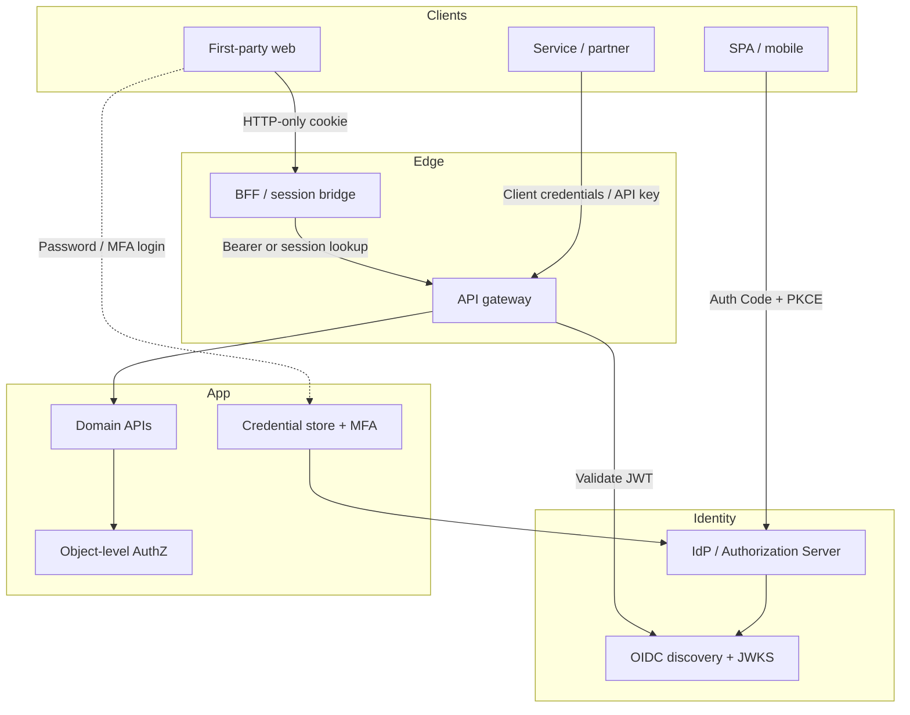

# Overview — OAuth, OIDC & Login Security

Authentication looks simple until you pick a grant, store a refresh token, or ship a login form that attackers can spray. This guide fills the depth that the API(Application Programming Interface) auth matrix and browser Auth UX guides intentionally leave out.

**Rule of thumb:** Separate **who the user is** (AuthN), **what they may do** (AuthZ), and **how the browser holds proof** (cookie vs Bearer). Mixing those three is how teams get CSRF(Cross-Site Request Forgery), stolen refresh tokens, and "we use JWT(JSON Web Token) so we're secure" mistakes.

> **Related:**
> - Client-type matrix → [api-design §4 Auth model](../../api-design-and-protection/includes/04-auth-model.md)
> - Browser cookie UX → [fullstack §7 Auth UX](../../fullstack-bff-and-clients/includes/07-auth-ux.md)
> - Org identity / RBAC(Role-Based Access Control) → [api-design §12](../../api-design-and-protection/includes/12-identity-rbac-iam-ad.md)
> - Fine-grained AuthZ(Authorization) → [api-design §12D](../../api-design-and-protection/includes/12D-fine-grained-authz.md)
> - Capstone → [06-decision-guide.md](06-decision-guide.md)

---

## AuthN vs AuthZ — and OIDC vs OAuth 2.0

Rough mapping (not a hard wall — OIDC rides on OAuth):

| Concern | Question | Protocol family | Typical artifact |
|---------|----------|-----------------|------------------|
| **AuthN(Authentication)** | Who logged in? | **OIDC(OpenID Connect)** (identity layer) | ID token, UserInfo, login session |
| **AuthZ(Authorization)** | What may this client/user do? | **OAuth(Open Authorization) 2.0** | Access token, scopes, resource access |

How to read it:

- **OAuth 2.0** is mainly an **authorization** framework: a client gets an **access token** to call APIs with certain scopes. It does **not** define how you prove who the human is.
- **OIDC** is an **identity** layer **on top of** OAuth 2.0: same authorize/token endpoints, plus an **ID token** (and UserInfo) so the client knows **who** authenticated.
- In a BFF(Backend for Frontend) or app stack: user signs in via **OIDC** (AuthN) → APIs are called with an **OAuth access token** (AuthZ at the edge) → your app still does **object/tenant AuthZ** (BOLA(Broken Object-Level Authorization), ReBAC(Relationship-Based Access Control), `tenant_id`) — [api-design §12D](../../api-design-and-protection/includes/12D-fine-grained-authz.md), [§16](../../api-design-and-protection/includes/16-multi-tenant-apis.md).

**Do not** send the ID token as `Authorization: Bearer` to APIs. ID token = AuthN to the client; access token = AuthZ to APIs — [§2](02-oidc-discovery-and-tokens.md).

---

## At a glance

| Concern | What this guide adds | Section |
|---------|----------------------|---------|
| **OAuth(Open Authorization) grants** | When to use Auth Code + PKCE(Proof Key for Code Exchange), client credentials, device code — and which flows are dead | [§1](01-oauth2-grants-and-flows.md) |
| **Client auth / token exchange** | Confidential client auth methods; BFF(Backend for Frontend) on-behalf-of (RFC 8693) | [§1a](01A-client-auth-and-token-exchange.md) |
| **Scopes / consent** | Scope taxonomy; first-party vs third-party consent | [§1b](01B-scopes-and-consent.md) |
| **PAR(Pushed Authorization Requests)** | Pushed authorize params; `request_uri` instead of fat redirect query | [§1c](01C-pushed-authorization-requests.md) |
| **Resource indicators** | `resource` / `aud` so tokens target one API | [§1d](01D-resource-indicators.md) |
| **Device / CIBA(Client-Initiated Backchannel Authentication)** | Device code polling; backchannel AuthN(Authentication) for known users | [§1e](01E-device-authorization-and-ciba.md) |
| **JAR(JWT-secured Authorization Request) / RAR(Rich Authorization Requests)** | Signed request objects; fine-grained `authorization_details` | [§1f](01F-jar-and-rar.md) |
| **OIDC(OpenID Connect)** | Discovery document, ID token vs access token, standard claims, `nonce` / `at_hash` | [§2](02-oidc-discovery-and-tokens.md) |
| **OIDC logout / step-up** | RP / front / back-channel logout; `prompt` / `max_age` / `acr_values` | [§2a](02A-oidc-logout-and-step-up.md) |
| **SSO(Single Sign-On) integration** | IdP(Identity Provider) → OIDC → app session → API Bearer; enterprise vs social; linking | [§2b](02B-sso-integration-playbook.md) |
| **SAML(Security Assertion Markup Language)** | Web Browser SSO, assertions, bindings, metadata, SAML→OIDC bridge | [§2c](02C-saml-protocol.md) |
| **Multi-tenant OIDC / B2B(Business-to-Business) SSO** | Tenant resolution, IdP topology, multi-issuer validation, membership / tenant switch | [§2d](02D-multi-tenant-oidc-and-b2b-sso.md) |
| **Token lifecycle** | Validation checklist, refresh rotation, revocation, JWKS(JSON Web Key Set) key rotation | [§3](03-token-lifecycle-and-validation.md) |
| **Integrity / anti-tamper** | Client is untrusted; signature or opaque lookup; cookie `sid` vs forgeable claims | [§3a](03A-token-cookie-integrity.md) |
| **Revoke / logout / denylist** | Validate vs invalidate; force sign-out; user/`jti`/session block stores | [§3b](03B-revoke-logout-denylist.md) |
| **Denylist Redis keys** | Basic/advanced Redis key shapes, TTL(Time To Live), user epoch, logout-all index | [§3c](03C-denylist-redis-patterns.md) |
| **Lifetimes / sliding** | Access/refresh/session/cookie/IdP clocks; silent re-auth | [§3d](03D-lifetimes-and-sliding-sessions.md) |
| **Concurrent sessions** | Device list; revoke one/others; caps | [§3e](03E-concurrent-sessions-and-devices.md) |
| **Cookie / session** | HttpOnly/Secure/SameSite, session store design, CSRF defenses that actually work | [§4](04-cookie-session-and-csrf.md) |
| **Third-party cookies / mobile** | Cookie deprecation; CHIPS(Cookies Having Independent Partitioned State); App Links vs custom schemes | [§4a](04A-third-party-cookies-and-mobile-redirects.md) |
| **Anonymous / guest** | Guest `sid`, workflow state, promote on register/login | [§4b](04B-anonymous-and-guest-sessions.md) |
| **Login hardening** | Password hashing, lockout/backoff, MFA(Multi-Factor Authentication), device trust, account recovery | [§5](05-login-security-playbook.md) |
| **Auth testing** | Automated positive/negative checklist for CI(Continuous Integration) | [§5a](05A-auth-testing-checklist.md) |
| **Signup / magic link** | Verify email; passwordless links; token hygiene | [§5b](05B-signup-verify-and-magic-links.md) |
| **WebAuthn(Web Authentication) / passkeys** | Phishing-resistant register/assert; recovery | [§5c](05C-webauthn-and-passkeys.md) |
| **Impersonation** | Support “act as”; actor≠subject; audit | [§5d](05D-impersonation-and-support-access.md) |

---

## Where this sits in the stack

---

## Document map

| # | Topic | File |
|---|-------|------|
| 1 | OAuth 2.0 grants and flows | [01-oauth2-grants-and-flows.md](01-oauth2-grants-and-flows.md) |
| 1a | Client authentication and token exchange | [01A-client-auth-and-token-exchange.md](01A-client-auth-and-token-exchange.md) |
| 1b | Scopes and consent | [01B-scopes-and-consent.md](01B-scopes-and-consent.md) |
| 1c | Pushed Authorization Requests | [01C-pushed-authorization-requests.md](01C-pushed-authorization-requests.md) |
| 1d | Resource indicators | [01D-resource-indicators.md](01D-resource-indicators.md) |
| 1e | Device authorization and CIBA | [01E-device-authorization-and-ciba.md](01E-device-authorization-and-ciba.md) |
| 1f | JAR and RAR | [01F-jar-and-rar.md](01F-jar-and-rar.md) |
| 2 | OIDC discovery and tokens | [02-oidc-discovery-and-tokens.md](02-oidc-discovery-and-tokens.md) |
| 2a | OIDC logout and step-up | [02A-oidc-logout-and-step-up.md](02A-oidc-logout-and-step-up.md) |
| 2b | SSO integration playbook | [02B-sso-integration-playbook.md](02B-sso-integration-playbook.md) |
| 2c | SAML protocol | [02C-saml-protocol.md](02C-saml-protocol.md) |
| 2d | Multi-tenant OIDC and B2B SSO | [02D-multi-tenant-oidc-and-b2b-sso.md](02D-multi-tenant-oidc-and-b2b-sso.md) |
| 3 | Token lifecycle and validation | [03-token-lifecycle-and-validation.md](03-token-lifecycle-and-validation.md) |
| 3a | Token and cookie integrity (anti-tampering) | [03A-token-cookie-integrity.md](03A-token-cookie-integrity.md) |
| 3b | Revoke, force logout, and denylist | [03B-revoke-logout-denylist.md](03B-revoke-logout-denylist.md) |
| 3c | Denylist Redis patterns | [03C-denylist-redis-patterns.md](03C-denylist-redis-patterns.md) |
| 3d | Lifetimes and sliding sessions | [03D-lifetimes-and-sliding-sessions.md](03D-lifetimes-and-sliding-sessions.md) |
| 3e | Concurrent sessions and devices | [03E-concurrent-sessions-and-devices.md](03E-concurrent-sessions-and-devices.md) |
| 4 | Cookie, session, and CSRF | [04-cookie-session-and-csrf.md](04-cookie-session-and-csrf.md) |
| 4a | Third-party cookies and mobile redirects | [04A-third-party-cookies-and-mobile-redirects.md](04A-third-party-cookies-and-mobile-redirects.md) |
| 4b | Anonymous and guest sessions | [04B-anonymous-and-guest-sessions.md](04B-anonymous-and-guest-sessions.md) |
| 5 | Login security playbook | [05-login-security-playbook.md](05-login-security-playbook.md) |
| 5a | Auth testing checklist | [05A-auth-testing-checklist.md](05A-auth-testing-checklist.md) |
| 5b | Signup, email verification, and magic links | [05B-signup-verify-and-magic-links.md](05B-signup-verify-and-magic-links.md) |
| 5c | WebAuthn and passkeys | [05C-webauthn-and-passkeys.md](05C-webauthn-and-passkeys.md) |
| 5d | Impersonation and support access | [05D-impersonation-and-support-access.md](05D-impersonation-and-support-access.md) |
| 6 | Decision guide | [06-decision-guide.md](06-decision-guide.md) |

---

## Default stacks

| Product shape | Default auth stack |
|---------------|-------------------|
| **First-party SaaS(Software as a Service) web** | OIDC login at IdP → BFF(Backend for Frontend) issues HTTP(Hypertext Transfer Protocol)-only session (or refresh) cookie → CSRF on mutations → short-lived access to APIs — [§4](04-cookie-session-and-csrf.md), [fullstack §7](../../fullstack-bff-and-clients/includes/07-auth-ux.md); guest funnel → [§4b](04B-anonymous-and-guest-sessions.md) |
| **SPA / native mobile** | Authorization Code + PKCE → short access JWT + rotating refresh (secure storage / BFF) — [§1](01-oauth2-grants-and-flows.md), [§3](03-token-lifecycle-and-validation.md) |
| **Employee SSO(Single Sign-On)** | Corporate IdP via OIDC (or SAML bridge) → [§2b](02B-sso-integration-playbook.md), [§2c](02C-saml-protocol.md); groups → roles — [api-design §12](../../api-design-and-protection/includes/12-identity-rbac-iam-ad.md) |
| **Partner / machine** | Scoped API keys or client credentials + optional mTLS(Mutual Transport Layer Security) — [api-design §4](../../api-design-and-protection/includes/04-auth-model.md) |
| **Password still required** | Argon2id/bcrypt, lockout + progressive delay, MFA for privileged actions — [§5](05-login-security-playbook.md) |

---

## Common mistakes

| Mistake | Fix |
|---------|-----|
| Using Implicit or Resource Owner Password grants | Auth Code + PKCE (public) or client credentials (confidential) — [§1](01-oauth2-grants-and-flows.md) |
| Treating access token and ID token as interchangeable | ID token = identity to the client; access token = AuthZ(Authorization) to APIs — [§2](02-oidc-discovery-and-tokens.md) |
| Long-lived JWT with no revocation plan | Short TTL + refresh rotation + optional denylist — [§3](03-token-lifecycle-and-validation.md) |
| JWT in cookie without CSRF | Cookie-bound tokens need SameSite + anti-CSRF — [§4](04-cookie-session-and-csrf.md) |
| Refresh token in `localStorage` | HTTP-only cookie via BFF, or platform secure storage — [§4](04-cookie-session-and-csrf.md) |
| Fast unsalted hashes / silent lockout forever | Modern KDF + rate limit + clear recovery path — [§5](05-login-security-playbook.md) |