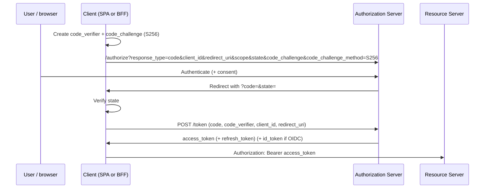
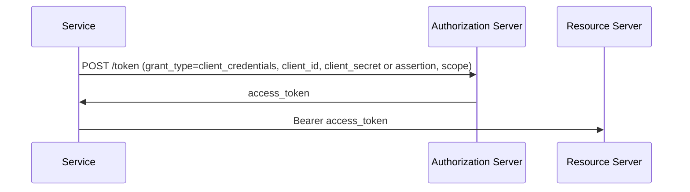
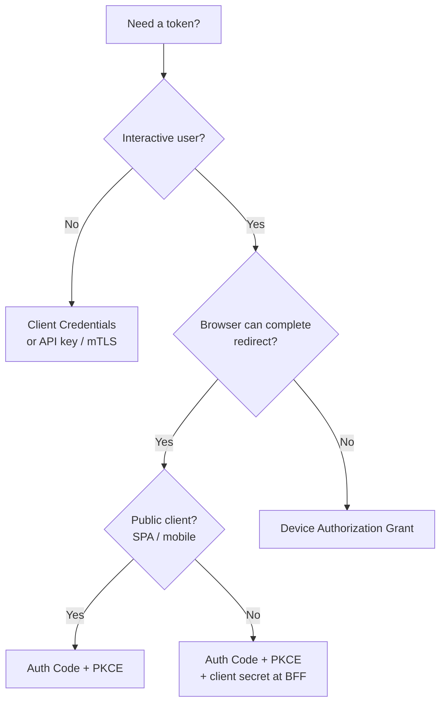

# OAuth 2.0 Grants and Flows

OAuth(Open Authorization) 2.0 is a **delegation** framework: a client obtains an access token from an authorization server so it can call an API(Application Programming Interface) on behalf of a user or itself. It does **not** define how the user logs in — that is OIDC(OpenID Connect) or your own login UI.

> **Scope:** Grant selection, flow steps, PKCE(Proof Key for Code Exchange), and deprecated grants. Confidential client auth + token exchange → [§1a](01A-client-auth-and-token-exchange.md). Scopes/consent → [§1b](01B-scopes-and-consent.md). PAR(Pushed Authorization Requests) → [§1c](01C-pushed-authorization-requests.md). Resource indicators → [§1d](01D-resource-indicators.md). Device / CIBA(Client-Initiated Backchannel Authentication) → [§1e](01E-device-authorization-and-ciba.md). JAR(JWT-secured Authorization Request) / RAR(Rich Authorization Requests) → [§1f](01F-jar-and-rar.md). OIDC discovery and ID tokens → [§2](02-oidc-discovery-and-tokens.md). Token validation/rotation → [§3](03-token-lifecycle-and-validation.md). Client-type matrix → [api-design §4](../../api-design-and-protection/includes/04-auth-model.md).

> **Related:** Client authentication / BFF(Backend for Frontend) on-behalf-of → [§1a](01A-client-auth-and-token-exchange.md) · Scopes/consent → [§1b](01B-scopes-and-consent.md) · PAR → [§1c](01C-pushed-authorization-requests.md) · Resource/`aud` → [§1d](01D-resource-indicators.md) · Device / CIBA → [§1e](01E-device-authorization-and-ciba.md) · JAR / RAR → [§1f](01F-jar-and-rar.md) · Browser holding tokens → [§4](04-cookie-session-and-csrf.md) · [fullstack §7](../../fullstack-bff-and-clients/includes/07-auth-ux.md)

---

## At a glance

| Grant | Who uses it | Tokens issued | Status |
|-------|-------------|----------------|--------|
| **Authorization Code + PKCE** | SPA, mobile, native, most web apps | Access (+ refresh); with OIDC also ID token | **Default for interactive users** |
| **Authorization Code** (confidential client) | Server-side web with client secret | Same | OK if secret stays server-side; still prefer PKCE |
| **Client Credentials** | Service-to-service, daemons | Access only (no user) | **Default for machines** |
| **Device Authorization** | TVs, CLI, input-constrained devices | Access (+ refresh) | Use when browser on device is awkward |
| **Refresh Token** | Any client that received a refresh | New access (+ optional rotated refresh) | Not a "login" grant — continuation |
| **Implicit** | Legacy SPAs | Access in redirect fragment | **Deprecated — do not use** |
| **Resource Owner Password** | Legacy "trust the app with password" | Access (+ refresh) | **Deprecated — do not use** |

**Rule of thumb:** Interactive human → Auth Code + PKCE. Machine → Client Credentials (or API key / mTLS(Mutual Transport Layer Security) per [api-design §4](../../api-design-and-protection/includes/04-auth-model.md)).

---

## Roles (vocabulary)

| Role | Job |
|------|-----|
| **Resource owner** | User who owns the data |
| **Client** | App requesting access (web, mobile, backend) |
| **Authorization server (AS)** | Issues tokens after AuthN/consent (often your IdP) |
| **Resource server** | API that accepts access tokens |

Public clients (SPA, mobile) **cannot** keep a client secret. Confidential clients (BFF(Backend for Frontend), traditional server) can.

---

## Authorization Code + PKCE (default interactive)

PKCE stops an attacker who steals the authorization `code` from exchanging it without the `code_verifier`.



### Required parameters

| Step | Parameter | Why |
|------|-----------|-----|
| `/authorize` | `response_type=code` | Authorization Code flow |
| | `client_id` | Registered client |
| | `redirect_uri` | Exact match to registration |
| | `scope` | Least privilege (`openid` required for OIDC) |
| | `state` | CSRF(Cross-Site Request Forgery) on the redirect; bind to session |
| | `code_challenge` / `code_challenge_method=S256` | PKCE |
| | `nonce` (OIDC) | Bind ID token to this login — [§2](02-oidc-discovery-and-tokens.md) |
| `/token` | `grant_type=authorization_code` | |
| | `code`, `code_verifier`, `redirect_uri` | Completes PKCE |

### Best practices

- Generate `code_verifier` with high entropy (≥43 chars from unreserved charset)
- Use **S256** only (`plain` is for legacy only)
- One-time `code`; short TTL (seconds to minutes)
- Exact redirect URI allowlist — no wildcards in production
- Confidential clients: still send PKCE; add client authentication on `/token`

---

## Client Credentials (machine)

No user; the client authenticates as itself.



| Practice | Detail |
|----------|--------|
| Scopes | Narrow per workload (`orders:write`, not `admin`) |
| Secret storage | Secret manager / vault — never in images or mobile apps |
| Prefer | Short-lived tokens; mTLS or workload identity (cloud IAM(Identity and Access Management)) when available |
| Not for | End-user browsers |

---

## Device Authorization Grant

For devices that cannot safely host a browser login UI (smart TV, headless CLI).

1. Device requests `device_code` + `user_code` + verification URI
2. User opens URI on a phone/PC and enters `user_code`
3. Device polls `/token` until authorized or timed out

Use when Auth Code redirect is impractical. Still enforce device polling limits and short `user_code` lifetime.

Deep dive (polling, security, and **CIBA(Client-Initiated Backchannel Authentication)**) → [§1e](01E-device-authorization-and-ciba.md).

---

## Refresh Token grant

```text
POST /token
grant_type=refresh_token
refresh_token=...
client_id=...
(+ client auth if confidential)
```

| Practice | Detail |
|----------|--------|
| **Rotation** | Issue a new refresh token each use; invalidate the old one |
| **Reuse detection** | If an old refresh is presented again → revoke the whole family (theft signal) |
| **Binding** | Tie refresh to client_id (+ optionally device/session) |
| **Storage** | Server-side or HTTP(Hypertext Transfer Protocol)-only cookie — not `localStorage` — [§4](04-cookie-session-and-csrf.md) |

Deep dive → [§3 Token lifecycle](03-token-lifecycle-and-validation.md).

---

## Deprecated / avoid

| Grant | Why it died | Migrate to |
|-------|-------------|------------|
| **Implicit** (`response_type=token`) | Access token in URL fragment; no refresh; XSS(Cross-Site Scripting)/leak risk | Auth Code + PKCE |
| **Resource Owner Password Credentials** | App handles the user's password; breaks SSO(Single Sign-On)/MFA(Multi-Factor Authentication) | Auth Code + PKCE (or your own first-party login that never looks like a third-party OAuth password grant) |

---

## Choosing a grant



---

## Common mistakes

| Mistake | Why it hurts | Fix |
|---------|---------------|-----|
| Skipping PKCE on SPAs | Stolen `code` becomes a token | Always PKCE S256 |
| Wildcard redirect URIs | Open redirect → token theft | Exact allowlist |
| Putting client secret in a SPA | Anyone can extract it | Public client + PKCE; secrets only on server/BFF(Backend for Frontend) |
| Using password grant for "simpler mobile login" | Password phishing + no IdP MFA | System browser / AS-hosted login + Auth Code |
| Treating `state` as optional | Login CSRF / session fixation adjacent attacks | Random `state`, verify on callback |
| One shared client_id for web + mobile + admin | Blast radius and wrong redirect policies | Separate clients per surface |

---

## Pros and cons (Auth Code + PKCE)

| Pros | Cons |
|------|------|
| Standard, widely supported | More moving parts than a password form |
| Works for public clients | Must store `code_verifier` / `state` safely during the dance |
| Composes with OIDC for identity | Misconfigured redirect URIs are a common outage *and* vuln |
| Refresh rotation + short access TTL | Refresh theft still catastrophic without reuse detection |