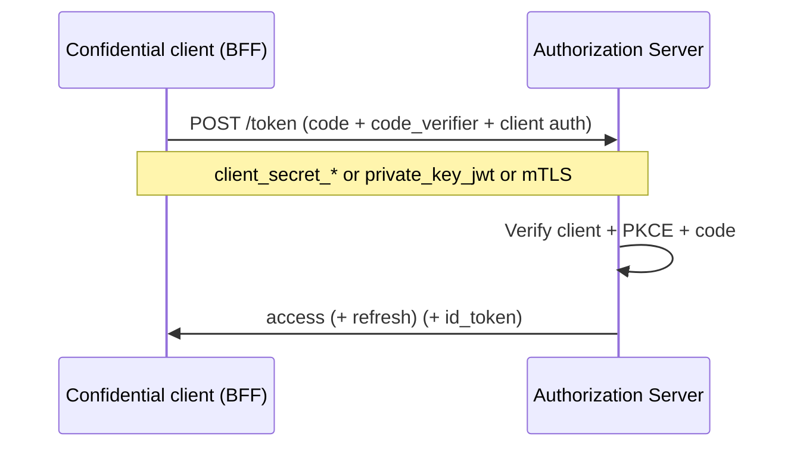
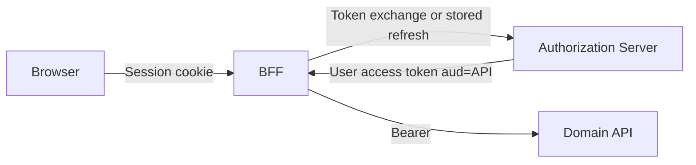

# Client Authentication and Token Exchange

Public clients prove themselves with **PKCE(Proof Key for Code Exchange)**. Confidential clients (BFF(Backend for Frontend), backends, daemons) must also **authenticate to the token endpoint**. Token **exchange** lets a BFF(Backend for Frontend) turn a user session into a short-lived access token for downstream APIs without giving those APIs the browser cookie.

> **Scope:** Client authentication methods and OAuth(Open Authorization) 2.0 token exchange (RFC 8693) for on-behalf-of. Grant selection → [§1](01-oauth2-grants-and-flows.md). BFF cookie bridge → [§4](04-cookie-session-and-csrf.md). Downstream JWT(JSON Web Token) validation → [§3](03-token-lifecycle-and-validation.md).

> **Related:** Machine auth matrix → [api-design §4](../../api-design-and-protection/includes/04-auth-model.md) · Secrets for client credentials → [enterprise-security §5](../../enterprise-security-compliance/includes/05-secrets-beyond-database.md)

---

## At a glance

| Client type | How it authenticates at `/token` |
|-------------|----------------------------------|
| **Public** (SPA, native) | `client_id` + PKCE only — **no** client secret |
| **Confidential** (BFF, server) | `client_id` + secret or stronger assertion (below) |
| **Workload** | Often mTLS(Mutual Transport Layer Security) or cloud workload identity instead of a long-lived secret |

**Rule of thumb:** Never put a client secret in a SPA or mobile binary. Prefer **private_key_jwt** or **mTLS** over shared secrets when the IdP supports them.

---

## Client authentication methods

| Method | How | Prefer when |
|--------|-----|-------------|
| **`client_secret_basic`** | HTTP(Hypertext Transfer Protocol) Basic (`client_id:secret`) on `/token` | Simple confidential clients; TLS(Transport Layer Security) required |
| **`client_secret_post`** | `client_id` + `client_secret` in form body | Same; some gateways break Basic |
| **`private_key_jwt`** | Client signs a JWT with its private key; AS verifies via JWKS(JSON Web Key Set) | Higher assurance; no shared secret in every deploy |
| **`tls_client_auth` / mTLS** | Client cert presented on the token call | Zero-trust / mesh; strong binding |
| **None (public)** | PKCE only | SPA / mobile |



### Practices

| Practice | Detail |
|----------|--------|
| Separate `client_id`s | Web BFF, mobile, admin, M2M — different secrets and redirect policies |
| Rotate secrets | Dual-secret overlap; store in secret manager — [enterprise-security §5](../../enterprise-security-compliance/includes/05-secrets-beyond-database.md) |
| Still use PKCE | Confidential clients should send PKCE too (defense in depth) |
| Audience on client assertions | `private_key_jwt` `aud` must be the token endpoint / issuer per IdP rules |

---

## Token exchange (on-behalf-of)

RFC 8693: a client presents a **subject token** (user access token or IdP assertion) and receives a **new** access token scoped for a downstream API(Application Programming Interface).

### Why BFFs need it



| Anti-pattern | Better |
|--------------|--------|
| Forward browser session cookie to domain APIs | APIs accept Bearer only |
| Reuse a long-lived user refresh inside every microservice | Exchange (or mint) short-lived access at the BFF edge |
| Call APIs with the BFF’s **client_credentials** token while pretending it’s the user | Downstream loses user identity / audit |

### Typical exchange request (shape)

```text
POST /token
grant_type=urn:ietf:params:oauth:grant-type:token-exchange
subject_token=...
subject_token_type=urn:ietf:params:oauth:token-type:access_token
requested_token_type=urn:ietf:params:oauth:token-type:access_token
audience=https://api.example.com
scope=orders:read
# + client authentication
```

| Check | Detail |
|-------|--------|
| **Actor vs subject** | Optional `actor_token` when a service acts on behalf of a user (delegation chain) |
| **Audience** | Downstream API resource identifier — pairs with resource indicators (RFC 8707) when available |
| **Scopes** | Least privilege; never wider than the subject held |
| **TTL** | Minutes; do not mint day-long exchanged tokens |

### Alternatives when exchange is unavailable

| Pattern | Notes |
|---------|-------|
| BFF holds refresh; refreshes access for user | Common; keep refresh HttpOnly / server-side — [§4](04-cookie-session-and-csrf.md) |
| IdP “OBO” proprietary flow (e.g. Entra OBO) | Same idea; follow vendor constraints |
| Trusted internal header after gateway AuthN | Only on a locked mesh; never from the public internet |

---

## Related standard endpoints (contracts)

| Endpoint | RFC | Use |
|----------|-----|-----|
| **Token revocation** | 7009 | Client tells AS to revoke refresh/access — complements [§3b](03B-revoke-logout-denylist.md) |
| **Token introspection** | 7662 | Resource server asks AS if opaque token is active |
| **Token exchange** | 8693 | This section |

Discover URLs via OAuth Authorization Server Metadata / OIDC(OpenID Connect) discovery when published.

---

## Common mistakes

| Mistake | Why it hurts | Fix |
|---------|---------------|-----|
| Client secret in SPA or mobile app | Anyone extracts it | Public client + PKCE |
| One `client_id` for BFF + SPA + M2M | Wrong auth method and blast radius | Split clients |
| Downstream APIs trust cookie from browser | CSRF(Cross-Site Request Forgery) + wrong trust boundary | Bearer via BFF exchange/refresh |
| Exchanged token with `aud` = IdP only | APIs reject or accept wrong tokens | Set `audience` / resource to the API |
| client_credentials used as “the user” | Broken audit and AuthZ | Token exchange or user refresh |

---

## Pros and cons

| Approach | Pros | Cons |
|----------|------|------|
| `client_secret_*` | Easy | Secret distribution and rotation |
| `private_key_jwt` / mTLS | No shared password; stronger binding | Key/cert lifecycle |
| Token exchange | Clear user + actor chain; short TTL downstream | IdP must support it; more moving parts |
| Refresh-at-BFF only | Works on most IdPs | BFF becomes refresh hotspot |

**Bottom line:** authenticate confidential clients properly; for BFF→API calls, prefer **token exchange (or BFF-held refresh)** so domain services see a user Bearer — never a browser session cookie.