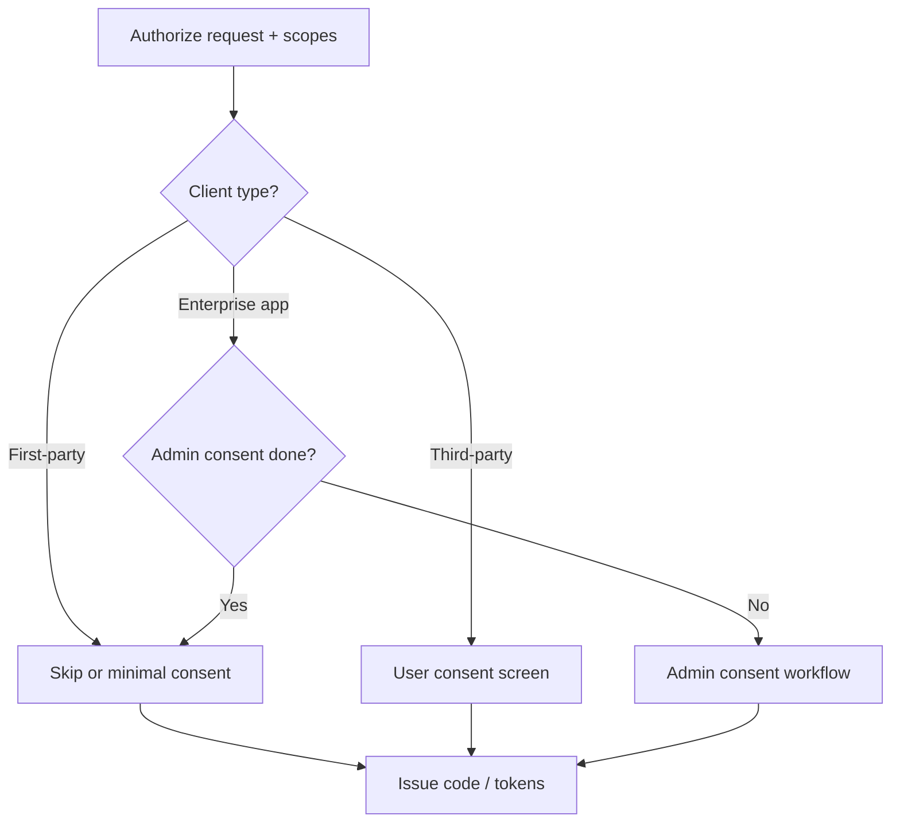

# Scopes and Consent Design

OAuth(Open Authorization) **scopes** are coarse permissions requested at authorize time. **Consent** is the user (or admin) approving those scopes. Bad scope design causes over-privilege, consent fatigue, or broken clients.

> **Scope:** Product/API(Application Programming Interface) scope taxonomy, consent UX, first-party vs third-party apps. Resource/`aud` depth → [§1d](01D-resource-indicators.md). Grant flows → [§1](01-oauth2-grants-and-flows.md). Client auth → [§1a](01A-client-auth-and-token-exchange.md). PAR(Pushed Authorization Requests) → [§1c](01C-pushed-authorization-requests.md). RBAC(Role-Based Access Control) after scopes → [api-design §12](../../api-design-and-protection/includes/12-identity-rbac-iam-ad.md). Object-level AuthZ(Authorization) → [api-design §4](../../api-design-and-protection/includes/04-auth-model.md).

---

## Rule of thumb

| Layer | Question |
|-------|----------|
| **Scope** | What *class* of API access is granted to this client? |
| **Role / claim** | What can this *user* do in the product? |
| **Object AuthZ** | Can this user touch *this* row? |

Scopes do **not** replace object-level checks. `orders:read` still requires `order.user_id == caller` (or tenant policy).

---

## Scope taxonomy

| Pattern | Example | Use |
|---------|---------|-----|
| **Resource.action** | `orders:read`, `orders:write` | Clear API products |
| **OIDC(OpenID Connect)** | `openid`, `profile`, `email` | Identity only — [§2](02-oidc-discovery-and-tokens.md) |
| **Offline** | `offline_access` | Refresh tokens (if your AS uses it) |
| **Admin** | `admin:users` | Separate client; never on public mobile app |

### Design practices

| Practice | Detail |
|----------|--------|
| Least privilege | Default read-only; write scopes explicit |
| Stable names | Renaming scopes breaks clients — version or add |
| Narrow clients | Partner integration gets only needed scopes |
| No “god scope” | `full_access` for production user apps |
| Document in OpenAPI / developer portal | Human-readable consent strings |

---

## First-party vs third-party consent

| App type | Consent UX |
|----------|------------|
| **First-party** (your BFF(Backend for Frontend) / official mobile) | Often **pre-consented** or quiet; still show permissions for sensitive scopes |
| **Third-party** (partners, marketplace) | Explicit consent screen; allow revoke in account settings |
| **Enterprise admin consent** | Tenant admin grants app org-wide (Entra-style); users may skip per-user prompt |

---

## Consent copy and revoke

| Do | Don't |
|----|-------|
| Plain language (“Read your orders”) | Raw scope strings only |
| List only **new** scopes on incremental authorize | Re-prompt every login for the same set |
| Account “Connected apps” + revoke | No way to undo partner access |
| Re-consent when scopes **expand** | Silently widen tokens on refresh |

Revoke → invalidate refresh/session for that client — [§3b](03B-revoke-logout-denylist.md).

---

## Resource indicators

When one AS serves many APIs, use `resource` / `aud` so tokens are not valid everywhere — full guide → [§1d](01D-resource-indicators.md). Always enforce `aud` at each API — [§3](03-token-lifecycle-and-validation.md).

---

## Common mistakes

| Mistake | Fix |
|---------|-----|
| One scope for all APIs | Split by resource; check `aud` |
| Putting fine-grained AuthZ only in scopes | Object checks in app |
| Refresh widens scopes | Scope lock at issue; re-consent to expand |
| Third-party client with admin scopes | Separate clients; admin consent + review |

---

## Pros and cons

| Approach | Pros | Cons |
|----------|------|------|
| Few broad scopes | Simple UX | Over-privilege |
| Many fine scopes | Least privilege | Consent fatigue |
| Pre-consent first-party | Smooth | Still need server AuthZ |

**Bottom line:** design scopes for **clients**, roles for **users**, object checks for **rows**; consent when a third party (or new sensitive scope) needs trust.