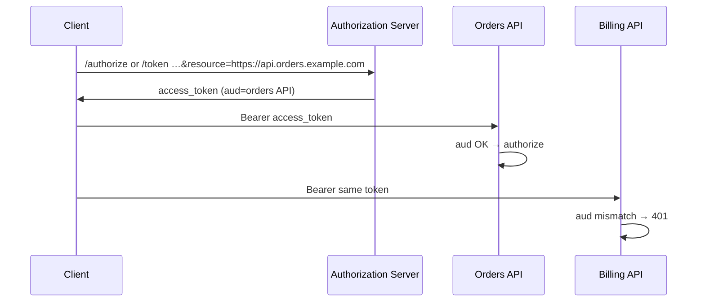
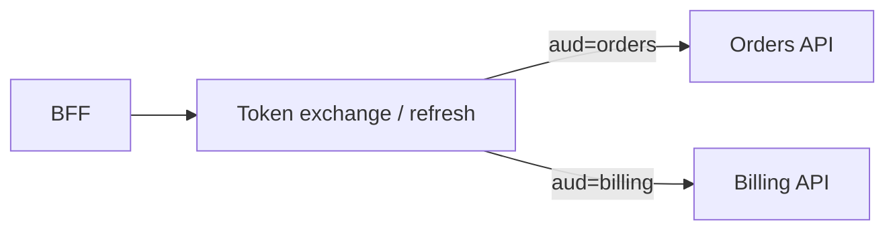

# Resource Indicators

**Resource indicators** (RFC 8707) let the client declare **which resource server (API(Application Programming Interface))** an access token is for. The authorization server encodes that target in the token’s **`aud` (audience)**. Each API(Application Programming Interface) then accepts only tokens minted for itself — not a single “god token” valid everywhere.

> **Scope:** `resource` parameter, audience design, multi-API AS layouts, relation to scopes. Scope/consent product design → [§1b](01B-scopes-and-consent.md). Access-token validation → [§3](03-token-lifecycle-and-validation.md). Token exchange when changing audience → [§1a](01A-client-auth-and-token-exchange.md). PAR(Pushed Authorization Requests) when authorize payloads get large → [§1c](01C-pushed-authorization-requests.md).

---

## Rule of thumb

| Mechanism | Answers |
|-----------|---------|
| **`resource` / `aud`** | *Which API* may accept this access token? |
| **`scope`** | *What class of operations* within that API (or AS policy)? |
| **Object AuthZ** | *Which rows* may this user touch? |

Always validate **`aud`** at the resource server. Use explicit `resource` at authorize/token time when one AS serves **multiple** APIs.

---

## Problem without resource indicators

```text
Access token aud = https://as.example.com  (or missing / wildcard)
→ Orders API and Billing API both accept the same Bearer
→ Compromise of a low-tier client escalates across the estate
```

With resource indicators:

```text
Authorize/token with resource=https://api.orders.example.com
→ access_token aud includes https://api.orders.example.com
→ Billing API rejects it (aud mismatch)
```

---

## How it works



### Request parameters

| Where | Parameter | Notes |
|-------|-----------|--------|
| `/authorize` | one or more `resource=` | Absolute URI identifying the API |
| `/token` | `resource=` | On code exchange or refresh, if AS allows narrowing/confirming |
| **PAR body** | `resource=` | Same params, pushed — [§1c](01C-pushed-authorization-requests.md) |

Discovery (when published): `resource_indicators_supported`, documentation of allowed resource URIs.

### Token shape

| Claim | Expectation |
|-------|-------------|
| **`aud`** | Resource URI(s) and/or AS-specific audience aliases — **must match this API** |
| **`scope` / `scp`** | Still present; interpret in context of that resource |
| **`iss`** | AS issuer — unchanged |

Some AS products use logical names (`api://orders`) mapped internally to URIs — treat whatever lands in `aud` as the contract.

---

## Resource URI design

| Practice | Detail |
|----------|--------|
| **Stable absolute URIs** | `https://api.orders.example.com` — not environment-relative guesses |
| **One resource per API product** | Don’t reuse one URI for unrelated services |
| **Document for partners** | Developer portal lists allowed `resource` values |
| **Avoid `aud=client_id` only for APIs** | That’s often wrong for resource servers; ID tokens use `aud=client_id` — [§2](02-oidc-discovery-and-tokens.md) |

---

## Scopes + resources together

| Example | Meaning |
|---------|---------|
| `resource=https://api.orders.example.com` + `scope=orders:read` | Read orders **on Orders API only** |
| Same scopes, different `resource` | AS may reject if those scopes aren’t registered for that API |
| No `resource`, broad `aud` | Legacy; migrate multi-API estates |

Consent screens should show **which app/API** is being authorized, not only raw scopes — [§1b](01B-scopes-and-consent.md).

---

## Multi-API and token exchange

A BFF(Backend for Frontend) that calls Orders and Billing should **not** reuse one multi-audience access token if you can avoid it.

| Approach | Detail |
|----------|--------|
| **Separate tokens** | Authorize/refresh per resource (or downscope on token) |
| **Token exchange** | Swap subject token for audience-specific access — [§1a](01A-client-auth-and-token-exchange.md) |
| **Multiple `resource` on one request** | Some AS return one token with multiple `aud` or refuse — prefer one resource per access token |



---

## Resource-server validation checklist

Extend [§3](03-token-lifecycle-and-validation.md):

1. Verify signature (JWKS(JSON Web Key Set))  
2. `iss` allowlist  
3. **`aud` must include this API’s resource identifier**  
4. `exp` / `nbf`  
5. Required scopes  
6. Object-level AuthZ  

Reject tokens whose only `aud` is an IdP issuer or another API’s URI.

---

## When you need this detail

| Situation | Guidance |
|-----------|----------|
| Single API behind one AS | Strict `aud` check may be enough; `resource` optional |
| Many micro-APIs, one AS | **Use resource indicators** (or equivalent AS “API audience” feature) |
| Partners with over-broad tokens | Force `resource` + narrow scopes |
| Moving from monolith to many APIs | Introduce resources before splitting tokens mid-flight |

---

## Implementation checklist

- [ ] Each API has a documented resource URI / audience value  
- [ ] Gateway/middleware rejects wrong `aud`  
- [ ] Authorize/token (or exchange) sets `resource` for multi-API clients  
- [ ] First-party BFF does not mint one token for all backends  
- [ ] ID tokens never used as API Bearers — [§2](02-oidc-discovery-and-tokens.md)  
- [ ] Tests: token for API A fails on API B — [§5a](05A-auth-testing-checklist.md)  

---

## Common mistakes

| Mistake | Fix |
|---------|-----|
| Skipping `aud` validation | Mandatory at every resource server |
| `aud` = AS issuer for all APIs | Distinct resource audiences |
| Scopes alone as isolation | Scopes ≠ audience |
| One access token listed in every microservice trust config | Per-API `aud` |
| Confusing ID token `aud` (client_id) with access token `aud` (API) | Different tokens, different audiences |

---

## Pros and cons

| Pros | Cons |
|------|------|
| Least-privilege tokens across APIs | More token acquisitions / exchanges |
| Clear blast-radius on theft | AS must support `resource` or equivalent |
| Cleaner partner integrations | Need a resource URI catalog |

**Bottom line:** **`aud` is the API’s identity check**; resource indicators are how clients **ask** for the right `aud`. Pair with scopes for verbs and object AuthZ for rows.