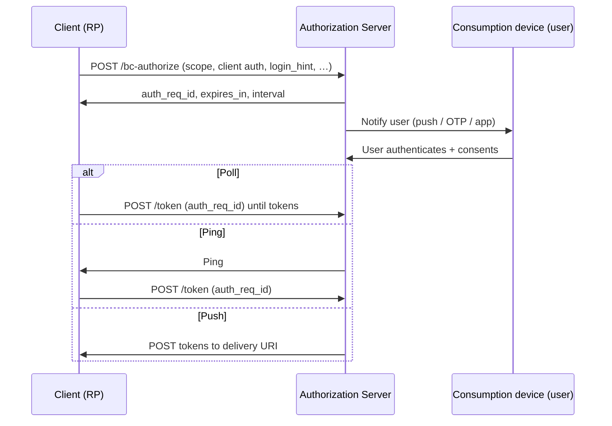
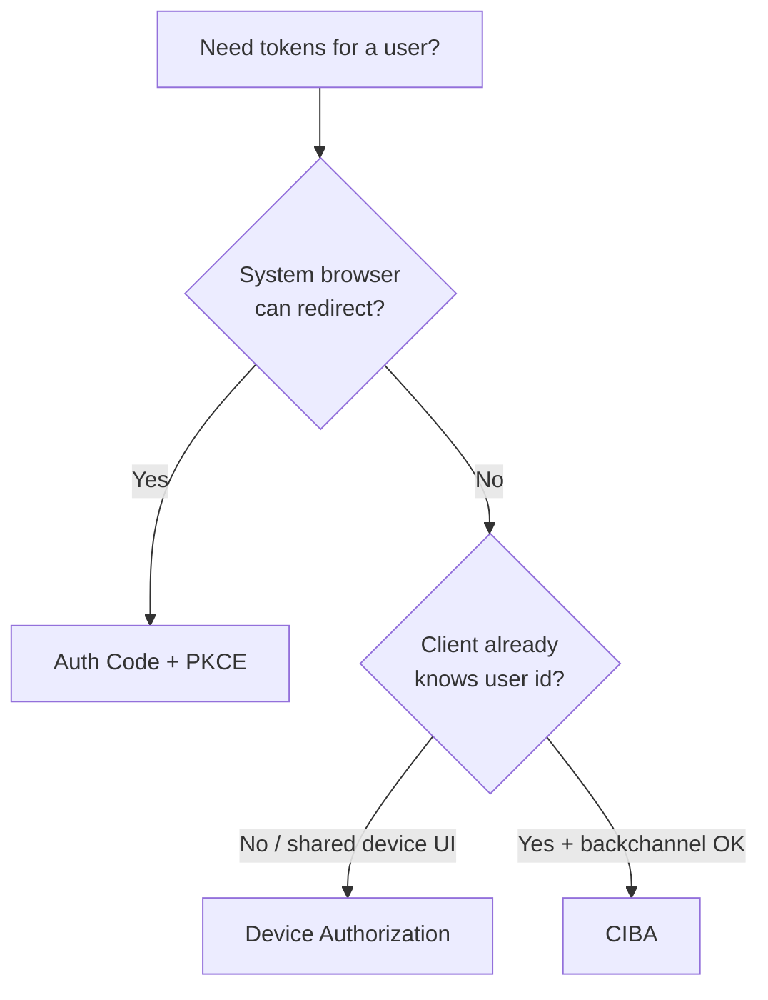

# Device Authorization and CIBA

Two OAuth(Open Authorization) patterns for when the **client cannot complete a normal browser redirect**: **Device Authorization** (RFC 8628 — TVs, CLI) and **CIBA(Client-Initiated Backchannel Authentication)** (OIDC(OpenID Connect) CIBA — bank apps, call-center / decoupled AuthN(Authentication)). Prefer Auth Code + PKCE(Proof Key for Code Exchange) whenever a system browser can finish the redirect.

> **Scope:** Device code polling, user_code UX, CIBA backchannel + notification modes, security limits. Default interactive grant → [§1](01-oauth2-grants-and-flows.md). Client auth → [§1a](01A-client-auth-and-token-exchange.md). Token lifecycle → [§3](03-token-lifecycle-and-validation.md).

> **Related:** Mobile redirects (App Links) → [§4a](04A-third-party-cookies-and-mobile-redirects.md) · Step-up → [§2a](02A-oidc-logout-and-step-up.md)

---

## At a glance

| Pattern | Who starts AuthN | User proves identity on | Client gets tokens via |
|---------|------------------|-------------------------|------------------------|
| **Auth Code + PKCE** | Client redirect | Same browser | `/token` with `code` |
| **Device Authorization** | Device | Separate browser (phone/PC) | Device polls `/token` with `device_code` |
| **CIBA** | Client backchannel | User’s authentication device (app push / OTP(One-Time Password)) | Client polls or gets ping/push token delivery |

**Rule of thumb:** Device grant = input-constrained **client device**. CIBA = client already knows who to authenticate and uses a **backchannel** — common in high-assurance / financial UX.

---

## Device Authorization Grant (RFC 8628)

### Flow

```mermaid
sequenceDiagram
    participant D as Device / CLI
    participant AS as Authorization Server
    participant U as User on phone/PC

    D->>AS: POST /device_authorization
    AS->>D: device_code, user_code, verification_uri, interval, expires_in
    D->>U: Show user_code + URI (or QR)
    U->>AS: Open URI; login; enter user_code; consent
    loop Poll ≥ interval
      D->>AS: POST /token (device_code)
      AS-->>D: authorization_pending / slow_down / tokens
    end
```

### Endpoints and parameters

| Step | Detail |
|------|--------|
| Discover | `device_authorization_endpoint` (and token endpoint) from AS metadata |
| Request | `client_id`, `scope` (+ client auth if confidential) |
| Response | `device_code`, `user_code`, `verification_uri` (+ optional `_complete`), `expires_in`, `interval` |
| Poll | `grant_type=urn:ietf:params:oauth:grant-type:device_code`, `device_code` |
| Errors | `authorization_pending`, `slow_down`, `expired_token`, `access_denied` |

### Security practices

| Control | Why |
|---------|-----|
| Short `user_code` TTL(Time To Live) + rate-limit guesses | Codes are short and human-typed |
| Enforce `interval`; honor `slow_down` | Prevent poll storms |
| Bound `device_code` to `client_id` | Stolen code useless for another client |
| Show consent scope clearly on verification page | User authorizes a TV/CLI they may not trust fully |
| Prefer QR + `verification_uri_complete` | Fewer typos; still verify URI is HTTPS AS |
| Rotate refresh; reuse detection | Same as other grants — [§3](03-token-lifecycle-and-validation.md) |

Do **not** use Device grant for ordinary SPA/mobile — use Auth Code + PKCE + App Links — [§4a](04A-third-party-cookies-and-mobile-redirects.md).

---

## CIBA (Client-Initiated Backchannel Authentication)

The client **POSTs to the AS backchannel** naming the user (`login_hint`, `id_token_hint`, or `login_hint_token`). The AS authenticates the user on a **consumption device** (banking app, phone). The client obtains tokens without a front-channel redirect to the AS login page.

### Modes (token delivery)

| Mode | Behavior |
|------|----------|
| **Poll** | Client polls token endpoint with `auth_req_id` |
| **Ping** | AS notifies client ping endpoint; then client calls token |
| **Push** | AS POSTs tokens to client token delivery endpoint (TLS(Transport Layer Security) + client auth) |



### When CIBA fits

| Fit | Avoid |
|-----|-------|
| Bank / broker already has user identifier | Public SPA “login with Google” |
| Call center: agent initiates, customer approves on phone | Replacing all web login |
| Decoupled step-up for a known session | Unauthenticated marketing sites |

Pair with strong client authentication (`private_key_jwt` / mTLS(Mutual Transport Layer Security)) — [§1a](01A-client-auth-and-token-exchange.md).

### Security practices

| Control | Why |
|---------|-----|
| Confidential client + strong client auth | Backchannel is server-to-server |
| Bind request to intended user; show transaction details on CD(Continuous Delivery) | Prevent “approve spam” / wrong-user AuthN |
| Short `auth_req_id` TTL; poll interval limits | Same class of abuse as device_code |
| User cancel → `access_denied` | Clear UX and audit |
| MFA(Multi-Factor Authentication) / WebAuthn(Web Authentication) on consumption device | CIBA does not replace step-up policy — [§2a](02A-oidc-logout-and-step-up.md), [§5c](05C-webauthn-and-passkeys.md) |

---

## Device vs CIBA vs Auth Code



---

## Implementation checklist

### Device

- [ ] Use only for input-constrained clients  
- [ ] Enforce poll `interval` / `slow_down`  
- [ ] Rate-limit `user_code` validation  
- [ ] HTTPS verification URI; no custom scheme for the **user** browser step  

### CIBA

- [ ] Discover `backchannel_authentication_endpoint`  
- [ ] Confidential client auth on bc-authorize + token  
- [ ] Choose poll vs ping vs push deliberately; secure delivery endpoints  
- [ ] Audit initiate / success / deny / expire  

---

## Common mistakes

| Mistake | Why it hurts | Fix |
|---------|---------------|-----|
| Device grant for mobile apps | Worse UX + weaker binding than App Links | Auth Code + PKCE |
| Ignoring `slow_down` | AS ban / outage | Back off |
| CIBA without strong client auth | Anyone could start AuthN for a user | mTLS / private_key_jwt |
| Push mode to an unauthenticated URL | Token theft | Authenticate delivery; TLS(Transport Layer Security); rotate |
| Long-lived `device_code` / `auth_req_id` | Stolen pending grants | Minutes-scale TTL |

---

## Pros and cons

| Pattern | Pros | Cons |
|---------|------|------|
| Device | Works on TVs/CLI | User_code phishing; polling complexity |
| CIBA | Decoupled high-assurance UX | IdP(Identity Provider) support varies; harder to operate |
| Auth Code + PKCE | Simplest secure default | Needs a browser redirect |

**Bottom line:** keep **Auth Code + PKCE** as default; use **Device** for constrained hardware; use **CIBA** when the client must start AuthN out-of-band for a **known user** with a strong backchannel.