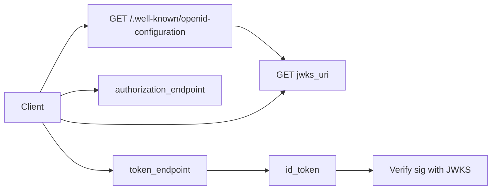

# OIDC Discovery and Tokens

OIDC(OpenID Connect) sits on OAuth(Open Authorization) 2.0 and adds **identity**: an ID token that tells the client *who* logged in, plus a discovery document so clients find endpoints and keys without hardcoding.

> **Scope:** Discovery, ID token vs access token, standard claims, `nonce` / `at_hash`, UserInfo. Logout channels and step-up → [§2a](02A-oidc-logout-and-step-up.md). SSO(Single Sign-On) integration → [§2b](02B-sso-integration-playbook.md). SAML(Security Assertion Markup Language) → [§2c](02C-saml-protocol.md). Grant mechanics → [§1](01-oauth2-grants-and-flows.md). Resource-server JWT(JSON Web Token) validation → [§3](03-token-lifecycle-and-validation.md). RBAC(Role-Based Access Control) from claims → [api-design §12](../../api-design-and-protection/includes/12-identity-rbac-iam-ad.md).

> **Related:** OIDC logout / step-up → [§2a](02A-oidc-logout-and-step-up.md) · SSO playbook → [§2b](02B-sso-integration-playbook.md) · SAML → [§2c](02C-saml-protocol.md)

---

## At a glance

| Artifact | Audience | Purpose |
|----------|----------|---------|
| **ID token** | Client (BFF(Backend for Frontend) / app) | Prove authentication event and subject identity |
| **Access token** | Resource server (API(Application Programming Interface)) | Authorize API(Application Programming Interface) calls |
| **Refresh token** | Authorization server (via client) | Obtain new access (and optionally ID) tokens |
| **Discovery document** | Client at startup | Locate authorize/token/JWKS(JSON Web Key Set)/UserInfo URLs and supported algs |
| **JWKS** | Validators | Public keys to verify signatures |

**Rule of thumb:** APIs authorize with the **access token**. Clients establish session identity from the **ID token** (then usually discard or keep only `sub` + session). Never send the ID token as `Authorization: Bearer` to your APIs unless you have a deliberate, documented exception.

---

## Discovery

OIDC providers publish metadata at:

```text
https://{issuer}/.well-known/openid-configuration
```

### Fields you actually use

| Field | Use |
|-------|-----|
| `issuer` | Must match ID token `iss` exactly |
| `authorization_endpoint` | Start Auth Code flow |
| `token_endpoint` | Code / refresh / client_credentials exchange |
| `jwks_uri` | Fetch signing keys |
| `userinfo_endpoint` | Optional profile claims |
| `end_session_endpoint` | RP-initiated logout (if supported) — depth → [§2a](02A-oidc-logout-and-step-up.md) |
| `scopes_supported` | Confirm `openid` (+ `profile`, `email`, …) |
| `id_token_signing_alg_values_supported` | Prefer RS256 / ES256; reject `none` and unexpected HS* for public clients |
| `code_challenge_methods_supported` | Must include `S256` for PKCE(Proof Key for Code Exchange) |

Cache discovery + JWKS with a TTL; refresh on unknown `kid` or validation failure (with rate limits).



---

## ID token vs access token

| | ID token | Access token |
|--|----------|--------------|
| **Format** | Always JWT | JWT or opaque |
| **Validated by** | Client (relying party) | Resource server / gateway |
| **Proves** | User authenticated to *this* client at *this* time | Bearer is allowed to call the API |
| **Typical claims** | `iss`, `sub`, `aud`=client_id, `exp`, `iat`, `auth_time`, `nonce` | `iss`, `sub`/`client_id`, `aud`=API, `scope`/`scp`, `exp` |
| **Sent to APIs?** | No (normally) | Yes |

---

## Core ID token claims

| Claim | Meaning | Check |
|-------|---------|-------|
| `iss` | Issuer URL | Exact match to discovery `issuer` |
| `sub` | Subject — stable user id at the IdP | Primary key for linking accounts |
| `aud` | Audience — must include **your client_id** | Reject if only the API audience |
| `exp` / `iat` / `nbf` | Time bounds | Clock skew tolerance (~60s) |
| `auth_time` | When AuthN happened | Useful for max-session and step-up |
| `nonce` | Replay binder from `/authorize` | Must match what you stored |
| `amr` / `acr` | Auth method / context class | Enforce MFA(Multi-Factor Authentication) policies |
| `email`, `email_verified`, `name`, … | Profile (if scoped) | Don't trust email alone for account merge without `email_verified` |

### Access-token hygiene (when JWT)

| Claim | Check |
|-------|-------|
| `aud` | Your API identifier / gateway audience |
| `scope` or `scp` | Coarse AuthZ at gateway |
| `client_id` / `azp` | Who obtained the token |
| Custom `roles` / `tenant_id` | Keep small; re-check object ownership in app — [api-design §12B](../../api-design-and-protection/includes/12B-identity-enterprise-api.md) |

---

## `nonce` and `at_hash`

| Mechanism | Purpose |
|-----------|---------|
| **`nonce`** | Client puts a random value in `/authorize`; IdP echoes it in the ID token. Prevents ID token replay into a different session. |
| **`at_hash`** | Hash of the access token inside the ID token (implicit/hybrid leftover; still validate when present with Auth Code). Confirms ID and access tokens were issued together. |

Always send and verify `nonce` for OIDC Auth Code flows.

---

## UserInfo endpoint

Optional `GET`/`POST` to `userinfo_endpoint` with the access token when claims are too large for the ID token or need freshness.

| Practice | Detail |
|----------|--------|
| Prefer | Put stable identity in ID token; fetch UserInfo only when needed |
| Cache | Short TTL; don't block every request on UserInfo |
| AuthZ | UserInfo is not a substitute for API object-level checks |

---

## Minimal verification checklist (ID token)

1. Fetch keys from `jwks_uri` (by `kid`)
2. Verify signature; reject `alg=none` and algorithm confusion (don't accept HS256 if you expected RS256)
3. `iss` exact match
4. `aud` contains this client_id
5. `exp` (and `nbf`) with skew
6. `nonce` match
7. Optional: `auth_time` / `acr` for step-up policies

Access-token validation for APIs → [§3](03-token-lifecycle-and-validation.md).

---

## Account linking

| Approach | Guidance |
|----------|----------|
| Stable key | Prefer IdP `iss` + `sub` as the external identity key |
| Email merge | Only when `email_verified=true` and with explicit user confirmation |
| Multiple IdPs | One local user ↔ many `(iss, sub)` rows |

---

## Common mistakes

| Mistake | Why it hurts | Fix |
|---------|---------------|-----|
| Hardcoding authorize/token URLs | Breaks on IdP region/migration; skips policy changes | Discovery + cache |
| Sending ID token to APIs as Bearer | Wrong audience; APIs may accept identity tokens meant for the client | Access token only |
| Skipping `nonce` | ID token injection / replay across sessions | Always verify |
| Trusting unverified email claim | Account takeover via IdP misconfig or colliding emails | Require `email_verified` + linking UX |
| Putting huge authorization graphs in JWT | Header bloat; stale AuthZ | Minimal claims; query AuthZ service or DB for fine-grained rights |
| Accepting any `alg` from the header blindly | Algorithm confusion attacks | Whitelist algs from discovery / config |

---

## Pros and cons (OIDC vs "roll your own identity JWT")

| Pros | Cons |
|------|------|
| Interoperable SSO(Single Sign-On), social login, enterprise IdPs | Operational dependency on IdP availability |
| Standard claims and discovery | Claim mapping and tenancy still your problem |
| MFA and conditional access live at the IdP | Debugging redirects and clock skew takes practice |
| Clear split: identity (ID) vs API access | Easy to misuse tokens if roles are confused |