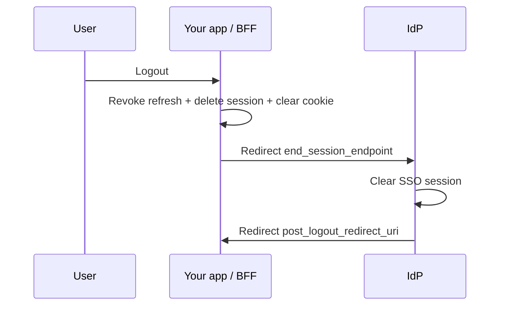
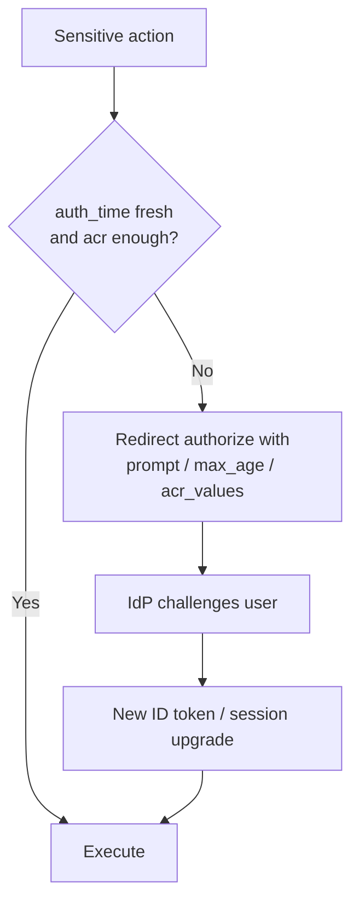

# OIDC Logout and Step-Up Authentication

OIDC(OpenID Connect) login is only half the session story. **Logout** must clear the app session and, when required, the IdP(Identity Provider) SSO(Single Sign-On) session. **Step-up** re-challenges the user (MFA(Multi-Factor Authentication) / re-auth) before sensitive actions without a full product redesign.

> **Scope:** RP-initiated, front-channel, and back-channel logout; `prompt` / `max_age` / `acr_values` for step-up. Discovery fields → [§2](02-oidc-discovery-and-tokens.md). App session revoke → [§3b](03B-revoke-logout-denylist.md). Cookie clear → [§4](04-cookie-session-and-csrf.md). MFA(Multi-Factor Authentication) product rules → [§5](05-login-security-playbook.md).

---

## At a glance

| Mechanism | What it clears | When to use |
|-----------|----------------|-------------|
| **App logout only** | Your session / refresh | Always as the first step |
| **RP-initiated logout** | IdP SSO via redirect to `end_session_endpoint` | User clicked “sign out”; single browser |
| **Front-channel logout** | Other RPs via hidden iframes | Multiple apps, same browser, IdP support |
| **Back-channel logout** | Other RPs via server POST | Reliable multi-app logout (iframes blocked) |
| **Step-up** | N/A — raises AuthN(Authentication) strength mid-session | Payments, admin, change-email |

**Rule of thumb:** Always destroy **your** session first ([§3b](03B-revoke-logout-denylist.md)). Add IdP logout when shared SSO must die too.

---

## RP-initiated logout

Relying party redirects the browser to the IdP:

```text
GET {end_session_endpoint}
  ?id_token_hint={id_token}
  &post_logout_redirect_uri={allowlisted_uri}
  &state={opaque}
```

| Parameter | Purpose |
|-----------|---------|
| `id_token_hint` | Helps IdP identify which SSO session to end |
| `post_logout_redirect_uri` | Exact allowlist — open-redirect risk if wild |
| `state` | CSRF(Cross-Site Request Forgery)-ish binder; verify on return |



Discovery: `end_session_endpoint` in the OIDC document — [§2](02-oidc-discovery-and-tokens.md).

---

## Front-channel logout

IdP loads each RP’s `frontchannel_logout_uri` in a **hidden iframe** so each app can clear its session cookies in the browser.

| Pros | Cons |
|------|------|
| Works without a back-channel URL | Blocked by third-party cookie / iframe policies — [§4a](04A-third-party-cookies-and-mobile-redirects.md) |
| Simple for classic same-site SSO | Unreliable in modern browsers |

Register `frontchannel_logout_uri` and `frontchannel_logout_session_required` per IdP docs. On iframe hit: delete session + clear cookies (may be limited if cookies are SameSite/partitioned).

---

## Back-channel logout

IdP **POSTs** a `logout_token` (JWT(JSON Web Token)) to each RP’s `backchannel_logout_uri`. No browser involved.

```mermaid
sequenceDiagram
    participant IdP
    participant RP1 as App A
    participant RP2 as App B

    IdP->>RP1: POST logout_token
    IdP->>RP2: POST logout_token
    RP1->>RP1: Verify JWT; delete sessions for sub/sid
    RP2->>RP2: Verify JWT; delete sessions for sub/sid
```

| Check on `logout_token` | Detail |
|-------------------------|--------|
| Signature + `iss` / `aud` | Same discipline as ID tokens — [§2](02-oidc-discovery-and-tokens.md) |
| `events` claim | Must include back-channel logout event URI |
| `sub` and/or `sid` | Map to sessions to destroy — index sessions by IdP `sid` when possible |
| `nonce` absent | Spec: logout tokens must not contain `nonce` |
| Replay | Track `jti` until `exp` |

**Prefer back-channel** for multi-app SSO when you control the RPs and can expose an HTTPS logout URI.

---

## Choosing a logout stack

| Scenario | Stack |
|----------|--------|
| Single first-party app | App revoke + clear cookie; optional RP-initiated |
| Several apps, one IdP, need SSO kill | App revoke + RP-initiated + **back-channel** (front-channel as best-effort) |
| IdP lacks back-channel | RP-initiated + document iframe limits |
| Admin force logout | [§3b](03B-revoke-logout-denylist.md) first; IdP admin revoke if available |

---

## Step-up authentication

Force a stronger or fresher AuthN **before** a sensitive action, then continue the same product session.

### OIDC knobs

| Parameter | Effect |
|-----------|--------|
| **`prompt=login`** | Force interactive re-auth (ignore SSO cookie) |
| **`prompt=consent`** | Force consent screen |
| **`max_age=n`** | ID token `auth_time` must be within *n* seconds or re-auth |
| **`acr_values`** | Request a specific authentication context class (e.g. MFA) |
| **`claims`** (essential) | Require claims like `acr` essential=true |



### App-side enforcement

| Store | Use |
|-------|-----|
| Session `auth_time` / `amr` / `acr` | From last ID token — [§4](04-cookie-session-and-csrf.md) |
| Policy table | e.g. `transfer > $X` → `acr=mfa` and `max_age=300` |
| Step-up success | Rotate session id; update `auth_time` |

Do not trust a client-sent “mfa_ok=true” flag — [§3a](03A-token-cookie-integrity.md), [§5](05-login-security-playbook.md).

### Triggers (examples)

- Change password, email, or MFA factors  
- Disable MFA / add recovery codes  
- High-value payment or admin role change  
- New device + privileged action  

---

## Common mistakes

| Mistake | Why it hurts | Fix |
|---------|---------------|-----|
| Only clearing the browser cookie | IdP SSO still silent-logs the user back in | RP-initiated or accept SSO re-entry by design |
| Front-channel only in 2020s browsers | Iframes/cookies fail silently | Back-channel + app revoke |
| `post_logout_redirect_uri` wildcards | Open redirect | Exact allowlist |
| Step-up only in the UI | Attacker calls API(Application Programming Interface) directly | Enforce `auth_time`/`acr` on the server |
| Ignoring `logout_token` signature | Attacker forges logout DoS or skips verify wrongly | Full JWT(JSON Web Token) validation + `jti` replay cache |
| No IdP `sid` on sessions | Cannot target back-channel logout precisely | Store IdP `sid` at login |

---

## Pros and cons

| Approach | Pros | Cons |
|----------|------|------|
| App-only logout | Simple | SSO may remain |
| RP-initiated | Clears IdP for this browser | Needs redirect UX |
| Front-channel | Multi-app without server hook | Fragile with cookie policies |
| Back-channel | Reliable multi-app | Endpoint + JWT verify ops |
| OIDC step-up | Standards-based re-auth | IdP must honor `acr` / `max_age` |

**Bottom line:** revoke local state always; add **back-channel (+ RP-initiated)** for real SSO logout; use **`prompt` / `max_age` / `acr_values`** and enforce them server-side for step-up.