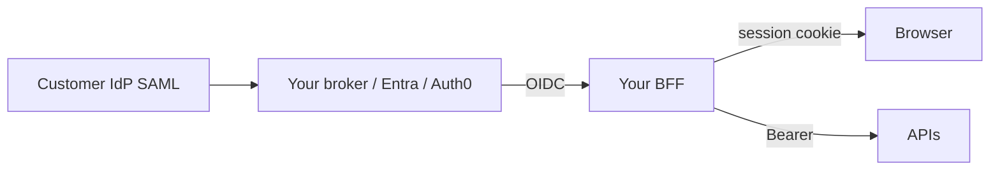

# SSO Integration Playbook

End-to-end path from **IdP(Identity Provider) SSO(Single Sign-On)** to **your app session** to **API(Application Programming Interface) Bearer**: how enterprise and social IdPs differ, how SAML(Security Assertion Markup Language) fits (via bridge), and how to link accounts safely when one user has many IdPs.

> **Scope:** Integration sequence and product choices. Grants → [§1](01-oauth2-grants-and-flows.md). OIDC(OpenID Connect) tokens → [§2](02-oidc-discovery-and-tokens.md). SAML protocol depth → [§2c](02C-saml-protocol.md). B2B(Business-to-Business) multi-tenant IdP routing → [§2d](02D-multi-tenant-oidc-and-b2b-sso.md). Logout → [§2a](02A-oidc-logout-and-step-up.md). BFF(Backend for Frontend) cookie → [§4](04-cookie-session-and-csrf.md). Lifetimes / silent re-auth → [§3d](03D-lifetimes-and-sliding-sessions.md). Groups→roles → [api-design §12](../../api-design-and-protection/includes/12-identity-rbac-iam-ad.md).

---

## Rule of thumb

Your browser never needs to send the **IdP cookie** to your APIs. Pattern:

1. User hits IdP (SSO cookie may skip password)
2. OIDC (or SAML) returns identity to your **BFF / app**
3. You create a **first-party session cookie**
4. APIs accept **Bearer** (or BFF session) — not the IdP cookie

---

## End-to-end sequence (OIDC)

```mermaid
sequenceDiagram
    participant U as User browser
    participant App as Your BFF / app
    participant IdP as IdP (SSO cookie)
    participant API as Domain API

    U->>App: GET /app (no session)
    App->>IdP: Redirect /authorize (OIDC + PKCE)
    Note over U,IdP: IdP SSO cookie may satisfy AuthN
    IdP->>App: Redirect ?code&state
    App->>IdP: POST /token (code + verifier + client auth)
    IdP->>App: id_token + access_token (+ refresh)
    App->>App: Verify id_token; create sid; link iss+sub
    App->>U: Set-Cookie __Host-session=sid
    U->>App: API calls with session cookie
    App->>API: Bearer access (exchange or refresh) — §1a
    API->>API: Validate JWT + object AuthZ
```

| Hop | Artifact | Owned by |
|-----|----------|----------|
| IdP | SSO session cookie on IdP domain | IdP |
| Callback | Authorization `code` | One-time |
| Token response | ID token (who) + access (optional at edge) | Verify then mostly discard ID token |
| Your app | `sid` HttpOnly cookie | You — [§4](04-cookie-session-and-csrf.md) |
| Domain API | Bearer access token | You / AS — [§3](03-token-lifecycle-and-validation.md) |

---

## Enterprise SSO vs social login

| | **Enterprise SSO** (Entra / Okta / workforce IdP) | **Social** (Google / Apple / GitHub) |
|--|---------------------------------------------------|-------------------------------------|
| **Who controls account** | Customer’s IT | User + provider |
| **Typical protocol to you** | OIDC (or SAML → bridge) | OIDC |
| **MFA(Multi-Factor Authentication) / conditional access** | IdP policy — trust `acr`/`amr` | Provider-dependent; don’t assume |
| **Claims for AuthZ(Authorization)** | Groups / roles / tenant | Email, `sub`; rarely fine-grained roles |
| **Email trust** | Usually org-verified | Require `email_verified`; still confirm on link |
| **Account lifecycle** | JML(Joiner-Mover-Leaver) / SCIM(System for Cross-domain Identity Management) — [§12C](../../api-design-and-protection/includes/12C-scim-and-jml-provisioning.md) | User deletes social ≠ your offboarding |
| **B2B multi-tenant** | Often one IdP per customer tenant | Usually one global social IdP |

**Product rule:** enterprise SSO maps groups → app roles. Social login maps to a **consumer user** with app-local roles — don’t invent admin from “Google said so.”

### B2B multi-tenant (pointer)

When each customer brings their own IdP (or you map email domains / subdomains to orgs), you need **tenant resolution before `/authorize`**, an **issuer allowlist per tenant**, and a **membership** model — not only the SSO sequence above.

Depth → [§2d Multi-tenant OIDC and B2B SSO](02D-multi-tenant-oidc-and-b2b-sso.md). API/data isolation stays in [api-design §16](../../api-design-and-protection/includes/16-multi-tenant-apis.md).

---

## SAML in this architecture

Prefer **OIDC to your app**. When a customer only offers SAML:

| Pattern | Description |
|---------|-------------|
| **IdP speaks SAML → your app is SP(Savings Plan)** | You implement SAML ACS — full protocol → [§2c](02C-saml-protocol.md) |
| **Bridge** | Customer SAML → your IdP/broker → **OIDC to your apps** (recommended at scale) |



---

## Account linking (multiple IdPs → one user)

Stable external key: **`(iss, sub)`** per linked identity — [§2](02-oidc-discovery-and-tokens.md).

| Step | Practice |
|------|----------|
| First login | Create local user; store `(iss, sub)` |
| Link another IdP | Require authenticated session **or** verified email match **with user confirmation** |
| Email-only merge | Only if `email_verified=true` **and** explicit consent — never auto-merge on unverified email |
| Unlink | Block unlinking the last factor without a password/passkey remaining |
| Conflicts | Two local users claiming same social `sub` → support tooling, not silent merge |

---

## Silent re-login after app expiry

When `sid` is dead but IdP SSO may live → [§3d](03D-lifetimes-and-sliding-sessions.md):

- Idle timeout → top-level authorize (or careful `prompt=none`)
- Absolute timeout → interactive / step-up
- Never depend on hidden iframe silent renew — [§4a](04A-third-party-cookies-and-mobile-redirects.md)

---

## Multi-app SSO

| Goal | Mechanism |
|------|-----------|
| One login across your apps | Shared IdP + each app’s own session **or** shared parent-domain session (careful) |
| One logout across apps | Back-channel (+ RP-initiated) — [§2a](02A-oidc-logout-and-step-up.md) |
| Shared roles | IdP groups → each app’s mapping table — [§12](../../api-design-and-protection/includes/12-identity-rbac-iam-ad.md) |

Prefer **separate first-party cookies per app** + shared IdP over one `Domain=.example.com` mega-cookie.

---

## Integration checklist

- [ ] App uses OIDC Auth Code + PKCE(Proof Key for Code Exchange) (or SAML SP with [§2c](02C-saml-protocol.md))
- [ ] First-party session cookie after callback; APIs get Bearer — [§1a](01A-client-auth-and-token-exchange.md)
- [ ] Link identities by `(iss, sub)`; email merge is explicit
- [ ] Enterprise: group→role map; social: local roles
- [ ] Lifetimes documented — [§3d](03D-lifetimes-and-sliding-sessions.md)
- [ ] Logout clears app + IdP as required — [§2a](02A-oidc-logout-and-step-up.md), [§3b](03B-revoke-logout-denylist.md)
- [ ] Tenant isolation if B2B SSO — [§2d](02D-multi-tenant-oidc-and-b2b-sso.md) + [api-design §16](../../api-design-and-protection/includes/16-multi-tenant-apis.md)

---

## Common mistakes

| Mistake | Fix |
|---------|-----|
| Forwarding IdP cookies to APIs | BFF session / Bearer only |
| Auto-linking on email alone | Verified + user confirm |
| One shared parent-domain cookie for all apps | Per-app host-only / `__Host-` |
| Assuming social MFA = enterprise conditional access | Enforce step-up in app for sensitive actions |
| Implementing SAML in every microservice | Broker → OIDC once |

---

## Pros and cons

| Approach | Pros | Cons |
|----------|------|------|
| OIDC-only apps + SAML broker | One protocol in eng | Broker ops |
| Native SAML SP in BFF | Direct customer federation | Heavier crypto/XML — [§2c](02C-saml-protocol.md) |
| Social + enterprise both | Wider signup | Linking complexity |

**Bottom line:** IdP owns SSO; **you** own the app session and API tokens; link with `(iss, sub)`; prefer OIDC everywhere and bridge SAML at the edge.