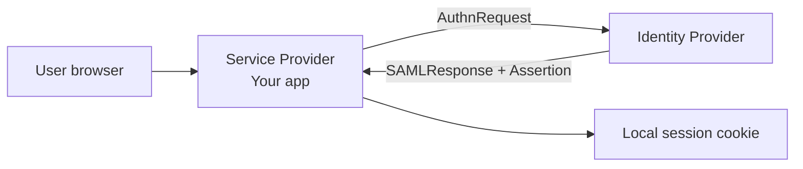
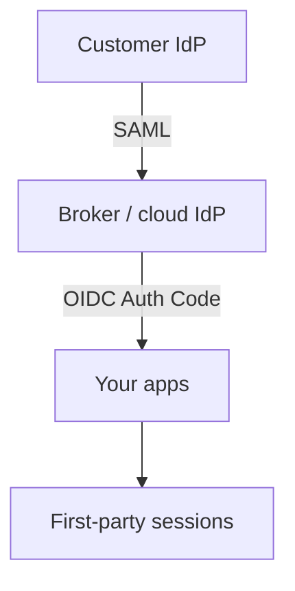

# SAML Protocol Guide

SAML(Security Assertion Markup Language) 2.0 is an XML-based **federated AuthN** protocol widely used in enterprise SSO(Single Sign-On). Your product should prefer **OIDC(OpenID Connect)** for new apps; use SAML when customers require it — either as a **Service Provider (SP)** or via a **broker** that speaks SAML to them and OIDC to you.

> **Scope:** SAML 2.0 Web Browser SSO profile — roles, assertions, bindings, metadata, signatures/encryption, SP- vs IdP-initiated flows, security checklist, and bridge to OIDC. App integration sequence → [§2b](02B-sso-integration-playbook.md). Per-tenant / BYO IdP → [§2d](02D-multi-tenant-oidc-and-b2b-sso.md). OIDC tokens → [§2](02-oidc-discovery-and-tokens.md). Enterprise AD(Active Directory)/Entra context → [api-design §12A](../../api-design-and-protection/includes/12A-identity-active-directory.md).

---

## At a glance

| Concept | Meaning |
|---------|---------|
| **IdP (Identity Provider)** | Authenticates the user; issues SAML assertions (e.g. Entra, Okta, AD FS) |
| **SP (Service Provider)** | Your app; consumes assertions and creates a local session |
| **Assertion** | Signed XML statement: who the user is (+ optional attributes) |
| **Metadata** | XML describing endpoints, certificates, entity IDs |
| **Binding** | How messages ride HTTP(Hypertext Transfer Protocol) (Redirect, POST, Artifact) |

**Rule of thumb:** Treat a SAML assertion like an **ID token** — verify signature and conditions, then create **your** session. Never pass raw assertions to domain APIs as a Bearer substitute.

---

## Roles and trust



| Trust object | Purpose |
|--------------|---------|
| **Entity ID** | Stable identifier for IdP and SP (URI) |
| **Signing cert** | Verify AuthnRequest (optional) / Assertion / Response |
| **Encryption cert** | Optional; IdP encrypts assertion for SP private key |
| **ACS URL** | Assertion Consumer Service — where IdP POSTs the response |
| **Single Logout endpoints** | Optional SAML logout (often fragile vs OIDC back-channel); not the SRE(Site Reliability Engineering) SLO(Service Level Objective) |

---

## Web Browser SSO — SP-initiated (default)

1. User hits SP → no session  
2. SP redirects to IdP with **AuthnRequest** (Redirect or POST binding)  
3. User authenticates at IdP (SSO cookie may apply)  
4. IdP returns **SAMLResponse** to SP **ACS** (usually POST binding)  
5. SP validates → creates session → redirect to relay state URL  

```mermaid
sequenceDiagram
    participant U as Browser
    participant SP as SP (your app)
    participant IdP as IdP

    U->>SP: GET /app
    SP->>U: 302 to IdP SSO URL + AuthnRequest
    U->>IdP: AuthnRequest
    IdP->>U: Login / SSO
    IdP->>U: POST ACS + SAMLResponse
    U->>SP: POST /acs
    SP->>SP: Verify signature, Conditions, Audience
    SP->>U: Set session cookie; 302 to RelayState
```

### IdP-initiated

IdP sends an unsolicited **SAMLResponse** to ACS (user clicked app tile in IdP portal).

| Practice | Detail |
|----------|--------|
| Allow only if required | Higher CSRF(Cross-Site Request Forgery)/confusion risk |
| Still verify | Signature, Audience, Destination, Conditions |
| RelayState | Strict allowlist of paths — open redirect risk |
| Prefer SP-initiated | Clearer CSRF/`InResponseTo` binding |

---

## Assertions — what to verify

A typical **Response** wraps an **Assertion** with `Subject`, `Conditions`, `AuthnStatement`, `AttributeStatement`.

| Check | Fail closed if |
|-------|----------------|
| **XML signature** | Invalid / wrong cert / wrapping attack (see below) |
| **Issuer** | Not the expected IdP entity ID |
| **Audience** | Does not include your SP entity ID |
| **Destination** | ACS URL mismatch (on Response) |
| **InResponseTo** | Does not match AuthnRequest ID (SP-initiated) |
| **NotBefore / NotOnOrAfter** | Outside skew window (~2–3 min) |
| **Recipient** | SubjectConfirmationData recipient ≠ ACS |
| **Subject** | Missing NameID / opaque id |

Map **NameID** (or a stable attribute) to local `(idp_entity_id, name_id)` — same idea as OIDC `(iss, sub)`.

### Attributes

Common: email, first/last name, groups.  
Treat like OIDC claims: don’t grant admin from an unverified attribute; map groups via a table — [§12](../../api-design-and-protection/includes/12-identity-rbac-iam-ad.md).

---

## Bindings

| Binding | How | Use |
|---------|-----|-----|
| **HTTP-Redirect** | AuthnRequest in query string (deflate+base64) | SP→IdP requests (size limits) |
| **HTTP-POST** | Form auto-POST with base64 SAML message | Responses to ACS (default) |
| **HTTP-Artifact** | Small artifact; SP resolves via back-channel | Rare; tighter environments |

Prefer **Redirect for request, POST for response**.

---

## Metadata exchange

| Side | Publishes |
|------|-----------|
| **IdP metadata** | SSO URL, signing cert(s), entity ID, NameID formats |
| **SP metadata** | ACS URLs, entity ID, signing/encryption certs, NameID policy |

Automate cert rotation with dual-cert overlap (similar to JWKS(JSON Web Key Set) overlap in OIDC).

---

## Signatures, encryption, XML dangers

| Topic | Practice |
|-------|----------|
| **Sign assertion and/or response** | Require at least assertion **or** response signed per your policy; many IdPs sign both |
| **Cert pinning** | Pin to metadata certs; alert on unexpected kid/cert |
| **Encryption** | Optional; use when assertions carry sensitive attributes |
| **XML canonicalization** | Use a maintained SAML library — do not roll your own XML crypto |
| **Signature wrapping** | Attackers move signed nodes; libraries must enforce references correctly |
| **XXE / entity expansion** | Disable external entities when parsing XML |
| **Algorithm agility** | Reject weak algorithms (e.g. RSA-SHA1 if policy requires SHA256) |

**Always use a vetted SAML stack** (e.g. pac4j, Spring Security SAML, ruby-saml, OneLogin toolkits) — not hand-parsed XML.

---

## Single Logout (SLO)

SAML SLO propagates logout between IdP and SPs (Redirect/POST).

| Reality | Guidance |
|---------|----------|
| Partial adoption | Many IdPs implement incompletely |
| Browser-centric | Similar fragility to front-channel OIDC logout — [§2a](02A-oidc-logout-and-step-up.md) |
| Prefer | Kill **your** session always; use IdP SLO when available; for multi-app prefer OIDC back-channel via broker |

---

## SAML → OIDC bridge (recommended at scale)



| Benefit | Detail |
|---------|--------|
| One protocol in application code | Engineers stay on OIDC |
| Centralize XML/crypto | Broker vendors harden SAML |
| Consistent logout | OIDC back-channel between broker and apps |

Your app still follows [§2b](02B-sso-integration-playbook.md); SAML stays at the broker edge.

---

## Mapping SAML → local session

| SAML | Local |
|------|-------|
| IdP entity ID + NameID | `(iss, sub)` equivalent |
| `AuthnInstant` | `auth_time` |
| SessionIndex | Store for SLO if used |
| Group attributes | Role mapping table |

Then issue first-party session cookie — [§4](04-cookie-session-and-csrf.md) — same as OIDC.

---

## SP implementation checklist

- [ ] SP metadata published; ACS HTTPS only  
- [ ] Validate signature, Audience, Destination, Conditions, InResponseTo  
- [ ] Clock skew configured; NTP on hosts  
- [ ] RelayState allowlist  
- [ ] NameID/`(entity_id, name_id)` account link  
- [ ] XXE disabled; library up to date  
- [ ] Cert rotation dual-run tested  
- [ ] IdP-initiated disabled unless required  
- [ ] Logout clears local session even if SLO fails  
- [ ] Prefer broker if many SAML customers  

---

## Common mistakes

| Mistake | Fix |
|---------|-----|
| Accepting unsigned assertions | Require signature per policy |
| Skipping Audience/Destination | Assertion replay across SPs |
| Open RelayState | Allowlist paths |
| Custom XML signature code | Maintained library only |
| Using assertion as API(Application Programming Interface) Bearer | Exchange for your session/JWT(JSON Web Token) |
| No cert rotation plan | Dual cert in metadata |

---

## Pros and cons vs OIDC

| | **SAML 2.0** | **OIDC** |
|--|--------------|----------|
| **Format** | XML assertions | JSON JWTs |
| **Enterprise legacy** | Ubiquitous | Growing / preferred for APIs |
| **Mobile / SPA** | Awkward | Natural (Auth Code + PKCE(Proof Key for Code Exchange)) |
| **API access tokens** | Not native | First-class |
| **Implementation risk** | XML wrapping/XXE | JWT `alg` confusion (still real) |

**Bottom line:** support SAML for enterprise customers who need it; validate assertions like ID tokens; create **your** session afterward; at scale, **broker SAML→OIDC** so apps stay on one protocol.