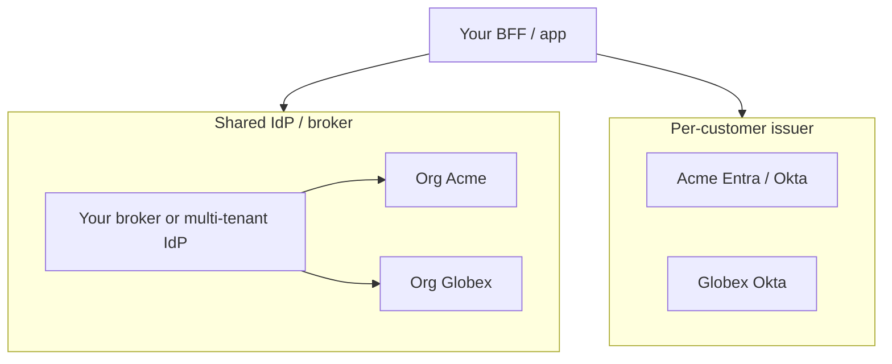
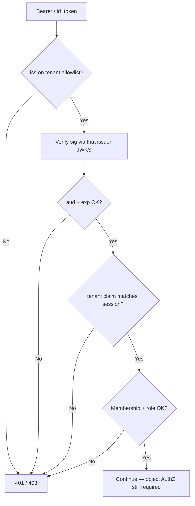

# Multi-Tenant OIDC and B2B SSO

B2B SaaS(Software as a Service) auth is more than putting `tenant_id` in a JWT(JSON Web Token). You must **resolve which customer org** the user is signing into, **route them to the right IdP**, and **bind every token and session to that tenant** so Acme never accepts Globex’s issuer or claims.

> **Scope:** Tenant resolution, IdP topology (shared vs per-customer issuer), authorize routing (`login_hint` / domain hints), multi-issuer validation, per-tenant clients, membership + tenant switch. End-to-end SSO(Single Sign-On) sequence → [§2b](02B-sso-integration-playbook.md). OIDC(OpenID Connect) discovery / ID tokens → [§2](02-oidc-discovery-and-tokens.md). Token validation → [§3](03-token-lifecycle-and-validation.md). API(Application Programming Interface)/data isolation → [api-design §16](../../api-design-and-protection/includes/16-multi-tenant-apis.md). Pool vs silo deployment → [architecture §10](../../architecture-decisions/includes/10-multi-tenant-system-models.md). JML(Joiner-Mover-Leaver) / SCIM(System for Cross-domain Identity Management) → [api-design §12C](../../api-design-and-protection/includes/12C-scim-and-jml-provisioning.md). AD(Active Directory)/IdP context → [§12A](../../api-design-and-protection/includes/12A-identity-active-directory.md).

> **Related:** SSO playbook → [§2b](02B-sso-integration-playbook.md) · SAML(Security Assertion Markup Language) bridge → [§2c](02C-saml-protocol.md) · Logout / step-up → [§2a](02A-oidc-logout-and-step-up.md) · Scopes / admin consent → [§1b](01B-scopes-and-consent.md) · Groups→roles → [api-design §12](../../api-design-and-protection/includes/12-identity-rbac-iam-ad.md)

---

## At a glance

| Concern | Practice |
|---------|----------|
| **Tenant resolution** | Subdomain, path, email domain, or org picker — before `/authorize` |
| **IdP routing** | Map `tenant_id` → issuer / discovery URL / SAML entity — never take issuer/config from the client alone |
| **Token binding** | Access token carries `tenant_id` / `org_id`; `iss` must be on that tenant’s allowlist |
| **Identity key** | Local user via `(iss, sub)` + **membership** rows (user ↔ tenants) |
| **Client config** | Per-tenant redirect URI / `client_id` when customers bring their own IdP |
| **Data plane** | Claim binding + object AuthZ — [api-design §16](../../api-design-and-protection/includes/16-multi-tenant-apis.md) |

**Rule of thumb:** Resolve tenant **first**, authenticate **second**, authorize **third**. A valid Google ID token is not a ticket into Acme Corp.

---

## Tenant vs user vs IdP

| Concept | Meaning | Example |
|---------|---------|---------|
| **Tenant** | Customer org on your product | Acme workspace |
| **User** | Person (may belong to many tenants) | `alice@acme.com` |
| **IdP / issuer** | Who authenticated them this login | `https://login.microsoftonline.com/{tid}/v2.0` |
| **Membership** | User has a role inside a tenant | Alice = admin @ Acme |

Alice can be in Acme (enterprise SSO) and a personal workspace (password/social). The **session** must record **which tenant is active**, not only who Alice is.

---

## IdP topology



| Topology | How it works | Fit |
|----------|--------------|-----|
| **Shared IdP + orgs** | One issuer; `org_id` / custom claim selects tenant | SMB, social + light B2B |
| **Broker** | Customer SAML/OIDC → your broker → OIDC to apps | Many enterprise customers; one protocol in eng — [§2b](02B-sso-integration-playbook.md) |
| **Per-tenant issuer** | Each customer has own `iss` + JWKS(JSON Web Key Set) | Strict federation; you maintain an issuer allowlist per tenant |
| **Hybrid** | Default shared IdP; enterprise tier gets BYO IdP | Common SaaS progression |

Prefer **broker → OIDC to your apps** when you have dozens of customer IdPs. Native per-tenant federation without a broker scales poorly in ops.

---

## Tenant resolution (before authorize)

Pick an explicit strategy; mix carefully.

| Signal | Pros | Cons / risks |
|--------|------|--------------|
| **Subdomain** `acme.app.com` | Clear UX; easy cookie host | Subdomain takeover if DNS(Domain Name System) not locked; vanity domain ops |
| **Path** `/t/acme/...` | Simple routing | Easy to forge in links — still resolve server-side |
| **Email domain** (home-realm discovery) | Familiar enterprise UX | Shared domains (`gmail.com`) must not map to a tenant; collisions need picker |
| **Org picker** after AuthN | Safe when domain is ambiguous | Extra step; user may pick wrong org |
| **Invite / magic link** | Strong binding to tenant | Token hygiene — [§5b](05B-signup-verify-and-magic-links.md) |

### Home-realm discovery (HRD)

1. Collect work email (or slug)
2. Look up verified domain → `tenant_id` + IdP config
3. If **zero** matches → consumer signup / password / social (policy)
4. If **one** match → redirect to that IdP
5. If **many** → org picker (user confirms)

Never auto-join a user to a tenant solely because their email domain matches an unverified claim.

---

## Authorize routing

Once `tenant_id` is known, build `/authorize` against **that tenant’s** authorization server (or broker org).

```mermaid
sequenceDiagram
    participant U as User
    participant App as Your BFF
    participant Dir as Tenant directory
    participant IdP as Tenant IdP / broker

    U->>App: Open acme.app.com (or enter work email)
    App->>Dir: Resolve tenant + IdP config
    Dir->>App: tenant_id, issuer, client_id, hints
    App->>App: Store tenant_id + state (+ PKCE)
    App->>IdP: /authorize (OIDC + PKCE + hints)
    IdP->>App: ?code&state
    App->>App: state.tenant_id must match session intent
    App->>IdP: POST /token
    IdP->>App: id_token + access_token
    App->>App: Verify iss against tenant allowlist; bind membership
    App->>U: Session cookie with active tenant_id
```

| Parameter / practice | Use |
|----------------------|-----|
| **`state` (and server session)** | Bind `tenant_id` (and `code_verifier`) so the callback cannot switch orgs |
| **`login_hint`** | Prefill email at IdP |
| **`domain_hint` / `hd` / `organization`** | Vendor-specific IdP routing (Entra, Google Workspace, Auth0 org, …) — treat as UX, not AuthZ |
| **`prompt=login` / `select_account`** | Avoid wrong SSO cookie when user has multiple IdP sessions |
| **Exact `redirect_uri`** | Allowlisted per client; per-tenant clients when BYO IdP |

PKCE(Proof Key for Code Exchange) and `state` remain mandatory — [§1](01-oauth2-grants-and-flows.md).

---

## Multi-issuer token validation

Resource servers and BFFs that accept many customer issuers need an **allowlist**, not “any valid JWT.”

| Check | Rule |
|-------|------|
| **`iss`** | Exact match to the **active tenant’s** configured issuer(s) |
| **JWKS** | Fetch/cache per issuer; unknown `kid` → refresh that issuer’s JWKS only |
| **`aud`** | Your API / client — [§1d](01D-resource-indicators.md), [§2](02-oidc-discovery-and-tokens.md) |
| **`tenant_id` / `org_id` claim** | Must equal active tenant (or mapped external org id) |
| **Membership** | `(iss, sub)` is a member of that tenant with required role |
| **Clock / alg** | Same as [§3](03-token-lifecycle-and-validation.md) — reject `none`, unexpected HS* for public clients |



**Do not** accept a token whose `iss` is valid for tenant B while the URL or session says tenant A.

If you mint **your own** access tokens after IdP login (BFF pattern), validate the IdP ID token once at login, then issue first-party tokens that already embed `tenant_id` — simpler than pushing every customer JWKS to every microservice.

---

## Client registration patterns

| Pattern | When | Notes |
|---------|------|-------|
| **One app client + org claim** | Shared / broker IdP | Simpler secrets; org chosen via HRD or IdP org feature |
| **Per-tenant OIDC client** | BYO IdP | Separate `client_id` / secret or private_key_jwt; redirect URIs per customer |
| **SAML SP per tenant** | Customer-only SAML | Prefer broker — [§2c](02C-saml-protocol.md) |
| **Admin consent** | Enterprise app install | Tenant admin grants org-wide — [§1b](01B-scopes-and-consent.md) |

Store IdP metadata (issuer, JWKS URI, client auth, claim maps) in a **tenant auth config** table. Rotate secrets like any credential — [enterprise-security §5](../../enterprise-security-compliance/includes/05-secrets-beyond-database.md).

---

## Membership, linking, and tenant switch

| Topic | Practice |
|-------|----------|
| **First enterprise login** | JIT(Just-In-Time) create user + membership **or** require prior SCIM provision — [§12C](../../api-design-and-protection/includes/12C-scim-and-jml-provisioning.md) |
| **Stable key** | Link IdP identity as `(iss, sub)` — [§2b](02B-sso-integration-playbook.md) |
| **Multi-tenant users** | Membership table: `(user_id, tenant_id, role)`; session holds `active_tenant_id` |
| **Tenant switch** | New session binding (or step-up); re-issue access/refresh with new `tenant_id`; do not only change a client-side header |
| **Social into enterprise tenant** | Deny by default unless invite + verified email + admin policy |
| **Offboarding** | SCIM/JML disable membership + revoke sessions — [§3b](03B-revoke-logout-denylist.md), [§12C](../../api-design-and-protection/includes/12C-scim-and-jml-provisioning.md) |

```text
users(id, ...)
identities(user_id, iss, sub, ...)          -- §2b linking
tenants(id, slug, ...)
tenant_idp_configs(tenant_id, issuer, ...) -- this section
memberships(user_id, tenant_id, role, ...)
sessions(sid, user_id, active_tenant_id, ...)
```

---

## Enterprise admin consent and provisioning

| Concern | Guidance |
|---------|----------|
| **Admin consent** | Customer IT grants the app to their tenant; users may skip per-user consent — [§1b](01B-scopes-and-consent.md) |
| **SCIM** | Push users/groups from IdP; treat as source of truth for membership when enabled — [§12C](../../api-design-and-protection/includes/12C-scim-and-jml-provisioning.md) |
| **JIT only** | Fine for SMB; weak for regulated offboarding unless paired with short sessions + IdP session checks |
| **Group → role** | Map in **your** tables; don’t grant global admin from a single IdP group claim alone — [§12](../../api-design-and-protection/includes/12-identity-rbac-iam-ad.md) |

---

## Integration checklist

- [ ] Tenant resolved before `/authorize`; bound into `state` / server login session
- [ ] Each tenant has explicit IdP config (issuer, JWKS, client, claim map) or uses shared-broker org
- [ ] Callback rejects `iss` / tenant mismatch; no client-supplied `tenant_id` as sole trust
- [ ] Access/session carries `active_tenant_id`; APIs enforce claim + object AuthZ — [§16](../../api-design-and-protection/includes/16-multi-tenant-apis.md)
- [ ] Multi-issuer: per-issuer JWKS cache; allowlist per tenant
- [ ] Membership model supports multi-org users; switch re-binds tokens
- [ ] Enterprise offboarding: SCIM/JML + revoke — [§3b](03B-revoke-logout-denylist.md), [§12C](../../api-design-and-protection/includes/12C-scim-and-jml-provisioning.md)
- [ ] Vanity/subdomain tenants: DNS and cookie host hardened
- [ ] Tests: wrong-issuer, cross-tenant claim, domain collision — [§5a](05A-auth-testing-checklist.md)

---

## Common mistakes

| Mistake | Why it hurts | Fix |
|---------|--------------|-----|
| Trust `tenant_id` from request body / query | Cross-tenant BOLA(Broken Object-Level Authorization) | Derive from session / signed token only |
| One global JWKS for all customers | Accept forged or wrong-tenant tokens | Per-issuer JWKS + tenant allowlist |
| Email domain → tenant without verification | Account takeover via lookalike domains | Verified domains + picker on ambiguity |
| Social login opens enterprise tenant | Bypass customer IdP / MFA(Multi-Factor Authentication) policy | Invite + policy; prefer enterprise IdP only |
| Tenant switch = change header only | Stale Bearer still scoped to old org | Re-issue tokens / rotate session |
| Same `redirect_uri` wildcards for all BYO IdPs | Open redirect / mix-ups | Exact allowlist per client |
| Assuming IdP `tid` claim == your `tenant_id` | External ids differ | Explicit mapping table |

---

## Pros and cons

| Approach | Pros | Cons |
|----------|------|------|
| Shared IdP + org claim | Fast to ship | Weaker customer IdP control |
| Broker + OIDC to apps | One eng protocol; many IdPs | Broker cost/ops |
| Native per-tenant issuer | Direct trust with customer IT | JWKS/allowlist complexity |
| Subdomain per tenant | Clear isolation UX | DNS/cookie/cert ops |

**Bottom line:** Resolve tenant before AuthN; allowlist `iss` per tenant; bind membership and `active_tenant_id` in the session; keep API isolation in [§16](../../api-design-and-protection/includes/16-multi-tenant-apis.md). Federation without tenant binding is just a login form with extra steps.