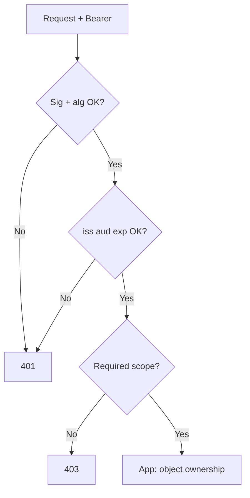

# Token Lifecycle and Validation

Access tokens should be **short-lived and verifiable**. Refresh tokens should be **rotating and detectable when stolen**. This section is the operational playbook for both authorization servers and resource servers (API(Application Programming Interface) gateways).

> **Scope:** Validation, TTL, refresh rotation, revocation overview, JWKS(JSON Web Key Set) rotation. Lifetimes matrix → [§3d](03D-lifetimes-and-sliding-sessions.md). Force logout / denylist ops playbook → [§3b](03B-revoke-logout-denylist.md). Client-untrusted / anti-tamper framing → [§3a](03A-token-cookie-integrity.md). Grant flows → [§1](01-oauth2-grants-and-flows.md). OIDC(OpenID Connect) ID token checks → [§2](02-oidc-discovery-and-tokens.md). Stateless scaling → [api-design §11A](../../api-design-and-protection/includes/11A-stateless-auth-operations.md). Signing-key secrets → [enterprise-security §5](../../enterprise-security-compliance/includes/05-secrets-beyond-database.md).

> **Related:** Lifetimes / sliding → [§3d](03D-lifetimes-and-sliding-sessions.md) · Revoke / force logout → [§3b](03B-revoke-logout-denylist.md) · Redis key patterns → [§3c](03C-denylist-redis-patterns.md) · Integrity threat model → [§3a Token and cookie integrity](03A-token-cookie-integrity.md) · Cookie session store → [§4](04-cookie-session-and-csrf.md)

---

## At a glance

| Token | Typical TTL | Store where | Revoke how |
|-------|-------------|-------------|------------|
| **Access (JWT(JSON Web Token))** | 5–15 minutes | Memory / short cache only | Wait for expiry, or denylist `jti` |
| **Access (opaque)** | 5–15 minutes | AS introspection or cache | Delete at AS |
| **Refresh** | Hours–days (bound to session) | Server / HTTP(Hypertext Transfer Protocol)-only cookie | Rotate + family revoke |
| **ID token** | Minutes (one login event) | Don't persist long | N/A — re-auth for new identity proof |

**Rule of thumb:** If you need instant global logout, you need a **session or refresh store** (or very short access TTL). Pure unsigned-expiry JWTs alone cannot be "deleted."

---

## Resource-server validation checklist (access JWT)

Run at the gateway or shared middleware:

1. **Signature** — resolve `kid` via JWKS; verify with expected alg (RS256/ES256)
2. **`exp` / `nbf` / `iat`** — reject expired; allow ~30–60s skew
3. **`iss`** — exact allowlist
4. **`aud`** — must include this API(Application Programming Interface)'s audience (resource indicator) — [§1d](01D-resource-indicators.md)
5. **`scope` / roles** — coarse gate (e.g. `orders:read`)
6. Optional **`jti` denylist** — for emergency revoke within TTL
7. Forward identity headers to the app (`X-User-Id`, `X-Tenant-Id`, scopes) — app still does object-level AuthZ



Never trust claims that the client could have forged — only trust after signature + issuer checks. Full anti-tamper framing (JWT vs opaque vs session cookie) → [§3a](03A-token-cookie-integrity.md).

---

## Opaque tokens and introspection

| Approach | When |
|----------|------|
| **JWT locally validated** | High QPS; accept eventual revoke via short TTL |
| **Opaque + introspection** | Need central revoke; lower QPS or cached introspection |
| **Hybrid** | JWT access + server-side refresh/session for logout |

Cache introspection results for a few seconds keyed by token hash; fail closed on AS outage for privileged APIs (or fail open only for low-risk reads with explicit policy).

---

## Refresh token rotation

```mermaid
sequenceDiagram
    participant C as Client
    participant AS as Authorization Server

    C->>AS: refresh_token=R1
    AS->>AS: Mark R1 used; issue R2 + access
    AS->>C: refresh_token=R2, access_token=A2

    Note over AS: Attacker later replays R1
    C->>AS: refresh_token=R1 (reuse)
    AS->>AS: Detect reuse → revoke family R1/R2/...
    AS->>C: invalid_grant
```

| Control | Detail |
|---------|--------|
| **One-time refresh** | Each refresh invalidates the previous |
| **Family / session id** | All tokens from one login share an id; reuse revokes all |
| **Sender-constrained** (advanced) | DPoP(Demonstration of Proof-of-Possession) or mTLS(Mutual Transport Layer Security)-bound tokens reduce bearer theft |
| **Idle vs absolute timeout** | e.g. idle 7d, absolute 30d — force re-auth |

---

## Revocation and logout

| Goal | Mechanism |
|------|-----------|
| User clicks logout | Revoke refresh + destroy server session; clear cookies |
| Admin disables user | Mark principal disabled; revoke refresh families; short access TTL drains |
| Suspected theft | Revoke family; rotate client secrets if confidential client leaked |
| Key compromise | Rotate signing keys; reject old `kid` after grace — [enterprise-security §5](../../enterprise-security-compliance/includes/05-secrets-beyond-database.md) |

RP-initiated logout (OIDC `end_session_endpoint`) clears the IdP SSO(Single Sign-On) session when you need cross-app logout.

**Full playbook** (validate vs invalidate, logout-all, denylist stores) → [§3b](03B-revoke-logout-denylist.md).

---

## JWKS and signing-key rotation

| Practice | Detail |
|----------|--------|
| Publish multiple keys | Old + new `kid` during overlap |
| Prefer asymmetric | RS256/ES256 — resource servers only need public JWKS |
| Overlap window | Hours–days; then remove old key |
| Monitor | Spike in `401 invalid_token` after rotations |
| Never | Embed long-lived symmetric secrets in every microservice config if JWKS works |

---

## Recommended lifetimes (starting point)

| Client | Access | Refresh | Notes |
|--------|--------|---------|-------|
| First-party web (BFF session) | 5–10 min (or session cookie only) | Session 8–12h idle / 7–30d absolute | Prefer server session — [§4](04-cookie-session-and-csrf.md) |
| SPA / mobile | 5–15 min | 7–30d with rotation | Secure storage / BFF(Backend for Frontend) |
| Service (client credentials) | 5–15 min | None | Re-auth with secret/assertion |
| High-privilege admin | 5 min + step-up MFA(Multi-Factor Authentication) | Short absolute | Re-auth for destructive actions |

---

## Common mistakes

| Mistake | Why it hurts | Fix |
|---------|---------------|-----|
| Multi-day access JWTs | Stolen token stays valid forever (practically) | Minutes-level TTL |
| Refresh without rotation | Stolen refresh is silently reusable | Rotate + reuse detection |
| Only checking signature | Wrong `aud` / `iss` still accepted | Full claim checklist |
| Denylist as only scale story | Hot key / Redis dependency for every request | Short TTL first; denylist for emergencies |
| Logging full tokens | Credential leak via logs | Log `jti` / subject only — [enterprise-security §6](../../enterprise-security-compliance/includes/06-audit-logging-and-retention.md) |
| Clock skew ignored | Intermittent 401s across regions | NTP + explicit skew window |

---

## Pros and cons

| Approach | Pros | Cons |
|----------|------|------|
| Short JWT + no denylist | Simple, fast, scales | Logout not instant |
| JWT + `jti` denylist | Emergency revoke | Extra infra; must bound denylist TTL |
| Opaque + introspection | Central control | Latency; AS becomes hotspot |
| BFF server session | Instant logout; CSRF(Cross-Site Request Forgery)-aware cookies | Session store required — [§4](04-cookie-session-and-csrf.md) |