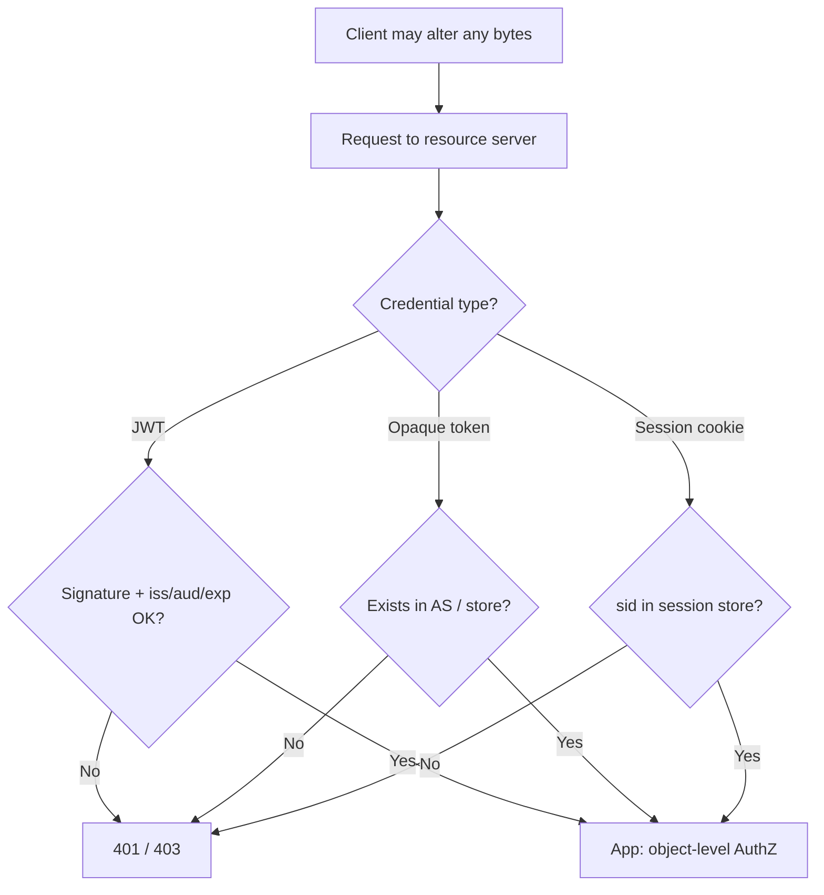

# Token and Cookie Integrity (Anti-Tampering)

The client (browser, mobile app, partner script) is **untrusted**. You cannot stop it from changing bytes before they reach the resource server. Protection means the server **detects tampering and rejects** the request — via cryptographic integrity or a server-side lookup.

> **Scope:** Threat model and per-credential integrity. Validation checklist and refresh rotation → [§3](03-token-lifecycle-and-validation.md). Cookie flags, session store, CSRF(Cross-Site Request Forgery) → [§4](04-cookie-session-and-csrf.md). Browser UX → [fullstack §7](../../fullstack-bff-and-clients/includes/07-auth-ux.md).

> **Related:** JWT(JSON Web Token) signing keys → [enterprise-security §5](../../enterprise-security-compliance/includes/05-secrets-beyond-database.md) · Object-level AuthZ(Authorization) after AuthN(Authentication) → [api-design §4](../../api-design-and-protection/includes/04-auth-model.md)

---

## Rule of thumb

**Integrity ≠ secrecy ≠ binding.**

| Goal | Mechanism |
|------|-----------|
| **Integrity** (detect modification) | Signature (JWT) or opaque random id + server lookup |
| **Secrecy** (harder to steal) | HttpOnly cookies, memory-only access tokens, no `localStorage` refresh |
| **Binding** (stolen token harder to replay elsewhere) | Short TTL(Time To Live), refresh rotation, DPoP(Demonstration of Proof-of-Possession) / mTLS(Mutual Transport Layer Security) |

HttpOnly stops JavaScript from *reading* a cookie; it does **not** stop modification or replay. CSRF defenses stop *other sites* from using the cookie; they do not prove the cookie value was untampered.

---

## At a glance — if the client changes it

| What client holds | If modified before send | How server detects |
|-------------------|-------------------------|-------------------|
| **JWT access token** | Claims edited (`sub`, roles, `exp`) | Signature verification fails → `401` |
| **Opaque access token** | Bits flipped | Introspection / store miss → `401` |
| **Refresh token** (opaque) | Bits flipped | Lookup miss; or reuse of rotated token → revoke family |
| **Session cookie (`sid`)** | Different id | No row in Redis/DB → unauthenticated |
| **Unsigned cookie with `role=admin`** | Attacker sets admin | **Design bug** — never put AuthZ in forgeable client data |



---

## Access token

### JWT

1. Authorization server signs with a private key (RS256 / ES256).
2. Resource server loads public keys from JWKS(JSON Web Key Set), verifies signature, then checks `iss`, `aud`, `exp` (full list → [§3](03-token-lifecycle-and-validation.md#resource-server-validation-checklist-access-jwt)).
3. Changing any signed claim breaks the signature.

Reject `alg=none` and algorithm confusion (e.g. accepting HS256 when you expected RS256).

### Opaque

High-entropy random string. Server resolves it via introspection or a token store. Modification produces a string that does not exist — same outcome as an invalid JWT, without local crypto.

---

## Refresh token

| Practice | Why |
|----------|-----|
| Prefer **opaque** server-side records (store hash of token) | No useful claims to edit; edit → invalid |
| **Rotate** on every use; detect reuse | Stolen copy becomes a revocation signal — [§3](03-token-lifecycle-and-validation.md#refresh-token-rotation) |
| Store in **HttpOnly** cookie (BFF) or platform secure storage | Reduces XSS(Cross-Site Scripting) theft — not integrity |
| Never `localStorage` | XSS can read *and* exfiltrate |

---

## Cookies and sessions

Put only a **random session id** in the cookie. Keep `user_id`, roles, tenant, and privileges in the **server session store**.

```text
Cookie: __Host-session=<random sid>
Store:  sid → { user_id, roles, exp, csrf_secret }
```

| Control | What it actually does |
|---------|----------------------|
| **HttpOnly + Secure + SameSite** | Harder to steal / misuse cross-site; **not** cryptographic integrity of the value |
| **Server session store** | Real identity and AuthZ; forged or random `sid` without a store row does nothing |
| **CSRF token** | Blocks cross-site *use* of a valid cookie |
| **Rotate `sid` on login** | Defeats session fixation |
| **Signed cookie frameworks** (e.g. HMAC(Hash-based Message Authentication Code) of payload) | Integrity of cookie *blob* — still prefer opaque `sid` + store for AuthZ |

Full cookie checklist → [§4](04-cookie-session-and-csrf.md).

---

## Beyond integrity: stolen-token replay

Tamper detection does not stop an attacker who steals a **valid** token and replays it unchanged.

| Control | Effect |
|---------|--------|
| Short access TTL (5–15 min) | Shrinks replay window |
| Refresh rotation + family revoke | Limits long-lived theft |
| HTTPS / TLS(Transport Layer Security) | Stops network MITM rewriting in transit |
| **DPoP** or **mTLS**-bound tokens | Sender-constrained — bearer alone is not enough |

### DPoP (advanced, short)

**DPoP(Demonstration of Proof-of-Possession)** binds an access token to a client-held key: the client sends a signed DPoP proof HTTP(Hypertext Transfer Protocol) header on each API(Application Programming Interface) call. A stolen Bearer without the private key is rejected.

| Use when | Skip when |
|----------|-----------|
| Public clients (SPA/mobile) with high bearer-theft risk | First-party BFF(Backend for Frontend) session already avoids exposing refresh to JS |
| Regulated APIs requiring proof-of-possession | Team cannot operate client key lifecycle yet |

Prefer short TTL + refresh rotation first; add DPoP when bearer exfiltration is a top residual risk. Pair with mTLS for confidential service clients instead of DPoP when possible.

Also: logout / admin disable → revoke refresh + sessions; access JWT drains with TTL or denylist — [§3b](03B-revoke-logout-denylist.md).

---

## Common mistakes

| Mistake | Why it hurts | Fix |
|---------|---------------|-----|
| "HttpOnly prevents clients from modifying the session" | Client never needed to read it to send a different cookie | Opaque `sid` + server store |
| "We use JWT so CSRF doesn't matter" | JWT *in a cookie* is still auto-sent | CSRF or don't use cookies — [§4](04-cookie-session-and-csrf.md) |
| Trusting `X-User-Id` / roles from client headers | Trivial privilege escalation | Derive identity only from verified token/session |
| Roles in an unsigned or weakly signed cookie | Attacker edits `admin=true` | Server-side session or signed JWT with full validation |
| Only checking JWT signature | Wrong `aud` / `iss` still accepted | Full claim checklist — [§3](03-token-lifecycle-and-validation.md) |
| Assuming TLS stops client-side edits | TLS protects the wire, not the endpoint | Integrity/lookup at the resource server |

---

## Pros and cons

| Approach | Pros | Cons |
|----------|------|------|
| Signed JWT access | Local verify; clear integrity story | Claims visible; revoke harder without short TTL |
| Opaque token / session `sid` | Nothing useful to edit; central revoke | Lookup latency; store dependency |
| DPoP / mTLS binding | Strong against pure bearer theft | More client and gateway complexity |

**Bottom line:** assume every credential can be altered in transit from the client's perspective; design so **altered credentials fail closed**, and **AuthZ never lives in forgeable client fields**.