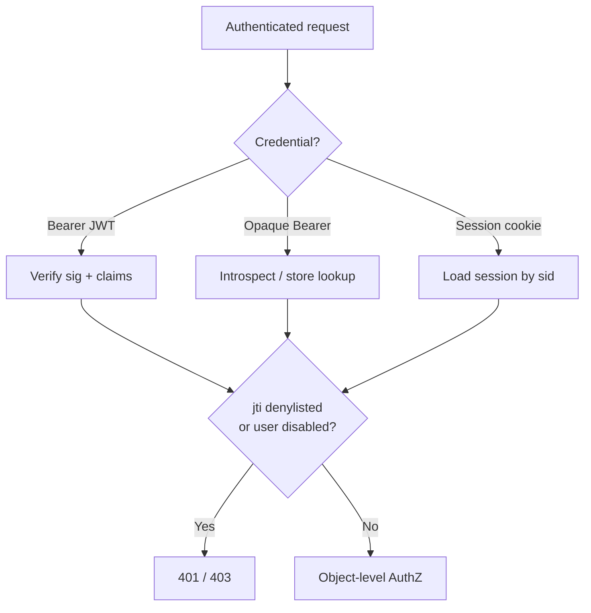
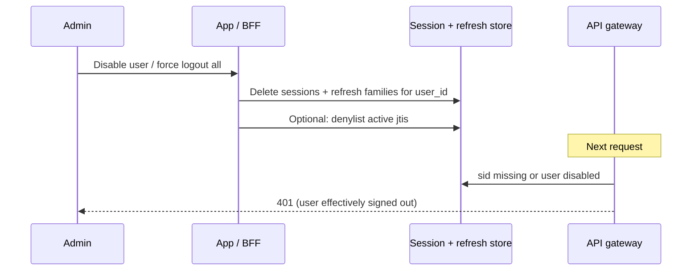

# Revoke, Force Logout, and Denylist

How to **validate** credentials on each request, **invalidate** them on logout or compromise, **force sign-out** (one device or all), and when to use a **denylist** vs deleting a session/refresh.

> **Scope:** Operational revoke/logout playbook. Token TTL(Time To Live) and validation checklist → [§3](03-token-lifecycle-and-validation.md). Integrity (tamper detect) → [§3a](03A-token-cookie-integrity.md). Concurrent devices / logout-others UX → [§3e](03E-concurrent-sessions-and-devices.md). Cookie flags and session store shape → [§4](04-cookie-session-and-csrf.md). Browser logout UX → [fullstack §7](../../fullstack-bff-and-clients/includes/07-auth-ux.md).

> **Related:** Disabled principals / JML(Joiner-Mover-Leaver) / SCIM(System for Cross-domain Identity Management) → [api-design §12C](../../api-design-and-protection/includes/12C-scim-and-jml-provisioning.md) · AD(Active Directory)/IdP(Identity Provider) context → [§12A](../../api-design-and-protection/includes/12A-identity-active-directory.md) · Audit without logging secrets → [enterprise-security §6](../../enterprise-security-compliance/includes/06-audit-logging-and-retention.md) · Device inventory UX → [§3e](03E-concurrent-sessions-and-devices.md)

---

## Rule of thumb

| Need | Prefer |
|------|--------|
| **Instant logout** | Delete server **session** and/or **refresh**; clear cookie |
| **Scale with rare revoke** | Short access JWT(JSON Web Token) (5–15 min); denylist only for emergencies |
| **Ban account** | Mark user **disabled** + revoke all sessions and refresh families |

A signed access JWT cannot be “deleted.” Instant kill needs a **session/refresh store**, **opaque introspection**, or a **`jti` denylist** until `exp`.

---

## Validate (accept the request?)

| Credential | How you validate |
|------------|------------------|
| **Access JWT** | Signature (JWKS(JSON Web Key Set)) + `iss` / `aud` / `exp` + scopes; optional `jti` denylist — [§3](03-token-lifecycle-and-validation.md) |
| **Opaque access** | Introspect or look up in token store; reject if missing/revoked |
| **Refresh** | Server lookup; must exist, not revoked, not already rotated away |
| **Session cookie** | Read `sid` → load session from Redis/DB; check idle/absolute expiry |
| **Session (server row)** | Exists, not revoked; principal not disabled |

The cookie value is not authority — the **session store row** (or verified token) is.

---

## Invalidate (make it stop working)

| What | How to invalidate |
|------|-------------------|
| **Access JWT** | Wait for `exp` **or** add `jti` to denylist with TTL = remaining lifetime |
| **Opaque access** | Delete or mark revoked at the authorization server |
| **Refresh** | Delete token; on theft/reuse revoke the whole **family** — [§3](03-token-lifecycle-and-validation.md#refresh-token-rotation) |
| **Session cookie** | `Set-Cookie` clear (Max-Age=0, matching Path/Domain) **and** delete `sid` in store |
| **Session** | `DEL session:{sid}`; logout-all → delete all sids indexed by `user_id` |

Clearing the cookie without deleting the store leaves a stolen `sid` usable until expiry.

---

## Force sign-out

### This device

1. Revoke that refresh family (if any)
2. Delete `session:{sid}`
3. Clear HttpOnly session/refresh cookie
4. Client drops in-memory access token
5. Access JWT: drain via TTL or denylist this `jti` if you need immediate API(Application Programming Interface) cut-off

### All devices (“logout everywhere”)

1. Query sessions / refresh families by `user_id`
2. Delete all of them
3. Clear this browser’s cookie (other devices lose store rows on next request)
4. Optional: OIDC(OpenID Connect) `end_session_endpoint` (+ back-channel for multi-app) — [§2a](02A-oidc-logout-and-step-up.md)

### Admin kick / ban

1. Mark principal **disabled** (app DB and/or IdP)
2. Revoke all refresh families + sessions for that user
3. Short access TTL drains remaining JWTs; optionally denylist known `jti`s or check `disabled` on every request
4. Block new logins at the authorization server / login API(Application Programming Interface)

Also revoke everything after password reset / MFA(Multi-Factor Authentication) reset — [§5](05-login-security-playbook.md).

---

## Denylist / blocklists — what to put where

Prefer precise stores over one vague “blacklist”:

| Block target | Store | Checked on |
|--------------|-------|------------|
| **User / principal** | `users.status = disabled` (or IdP disable) | Login + authenticated requests (or at token issue) |
| **Access JWT `jti`** | Redis denylist; TTL = time left until `exp` | Gateway before accepting Bearer |
| **Refresh / family id** | AS revoke table | `/token` refresh grant |
| **Session `sid`** | Delete row (or `revoked_at`) | Every cookie-authenticated request |
| **Cookie string itself** | Don’t long-term blacklist | Useless once `sid` is gone |

### When to use a `jti` denylist

| Use | Skip |
|-----|------|
| Compromised access JWT still within TTL | As the *only* logout mechanism at scale |
| Emergency “kill this token now” | Multi-day access tokens (fix TTL instead) |
| Privileged admin sessions | Without bounding denylist TTL to `exp` |

**Denylist hygiene:** key = `deny:jti:{jti}`, value = reason code, TTL = remaining token life so Redis does not grow forever.

**Redis key cookbook** (basic + advanced examples) → [§3c](03C-denylist-redis-patterns.md).

---

## Recommended stacks

| Product shape | Logout / revoke design |
|---------------|------------------------|
| **First-party web (BFF)** | Server session is source of truth; logout = delete `sid` + clear cookie; access JWT optional/internal |
| **SPA / mobile** | Rotating refresh in HttpOnly or secure storage; logout = revoke family; access JWT short TTL |
| **High QPS public API** | JWT validate locally; accept ≤15 min revoke lag **or** hybrid session for interactive users |
| **Regulated / instant revoke** | Opaque access + introspection, or JWT + denylist + disabled-user check |

---

## Priority checklist

- [ ] Logout deletes **server** session/refresh, not only the browser cookie
- [ ] Logout-all indexed by `user_id`
- [ ] Access JWT TTL short enough that “wait for expiry” is acceptable — or denylist/`disabled` check exists
- [ ] Refresh rotation + reuse → family revoke
- [ ] Disabled users cannot refresh or create new sessions
- [ ] Denylist entries expire with token `exp` — Redis shapes → [§3c](03C-denylist-redis-patterns.md)
- [ ] Auth revoke events audited without logging raw tokens — [enterprise-security §6](../../enterprise-security-compliance/includes/06-audit-logging-and-retention.md)

---

## Common mistakes

| Mistake | Why it hurts | Fix |
|---------|---------------|-----|
| Only `Set-Cookie` clear on logout | Stolen `sid` still works | Delete session store row |
| Multi-day access JWT + “we’ll blacklist later” | Huge replay window; denylist hot | Short TTL first |
| Denylist without TTL | Unbounded Redis growth | TTL = remaining `exp` |
| Ban user but leave refresh valid | Attacker refreshes forever | Disable + revoke families |
| Checking disabled only at login | Already-issued tokens keep working | Check on refresh and/or every request |
| Logging full tokens on revoke | Credential leak | Log `jti` / `user_id` / family id only |

---

## Pros and cons

| Approach | Pros | Cons |
|----------|------|------|
| Session/refresh delete | Instant, simple mental model | Needs shared store |
| Short JWT, no denylist | Fast, scales | Logout lag up to TTL |
| JWT + `jti` denylist | Emergency instant revoke | Extra hop; ops discipline on TTL |
| Opaque + introspection | Central control | AS latency / availability |
| User `disabled` flag | Account-level ban | Must be consulted on hot path or at refresh |

**Bottom line:** validate with crypto or store lookup; invalidate by **deleting server state**; force logout by clearing **sessions + refresh**; use **denylist** as a surgical tool for still-living access JWTs — not as your primary session design.