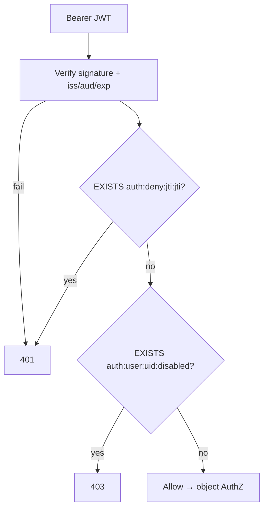

# Denylist Redis Patterns

Concrete **Redis key shapes** for denylist / revoke checks that complement the policy in [§3b](03B-revoke-logout-denylist.md). Prefer precise keys (`jti`, `sid`, `user`, `family`) over one eternal “blacklist” set.

> **Scope:** Redis key design, TTL(Time To Live) rules, basic and advanced patterns, gateway check order. Revoke/logout policy → [§3b](03B-revoke-logout-denylist.md). JWT(JSON Web Token) validation → [§3](03-token-lifecycle-and-validation.md). Session store shape → [§4](04-cookie-session-and-csrf.md).

> **Related:** Secrets not in Redis plaintext → [enterprise-security §5](../../enterprise-security-compliance/includes/05-secrets-beyond-database.md)

---

## Rule of thumb

| Do | Don't |
|----|-------|
| TTL every deny key to the credential’s remaining life | Grow an unbounded `SADD blacklist *` forever |
| Store **ids** (`jti`, `sid`, `user_id`, family id) | Store raw access/refresh tokens as keys |
| Check denylist **after** signature / session load | Treat Redis as the only AuthN(Authentication) |
| Prefer **delete session/refresh** for normal logout | Put every logout on a `jti` denylist at high QPS |

---

## Basic key catalog

Assume a key prefix `auth:` (or `{tenant}:auth:` in multi-tenant Redis).

| Purpose | Key | Value | TTL |
|---------|-----|-------|-----|
| Deny access JWT | `auth:deny:jti:{jti}` | reason code (`logout`, `theft`, `admin`) | `exp - now` (seconds) |
| Session exists | `auth:sess:{sid}` | JSON/hash: `user_id`, `exp`, … | idle or absolute remaining |
| User disabled | `auth:user:{user_id}:disabled` | `1` or reason | long / until re-enabled (or no TTL + explicit DEL) |
| Refresh revoked | `auth:deny:rt:{token_hash}` | `1` | refresh absolute remaining |
| Refresh family revoke | `auth:deny:fam:{family_id}` | `1` | family absolute remaining |

```text
# Deny a JWT for the rest of its life
SET auth:deny:jti:01HZX... theft EX 847   # 847s until access token exp

# Normal logout — delete session (preferred over denylisting the cookie)
DEL auth:sess:a1b2c3d4

# Ban user (checked on login + optionally every request)
SET auth:user:u_42:disabled 1
```

### Gateway check order (Bearer JWT)



### BFF check order (session cookie)

```text
1. Read cookie sid
2. HGETALL / GET auth:sess:{sid}  → miss = 401
3. If user disabled → 401/403 + DEL session
4. Optionally slide idle TTL (see lifetimes section suggestion)
```

---

## Basic examples (copy-ready)

### 1. Emergency revoke one access token

```bash
# After validating JWT locally, you know jti and exp
TTL=$((EXP_UNIX - $(date +%s)))
redis-cli SET "auth:deny:jti:${JTI}" "theft" EX ${TTL}
```

```text
Gateway:
  if redis.exists(f"auth:deny:jti:{jti}"): return 401
```

### 2. Logout this device (session)

```bash
redis-cli DEL "auth:sess:${SID}"
# Clear browser cookie separately (Max-Age=0)
```

### 3. Logout all devices

```bash
# Maintain secondary index at login:
#   SADD auth:user:{user_id}:sess {sid}
#   SET auth:sess:{sid} ... 

redis-cli SMEMBERS "auth:user:${USER_ID}:sess"
# for each sid: DEL auth:sess:{sid}
redis-cli DEL "auth:user:${USER_ID}:sess"

# Also revoke refresh families for that user (AS DB or Redis set)
```

### 4. Disable user (ban)

```bash
redis-cli SET "auth:user:${USER_ID}:disabled" "admin_ban"
# Plus: delete all sessions + refresh families (same as logout-all)
```

Re-enable: `DEL auth:user:{user_id}:disabled`.

---

## Advanced patterns

### A. Refresh-family revoke (reuse detection)

```text
auth:rt:fam:{family_id}     → current refresh hash + user_id   (TTL = absolute session)
auth:deny:fam:{family_id}   → 1                                 (TTL = remaining absolute)

On refresh:
  if EXISTS deny:fam → reject, kill all
  if presented refresh != current → SET deny:fam, delete family, reject (theft)
  else rotate: SET new current hash, invalidate old
```

### B. User-level “epoch” (instant kill all JWTs without listing `jti`s)

Embed `ver` or `tv` (token version) in access JWT claims. On password reset / ban:

```bash
INCR auth:user:{user_id}:tv
# optional: SET auth:user:{user_id}:tv {n}  (no short TTL — version is durable)
```

```text
Gateway after JWT verify:
  if jwt.tv != redis.get(f"auth:user:{uid}:tv"): return 401
```

**Pros:** one key invalidates all outstanding access JWTs for that user.  
**Cons:** every request hits Redis for `tv` (cache locally for 1–5s if acceptable).

### C. Bloom / cuckoo filter for huge deny sets (rare)

When emergency bulk revoke floods millions of `jti`s:

| Approach | Notes |
|----------|-------|
| Short access TTL (5–15m) | Usually better than a giant filter |
| User epoch (`tv`) | Prefer over millions of `jti` keys |
| Bloom denylist | Probabilistic false positives → force re-auth; ops-heavy |

Only use probabilistic filters with a clear false-positive UX.

### D. Cluster / multi-tenant keys

```text
{tenant_id}:auth:deny:jti:{jti}     # hash-tag keeps keys on one slot if needed
{tenant_id}:auth:sess:{sid}
```

Use Redis hash tags `{tenant_id}` when you need MULTI/EXEC or related keys on one cluster slot.

### E. Pipeline the hot path

```text
PIPELINE
  EXISTS auth:deny:jti:{jti}
  GET auth:user:{uid}:disabled   # or GET ...:tv
EXEC
```

Avoid chatty round-trips per check.

### F. Dual-write with AS revocation (RFC 7009)

```text
Logout →
  1. DEL auth:sess:{sid}
  2. SET auth:deny:fam:{family} EX ...
  3. POST IdP /revoke (refresh) when available — [§1a](01A-client-auth-and-token-exchange.md)
```

Redis is your edge cache of deny decisions; the authorization server remains source of truth for refresh when you use a hosted IdP(Identity Provider).

---

## What not to put in Redis

| Anti-pattern | Why |
|--------------|-----|
| `SET auth:token:{raw_access_token}` | Keyspace leak = credential dump; huge keys |
| Permanent `SADD auth:blacklist {jti}` with no TTL | Memory death |
| Denylist as substitute for short access TTL | Hot key / latency on every request |
| Caching full PII(Personally Identifiable Information) in session values | Prefer ids + fetch; encrypt if you must — [enterprise-security §7](../../enterprise-security-compliance/includes/07-pii-and-data-classification.md) |

---

## Ops checklist

- [ ] Every `deny:jti` / `deny:rt` / `deny:fam` has **TTL ≤ credential life**
- [ ] Logout-all uses `user→sess` index (or equivalent)
- [ ] Disabled users blocked on **refresh** and **login**, not only UI
- [ ] Redis failure policy documented: fail-closed for admin APIs; explicit fail-open only for low-risk reads
- [ ] Metrics: deny hits, session miss, disabled hits, Redis latency
- [ ] No raw tokens in keys or values

---

## Common mistakes

| Mistake | Fix |
|---------|-----|
| TTL = 30 days on every `jti` deny | TTL = `exp - now` |
| Only denylist JWT; leave refresh valid | Revoke family / delete refresh |
| Cookie string on a blacklist | `DEL auth:sess:{sid}` |
| `tv` bump without forcing re-login UX | Return 401 + clear cookie + redirect authorize |
| One global Redis DB for all envs | Separate instances or key prefixes `prod:` / `staging:` |

---

## Pros and cons

| Pattern | Pros | Cons |
|---------|------|------|
| `deny:jti` + short access TTL | Simple emergency kill | Per-token keys under abuse |
| Session `DEL` | Instant web logout | Needs session architecture |
| User `tv` epoch | One key kills all access JWTs | Extra Redis get each request |
| IdP revoke only | Less Redis | App sessions may linger |

**Bottom line:** use Redis for **session rows** and **short-lived deny ids**; use **user disabled / token version** for account-wide kills; never grow an immortal blacklist of raw tokens.