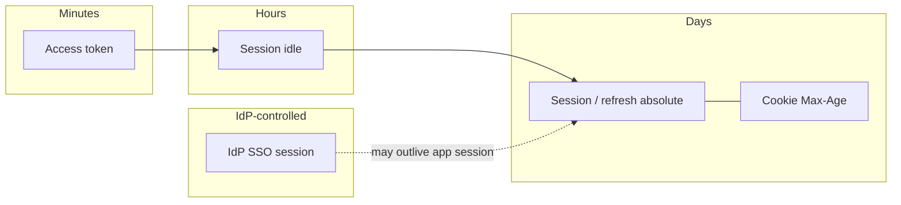
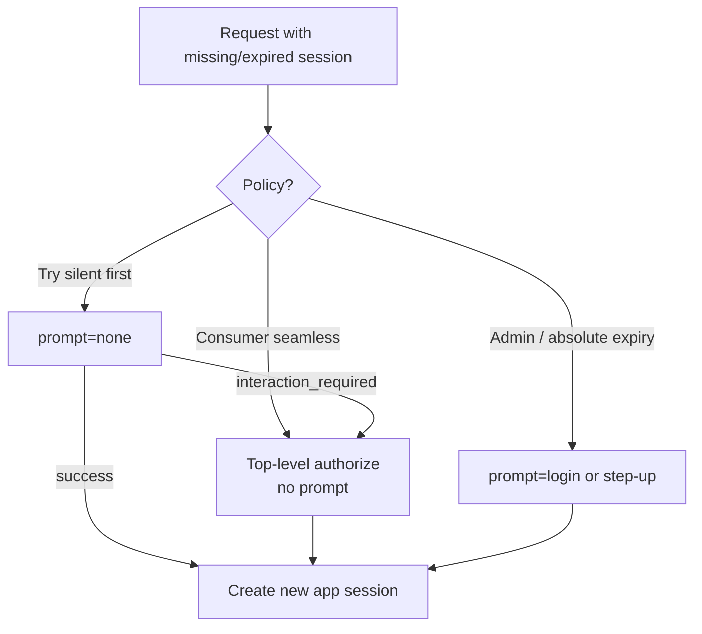

# Lifetimes and Sliding Sessions

One place for **how long** each layer lives: access token, refresh token, app session (idle + absolute), cookie `Max-Age`, and IdP(Identity Provider) SSO(Single Sign-On) session — plus **sliding renewal** and what to do when the app session dies but IdP SSO is still alive.

> **Scope:** Lifetime matrix, sliding rules, silent re-auth vs force login. Token validation → [§3](03-token-lifecycle-and-validation.md). Session store fields → [§4](04-cookie-session-and-csrf.md). Revoke before expiry → [§3b](03B-revoke-logout-denylist.md). SSO integration → [§2b](02B-sso-integration-playbook.md).

---

## Rule of thumb

| Layer | Job of its clock |
|-------|------------------|
| **Access token** | Limit stolen-Bearer window |
| **Refresh / session** | Limit how long “stay logged in” lasts without re-auth |
| **Absolute** | Hard cap even if the user is active every minute |
| **Idle** | Log out abandoned tabs |
| **IdP SSO** | Shared login across apps — **not** your API(Application Programming Interface) session |

Never set cookie `Max-Age` longer than the server session absolute timeout — the cookie is only a pointer.

---

## Lifetime matrix (starting defaults)

| Clock | SaaS(Software as a Service) web (BFF(Backend for Frontend) session) | SPA / mobile (refresh) | High-privilege admin |
|-------|-----------------------------------------------|------------------------|----------------------|
| **Access JWT(JSON Web Token)** | 5–10 min (or none if cookie-session only) | 5–15 min | 5 min |
| **Refresh** | N/A if session-only; else 7–30d absolute | 7–30d absolute, rotate | 8–24h absolute |
| **Session idle** | 8–12h | Align with refresh idle if any | 15–60 min |
| **Session absolute** | 7–30d | 7–30d | 8–12h |
| **Cookie `Max-Age`** | = session absolute (or session cookie) | Refresh cookie = refresh absolute | = absolute |
| **IdP SSO** | IdP policy (often 8–24h idle / longer absolute) | Same | Prefer shorter + step-up — [§2a](02A-oidc-logout-and-step-up.md) |

Tune per threat model; document chosen numbers in an ADR.

---

## Sliding renewal — when clocks reset

| Clock | Resets on activity? | Typical rule |
|-------|---------------------|--------------|
| **Access `exp`** | No | Re-issue via refresh or new login |
| **Session idle** | **Yes** | Any authenticated request (or heartbeat) extends `idle_expires_at` |
| **Session absolute** | **No** | Fixed from login / last hard re-auth |
| **Refresh idle** (if used) | Yes | On successful refresh or API use via BFF(Backend for Frontend) |
| **Refresh absolute** | No | From family creation |
| **Cookie `Max-Age`** | Only if you **Set-Cookie** again | On slide, re-issue cookie with new Max-Age **or** use session cookie + server idle only |
| **IdP SSO** | IdP-defined | You do not slide it from your API |

### Recommended slide policy (BFF session)

1. On each authenticated request: if `now < absolute_expires_at` and `now < idle_expires_at` → set `idle_expires_at = now + idle_ttl`.
2. If `now >= idle_expires_at` or `now >= absolute_expires_at` → session dead → [re-auth path](#app-session-dead-idp-sso-still-alive).
3. Optionally re-`Set-Cookie` only when idle was extended (throttle to once per N minutes to avoid header churn).

**Do not** extend absolute on activity — that creates immortal sessions for always-open dashboards.

---

## App session dead, IdP SSO still alive

Common after idle timeout: user returns, your `sid` is gone, but the IdP still has an SSO cookie.

| Strategy | UX | Security | When |
|----------|-----|----------|------|
| **A. Silent OIDC(OpenID Connect) re-auth** (`prompt=none`) | Seamless | Relies on IdP SSO; fails if third-party cookies blocked — [§4a](04A-third-party-cookies-and-mobile-redirects.md) | Same-site top-level or first-party BFF redirect |
| **B. Top-level OIDC authorize** (no prompt) | Brief redirect, often no password if SSO live | Good default | First-party web |
| **C. Force interactive** (`prompt=login` or always) | Re-enter credentials/MFA(Multi-Factor Authentication) | Highest | Admin, step-up, or after absolute expiry |
| **D. Show login page only** | Clear “signed out” | No silent surprise | Consumer apps that prefer explicit return |

**Absolute expiry** should usually use **C** (or step-up), not silent SSO — absolute means “re-prove who you are.”

**Idle expiry** often uses **B** (or **A** if you still control a reliable first-party path).

Store `auth_time` from the new ID token on the new session — [§2](02-oidc-discovery-and-tokens.md), [§2a](02A-oidc-logout-and-step-up.md).

---

## Aligning layers (checklist)

- [ ] `access_ttl` ≪ `session_idle` ≪ `session_absolute`
- [ ] Cookie lifetime ≤ session absolute
- [ ] Refresh absolute ≤ session absolute (if both exist)
- [ ] Idle slide never extends absolute
- [ ] Logout deletes server state even if cookie TTL(Time To Live) remains — [§3b](03B-revoke-logout-denylist.md)
- [ ] Document silent vs interactive re-auth for idle vs absolute

---

## Common mistakes

| Mistake | Fix |
|---------|-----|
| Cookie `Max-Age=30d` but server session 8h idle only | Align or use session cookies + server idle |
| Sliding absolute timeout | Cap with absolute from login |
| Silent `prompt=none` in hidden iframe | Broken under third-party cookie rules — top-level / BFF — [§4a](04A-third-party-cookies-and-mobile-redirects.md) |
| Treating IdP SSO TTL as your API session | Separate clocks; create your own `sid` |
| Multi-day access JWT “to avoid refresh” | Short access + refresh/session — [§3](03-token-lifecycle-and-validation.md) |

---

## Pros and cons

| Approach | Pros | Cons |
|----------|------|------|
| Short access + sliding idle session | Good UX + bounded theft | Need session store |
| Absolute-only (no idle) | Simple | Abandoned tabs stay privileged |
| Always `prompt=login` on expiry | Strong | Noisy UX |
| Silent SSO renew | Seamless | Fragile; weaker after absolute |

**Bottom line:** publish one matrix; slide **idle** only; on expiry choose **interactive for absolute**, **top-level OIDC (or careful silent) for idle**.