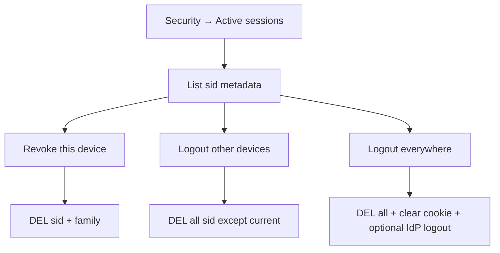

# Concurrent Sessions and Devices

Users often have **many sessions** (phone, laptop, tablet). Product and security need a clear policy: how many are allowed, how to list them, how to **revoke one device** or **logout others**, and how that interacts with refresh families and OIDC(OpenID Connect) SSO(Single Sign-On).

> **Scope:** Session inventory, caps, per-device revoke, “logout other devices,” UX/audit. Force logout / denylist mechanics → [§3b](03B-revoke-logout-denylist.md). Redis key shapes → [§3c](03C-denylist-redis-patterns.md). Lifetimes → [§3d](03D-lifetimes-and-sliding-sessions.md). Cookie session store → [§4](04-cookie-session-and-csrf.md).

> **Related:** Login device trust → [§5](05-login-security-playbook.md) · Impersonation must not confuse device lists → [§5d](05D-impersonation-and-support-access.md)

---

## At a glance

| Capability | Default guidance |
|------------|------------------|
| **List sessions** | Show device label, approx location, last active, current |
| **Revoke one** | Delete that `sid` + its refresh family |
| **Logout others** | Keep current `sid`; delete all other sids/families for `user_id` |
| **Logout everywhere** | Delete all including current; clear cookie — [§3b](03B-revoke-logout-denylist.md) |
| **Cap** | Soft cap for consumer (e.g. 10); hard/low for admin |
| **New device** | Notify; optional step-up — [§5](05-login-security-playbook.md) |

**Rule of thumb:** Every login creates a **session record** you can revoke. Refresh tokens belong to a **family** tied to that device/session.

---

## Data model

```text
session:{sid} = {
  user_id, created_at, last_seen, idle_exp, absolute_exp,
  device: { name, type, ua_hash },
  ip_hash, geo_hint,
  refresh_family_id,
  amr / acr,            # optional AuthN strength
  current_flagable via cookie match
}

user_sessions:{user_id} = SET of sid   # index for logout-all / list
family:{family_id} → refresh state     # rotation / reuse — §3
```

Do not trust client-supplied “device id” as authority — treat it as a label; server issues `sid` / `family_id`.

---

## Policies

### Concurrent session cap

| Audience | Policy example |
|----------|----------------|
| Consumer | Allow N sessions; on N+1 revoke **oldest idle** or ask user |
| Workforce / admin | Lower N; step-up on new device; alert on parallel geo |
| Shared kiosk account | Prefer 1 session; disable refresh persistence |

Caps are product security, not a substitute for revoke-on-password-change.

### When to force revoke others

| Event | Action |
|-------|--------|
| Password change / reset | Logout **everywhere** (or everywhere except current after step-up) |
| MFA(Multi-Factor Authentication) reset / recovery | Everywhere |
| User clicks “logout other devices” | Others only |
| Suspicious login confirmed | That family + optional everywhere |
| Admin disables user | Everywhere + denylist/disable — [§3b](03B-revoke-logout-denylist.md) |

---

## UX flows



| UX detail | Practice |
|-----------|----------|
| Label devices | Parse UA carefully; allow user rename |
| “This device” | Compare cookie `sid` to listed row |
| Immediate effect | Other devices fail on next API(Application Programming Interface) call / refresh |
| Access JWT(JSON Web Token) still valid briefly | Short TTL(Time To Live) or denylist `jti` if you need instant cut — [§3b](03B-revoke-logout-denylist.md) |
| Multi-tab same browser | Same `sid` — one revoke logs all tabs out |

---

## Interaction with SSO / OIDC

| Layer | Behavior |
|-------|----------|
| **App sessions** | Your `sid` list — primary UX for “devices in *this* app” |
| **IdP(Identity Provider) SSO cookie** | May still be alive after app logout-others — next OIDC can silent-SSO unless `prompt=login` / max_age — [§3d](03D-lifetimes-and-sliding-sessions.md) |
| **RP-initiated + back-channel** | Use when “logout everywhere” must include other apps — [§2a](02A-oidc-logout-and-step-up.md) |

Document for users: “Signed out of this app” vs “Signed out of company SSO.”

---

## Implementation checklist

- [ ] Index sessions by `user_id` for list / bulk delete  
- [ ] Bind refresh family to session/device  
- [ ] Password/MFA recovery → revoke policy enforced  
- [ ] Audit: login, revoke-one, logout-others, logout-all  
- [ ] Cap policy + tests (oldest evicted or rejected)  
- [ ] UI never shows raw `sid` / refresh  
- [ ] Guest sessions separate inventory — [§4b](04B-anonymous-and-guest-sessions.md)  

---

## Common mistakes

| Mistake | Why it hurts | Fix |
|---------|---------------|-----|
| Logout = clear cookie only | Stolen sid works until TTL | Delete store row — [§3b](03B-revoke-logout-denylist.md) |
| One global refresh for all devices | Cannot revoke one phone | Per-device family |
| No session list | Users cannot evict theft | Security settings page |
| Cap without eviction UX | Random logouts confuse | Notify + deterministic policy |
| Assuming IdP logout from app-only revoke | SSO still open | Separate messaging + optional RP logout |

---

## Pros and cons

| Approach | Pros | Cons |
|----------|------|------|
| Unlimited sessions + revoke UI | Simple; user controls | Harder to spot abuse |
| Hard cap | Limits blast radius | Support tickets on eviction |
| Single session only | Max control | Bad multi-device UX |

**Bottom line:** track **per-device sessions + refresh families**, expose **revoke one / others / everywhere**, and align password and recovery events with **logout-all**.