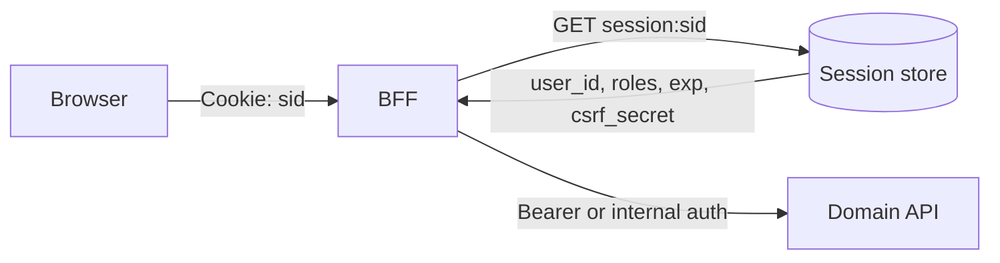
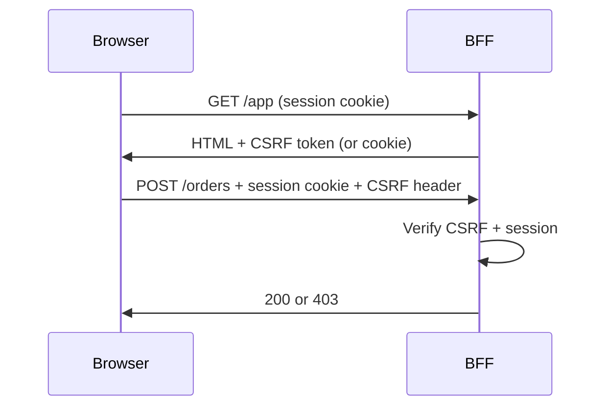

# Cookie, Session, and CSRF

For first-party web apps, the safest default is still a **server session** (or BFF(Backend for Frontend)-held refresh) delivered via **HTTP(Hypertext Transfer Protocol)-only Secure cookies**, defended against CSRF(Cross-Site Request Forgery). This section is the mechanics; UX and product patterns live in fullstack.

> **Scope:** Cookie flags, session store design, CSRF patterns, JWT(JSON Web Token)-in-cookie pitfalls. Third-party cookie deprecation and mobile redirects → [§4a](04A-third-party-cookies-and-mobile-redirects.md). Guest / anonymous sessions → [§4b](04B-anonymous-and-guest-sessions.md). Why client edits fail closed (integrity) → [§3a](03A-token-cookie-integrity.md). Browser Auth UX → [fullstack §7](../../fullstack-bff-and-clients/includes/07-auth-ux.md). Token TTL(Time To Live)/rotation → [§3](03-token-lifecycle-and-validation.md). Stateless API(Application Programming Interface) tiers → [api-design §11A](../../api-design-and-protection/includes/11A-stateless-auth-operations.md).

> **Related:** Third-party cookies / mobile OAuth(Open Authorization) redirects → [§4a](04A-third-party-cookies-and-mobile-redirects.md) · Guest sessions → [§4b](04B-anonymous-and-guest-sessions.md) · Anti-tamper → [§3a](03A-token-cookie-integrity.md) · BFF token exchange → [§1a](01A-client-auth-and-token-exchange.md) · Concurrent devices → [§3e](03E-concurrent-sessions-and-devices.md)

---

## At a glance

| Pattern | Browser holds | CSRF needed? | Good for |
|---------|---------------|--------------|----------|
| **Opaque session cookie** | Session id only | Yes | First-party web + BFF |
| **Refresh cookie + memory access token** | HTTP-only refresh; access in memory | Yes (on refresh / cookie routes) | SPA with BFF refresh |
| **Bearer access in `Authorization` header** | Memory / secure native store | Usually no | SPA/mobile calling APIs directly |
| **Access JWT in cookie** | JWT | Yes | Avoid unless you understand CSRF + size |

**Rule of thumb:** If the browser *automatically* attaches the credential (cookies), you must mitigate CSRF. If JavaScript must *explicitly* set `Authorization`, CSRF is largely out of scope — XSS(Cross-Site Scripting) becomes the dominant threat.

---

## Cookie attribute checklist

| Attribute | Value | Why |
|-----------|-------|-----|
| **`HttpOnly`** | Yes | Block JS exfiltration of session/refresh |
| **`Secure`** | Yes | HTTPS only |
| **`SameSite`** | `Lax` or `Strict` | Baseline CSRF reduction; `None` only with Secure + strong CSRF for cross-site needs |
| **`Path`** | Narrow (e.g. `/` or `/api`) | Limit where cookie is sent |
| **`Domain`** | Host-only when possible | Avoid sharing across sibling apps unless intentional |
| **`Max-Age` / `Expires`** | Align with idle/absolute policy | Prefer server-side idle tracking |
| **`__Host-` prefix** | Prefer for session | Forces Secure, no Domain, Path=/ |
| **`__Secure-` prefix** | Alternative | Forces Secure |

Set cookies only from trusted responses over TLS(Transport Layer Security). Clear on logout with matching Path/Domain.

---

## Session store design

Put only a **random session id** in the cookie. Keep identity and AuthZ(Authorization) in the server store — why that defeats client modification → [§3a](03A-token-cookie-integrity.md).

| Field (examples) | Purpose |
|------------------|---------|
| `user_id` / `tenant_id` | Identity |
| `auth_time` / `amr` | Step-up / MFA(Multi-Factor Authentication) age |
| `idle_expires_at` / `absolute_expires_at` | Timeouts |
| `csrf_secret` | Synchronizer token |
| `refresh_family_id` | Tie to OAuth(Open Authorization) refresh if bridged |
| `ip_hash` / `ua_hash` (optional) | Anomaly signals — don't brick mobile carriers with hard IP bind |

### Practices

- Store sessions in Redis/DB — **not** app memory ([api-design §11A](../../api-design-and-protection/includes/11A-stateless-auth-operations.md))
- Rotate session id on login and privilege elevation (fixation)
- Absolute timeout even if idle refresh continues
- Support "logout all devices" by indexing sessions by `user_id`

---

## CSRF defenses (pick a stack)

| Defense | How it works | Notes |
|---------|--------------|-------|
| **Synchronizer token** | Server stores secret; form/header must echo it | Classic; works with `SameSite=Lax` |
| **Double-submit cookie** | CSRF cookie readable by JS; JS copies to header | Needs careful cookie scoping; pair with SameSite |
| **SameSite=Strict/Lax** | Browser withholds cookies on cross-site POSTs (Lax allows top-level GET) | Necessary but not always sufficient (`None`, subdomain XSS, old browsers) |
| **Origin / Referer check** | Reject mutating requests without expected Origin | Defense in depth for APIs |

**Apply CSRF to:** cookie-authenticated `POST`/`PUT`/`PATCH`/`DELETE` (and dangerous `GET`s — better: don't mutate on GET).

**Do not blindly CSRF-protect:** pure Bearer-from-header APIs — different threat model ([enterprise-security §3](../../enterprise-security-compliance/includes/03-owasp-and-common-vulns.md)).

---

## BFF cookie bridge (recommended first-party web)

1. User completes OIDC(OpenID Connect) Auth Code at IdP (often via BFF)
2. BFF validates ID token, creates server session, sets `__Host-session` HTTP-only cookie
3. Browser calls BFF with cookies; BFF calls APIs with service identity or on-behalf-of token
4. Logout clears cookie + revokes session/refresh — full force-logout / denylist steps → [§3b](03B-revoke-logout-denylist.md)

This keeps refresh tokens off JavaScript and centralizes CSRF. Product UX details → [fullstack §7](../../fullstack-bff-and-clients/includes/07-auth-ux.md).

---

## JWT in a cookie — when people do it anyway

| Risk | Mitigation if you insist |
|------|--------------------------|
| CSRF | SameSite + synchronizer; treat like a session cookie |
| Size | Keep claims tiny; 4KB cookie limits |
| Logout | Still need denylist or short TTL |
| XSS | HttpOnly helps; XSS can still drive authenticated actions | Prefer opaque session id |

Usually worse than opaque session id + server store.

---

## CORS interaction

| Rule | Detail |
|------|--------|
| Credentialed CORS | `Access-Control-Allow-Origin` must be **explicit origins**, never `*` with `Credentials: true` |
| Allowlist | Exact frontend origins |
| Methods/headers | Include CSRF header name if used |

---

## Common mistakes

| Mistake | Why it hurts | Fix |
|---------|---------------|-----|
| `SameSite=None` without Secure | Browsers reject or weaken | Always Secure |
| "We use JWT so CSRF doesn't apply" | JWT *in a cookie* is still auto-sent | CSRF or don't use cookies |
| Session fixation (reuse pre-login sid) | Attacker keeps victim's pre-auth cookie | Rotate sid on login |
| Sticky in-memory sessions | Breaks scale / deploys | External session store |
| CSRF token only on HTML forms, not fetch/XHR | SPA mutations unprotected | Header on all mutating calls |
| Sharing parent `Domain=.example.com` cookies across apps | One XSS app steals all sessions | Host-only / `__Host-` |

---

## Pros and cons

| Pattern | Pros | Cons |
|---------|------|------|
| HTTP-only session cookie + BFF | Instant logout; no token in JS; CSRF manageable | Session store + CSRF plumbing |
| Memory access + HTTP-only refresh | Fits SPA; refresh safer than localStorage | Refresh cookie still CSRF-sensitive |
| Bearer from JS only | Minimal CSRF | XSS steals tokens; refresh storage hard |