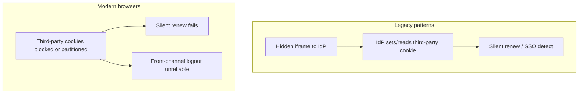
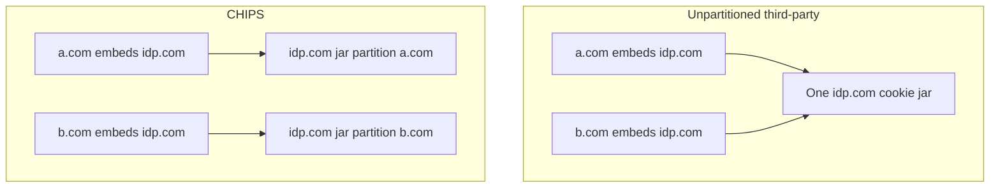
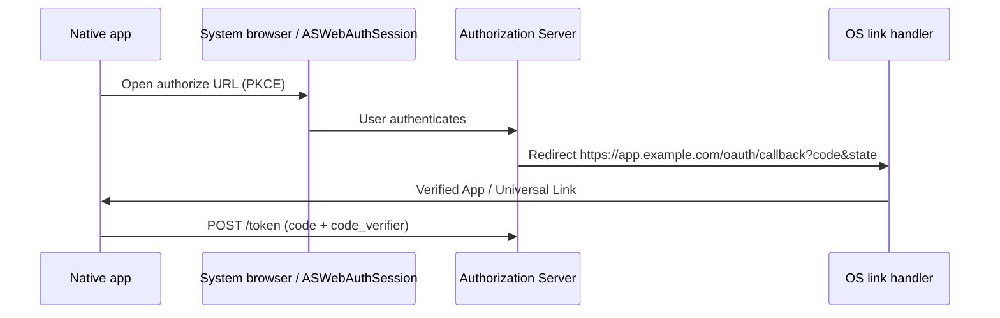

# Third-Party Cookies and Mobile Redirects

Browser **third-party cookie** restrictions break classic cross-site SSO(Single Sign-On) and some SPA refresh patterns. Mobile **custom URL schemes** for OAuth(Open Authorization) redirects are phishing-prone. Prefer first-party cookies + BFF(Backend for Frontend), and **claimed HTTPS app links** for native callbacks.

> **Scope:** Third-party cookie deprecation, partitioned cookies (CHIPS) in depth, impact on OIDC(OpenID Connect) front-channel logout / cross-site IdP(Identity Provider) cookies; mobile redirect safety (App Links / Universal Links vs custom schemes). Cookie flags and CSRF(Cross-Site Request Forgery) → [§4](04-cookie-session-and-csrf.md). Guest sessions → [§4b](04B-anonymous-and-guest-sessions.md). OIDC logout channels → [§2a](02A-oidc-logout-and-step-up.md). Auth Code + PKCE(Proof Key for Code Exchange) → [§1](01-oauth2-grants-and-flows.md).

> **Related:** Browser auth UX → [fullstack §7](../../fullstack-bff-and-clients/includes/07-auth-ux.md)

---

## At a glance

| Pattern | Third-party cookie risk | Prefer |
|---------|-------------------------|--------|
| First-party BFF session on your site | Low | **Default** — [§4](04-cookie-session-and-csrf.md) |
| SPA silent renew via hidden IdP iframe | **High — often broken** | Refresh via BFF / top-level redirect |
| Front-channel logout iframes | **High** | Back-channel logout — [§2a](02A-oidc-logout-and-step-up.md) |
| Cross-site IdP session cookie on `idp.com` embedded in `app.com` | **High** | Top-level redirects only |
| Mobile `myapp://callback` | Scheme hijack risk | **HTTPS App Links / Universal Links** |

**Rule of thumb:** Design as if **third-party cookies do not exist**. Keep auth cookies **first-party** to your site (or BFF), and complete OAuth with **top-level** navigations.

---

## What broke

| Symptom | Likely cause |
|---------|--------------|
| Users re-prompted constantly | Silent renew iframe cannot see IdP session |
| “Logout didn’t propagate” to other apps | Front-channel iframe cookies blocked |
| Safari / Chrome differences | ITP / third-party phase-out timelines differ |

---

## Mitigations

| Approach | Detail |
|----------|--------|
| **BFF / first-party session** | Cookie set on `app.example.com` — first-party; no IdP cookie needed on API(Application Programming Interface) calls |
| **Top-level authorize / refresh** | Full-page or popup with user gesture; avoid hidden iframes |
| **Rotating refresh in HttpOnly first-party cookie** | SPA calls same-site BFF `/refresh` — [§4](04-cookie-session-and-csrf.md) |
| **Back-channel logout** | Server-to-server; no browser cookie — [§2a](02A-oidc-logout-and-step-up.md) |
| **Partitioned cookies (CHIPS)** | `Partitioned` + `SameSite=None; Secure` — limited cross-site use; not a free pass for silent SSO |
| **Storage Access API** | User-gesture grant for embedded cases; poor fit for invisible renew |

Do not rely on `SameSite=None` third-party IdP cookies for primary session design.

---

## CHIPS and `Partitioned` cookies (detail)

**CHIPS(Cookies Having Independent Partitioned State)** lets a third party set a cookie that is **keyed by the top-level site** (the partition), so `tracker.example` embedded in `a.com` and `b.com` does **not** share one jar.

| Attribute combo | Meaning |
|-----------------|--------|
| `Partitioned; SameSite=None; Secure` | Cookie only sent when embedded under the **same top-level site** that set it |
| Without `Partitioned` | Classic third-party cookie — widely blocked |

| Use CHIPS when | Do not expect CHIPS to |
|----------------|------------------------|
| Embedded widget must keep a **per-embedder** session | Restore silent SSO(Single Sign-On) across many first-party apps |
| You control both embedder and embed and tested browsers | Replace first-party BFF(Backend for Frontend) session design |
| Cross-site but partition-scoped UX is enough | Make front-channel logout iframes reliable everywhere |

### Practices

| Do | Don't |
|----|-------|
| Prefer **first-party** app session cookies — [§4](04-cookie-session-and-csrf.md) | Design primary login on unpartitioned third-party IdP cookies |
| If embedding requires cookies, set `Partitioned` + `Secure` + `SameSite=None` and test Chrome/Safari/Firefox | Assume `Partitioned` alone removes CSRF(Cross-Site Request Forgery) — still defend state-changing calls |
| Document which top-level sites are supported partitions | Use CHIPS for hidden iframe silent renew as the main refresh path |
| Guest/auth cookies for **your** site stay host-only / `__Host-` | Share `Domain=.example.com` across untrusted apps |

**Bottom line for CHIPS:** useful for **partitioned embeds**, not a substitute for top-level OIDC(OpenID Connect) + first-party sessions.

---

## Cookie checklist under modern browsers

| Flag / choice | Guidance |
|---------------|----------|
| Host-only / `__Host-` | Prefer for app session — [§4](04-cookie-session-and-csrf.md) |
| `SameSite=Lax` or `Strict` | First-party app default |
| `SameSite=None; Secure` | Only when you truly need cross-site; expect breakage; add CSRF |
| `Partitioned` | Use only with a clear CHIPS(Cookies Having Independent Partitioned State) design; test per browser |
| Avoid parent `Domain=.example.com` across untrusted apps | One XSS(Cross-Site Scripting) app → shared cookie jar |

---

## Mobile OAuth redirects

### Prefer claimed HTTPS links

| Platform | Mechanism |
|----------|-----------|
| **Android** | App Links (Digital Asset Links) — `https://app.example.com/oauth/callback` |
| **iOS** | Universal Links (apple-app-site-association) — same idea |
| **Fallback** | Private-use URI scheme only with extra mitigations (below) |

### Why custom schemes are weak

| Risk | Detail |
|------|--------|
| **Scheme hijacking** | Another app registers `myapp://` and steals the `code` |
| **PKCE helps** | Attacker still needs `code_verifier` — keep verifier in app memory only |
| **Still prefer HTTPS links** | OS verifies app ownership of the domain |

### Practices

| Do | Don't |
|----|-------|
| System browser or `ASWebAuthenticationSession` / Chrome Custom Tabs | Embedded WebView that captures passwords |
| Auth Code + PKCE; verify `state` | Implicit flow; custom scheme without PKCE |
| Exact redirect URI registration | Wildcard redirects |
| App Attest / Play Integrity optional for high risk | Trust redirect alone as device proof |

---

## Designing for both web and mobile

| Client | Redirect / cookie strategy |
|--------|----------------------------|
| **First-party web** | BFF first-party session cookie; OIDC via top-level redirect |
| **SPA** | Same-site BFF for refresh; no IdP iframe silent renew |
| **Native mobile** | System browser + HTTPS claim links + PKCE |
| **Multi-app SSO logout** | Back-channel; do not depend on front-channel iframes |

---

## Common mistakes

| Mistake | Why it hurts | Fix |
|---------|---------------|-----|
| Hidden iframe silent renew as primary | Breaks when third-party cookies die | Top-level or BFF refresh |
| Front-channel-only logout | Other apps stay signed in | Back-channel — [§2a](02A-oidc-logout-and-step-up.md) |
| `myapp://` callback without App Links | Code theft by malicious app | HTTPS Universal / App Links |
| OAuth inside WebView | Phishing / cookie jar confusion | System browser / official auth session APIs |
| Assuming Chrome policy = Safari policy | Divergent breakage | Test both; design without third-party cookies |

---

## Pros and cons

| Approach | Pros | Cons |
|----------|------|------|
| First-party BFF cookies | Aligns with browser future | Extra BFF hop |
| Partitioned cookies | Some embeds still work | Complex; not universal SSO |
| App / Universal Links | Strong redirect binding | Setup (AASA / assetlinks) ops |
| Custom URI scheme | Easy to prototype | Hijack risk |

**Bottom line:** treat third-party cookies as gone; keep sessions **first-party**; use **back-channel** for SSO logout; on mobile, ship **HTTPS claimed redirects** + PKCE in the **system browser**.