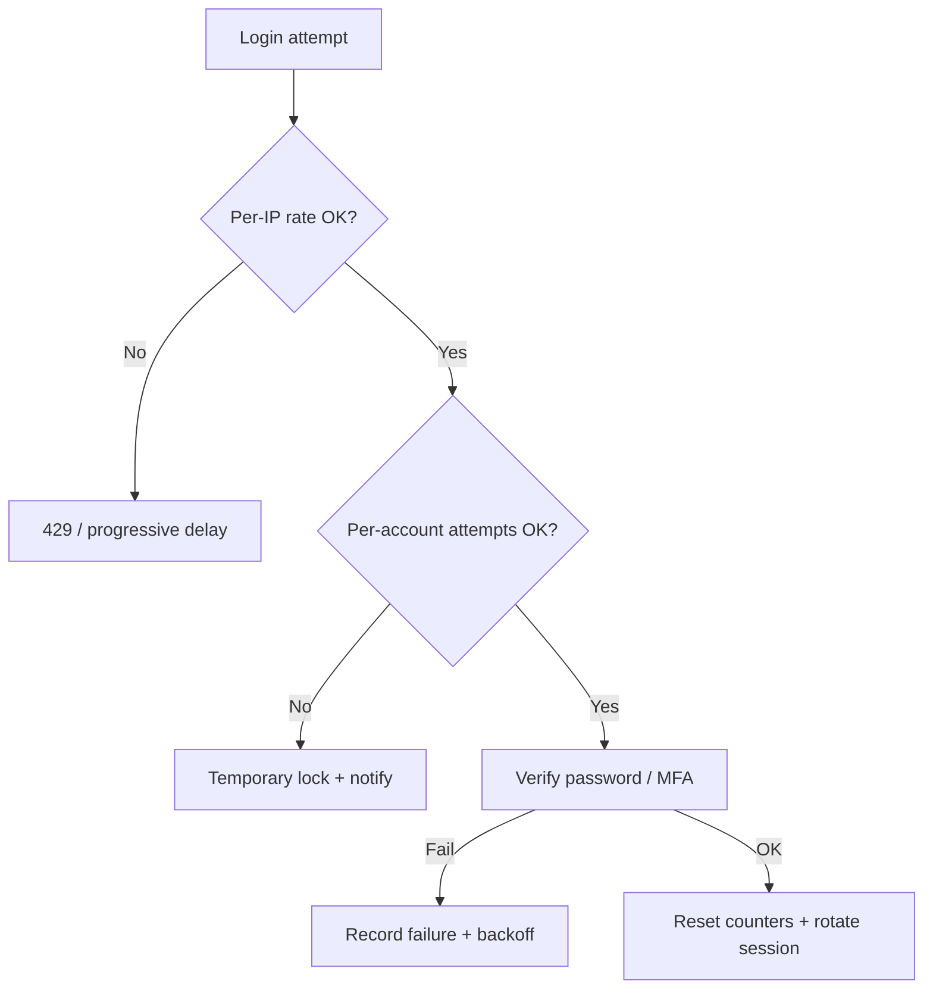

# Login Security Playbook

Whether you host passwords yourself or broker login to an IdP, **login is an attack surface**: credential stuffing, brute force, phishing, and account recovery abuse. This playbook covers credential storage, throttling, MFA(Multi-Factor Authentication), device trust, and recovery.

> **Scope:** Password hashing, lockout/backoff, MFA, step-up, device/session trust, recovery. Signup / magic link → [§5b](05B-signup-verify-and-magic-links.md). WebAuthn(Web Authentication) / passkeys → [§5c](05C-webauthn-and-passkeys.md). Impersonation → [§5d](05D-impersonation-and-support-access.md). Auth test checklist → [§5a](05A-auth-testing-checklist.md). OAuth(Open Authorization)/OIDC(OpenID Connect) protocol → [§1](01-oauth2-grants-and-flows.md)–[§2](02-oidc-discovery-and-tokens.md). Cookie sessions → [§4](04-cookie-session-and-csrf.md). Org-wide IAM(Identity and Access Management) → [api-design §12](../../api-design-and-protection/includes/12-identity-rbac-iam-ad.md). OWASP(Open Worldwide Application Security Project) framing → [enterprise-security §3](../../enterprise-security-compliance/includes/03-owasp-and-common-vulns.md).

---

## At a glance

| Control | Default |
|---------|---------|
| **Password hashing** | Argon2id (or bcrypt/scrypt); unique salt; tune for ~50–100ms |
| **Transport** | TLS(Transport Layer Security) only; never log passwords |
| **Throttling** | Per-account + per-IP progressive delay / lockout with clear UX |
| **MFA** | Required for admins and high-risk; offer TOTP(Time-based One-Time Password)/WebAuthn for all |
| **Recovery** | Time-limited, single-use tokens; step-up before changing email/password |
| **Monitoring** | Alert on stuffing patterns, MFA fatigue, recovery spikes |

**Rule of thumb:** Prefer **pushing AuthN to a mature IdP** (OIDC) when you can. If you must own passwords, treat the credential store like a payment vault — hashed, rate-limited, audited.

---

## Password storage

| Do | Don't |
|----|-------|
| Argon2id with per-password salt | MD5, SHA1, unsalted SHA256, reversible encryption |
| Store only the hash + parameters | Store plaintext "for support" |
| Rehash on login when params upgrade | Leave ancient bcrypt cost forever |
| Pepper (optional) in KMS(Key Management Service)/HSM(Hardware Security Module) | Pepper in the same DB as hashes |

```text
hash = Argon2id(password, salt, memory, iterations, parallelism)
# store: algorithm_id | params | salt | hash
```

On login: constant-time compare; identical generic error for unknown user vs bad password ("Invalid email or password").

---

## Brute force and credential stuffing



| Control | Guidance |
|---------|----------|
| **Per-account limit** | e.g. 5–10 failures → exponential backoff or 15–60 min soft lock |
| **Per-IP /ASN limit** | Catch stuffing across many accounts |
| **CAPTCHA / proof-of-work** | After threshold, not on first attempt |
| **Breach password check** | Block known-breached passwords (k-anonymity API(Application Programming Interface)s) |
| **Credential stuffing signals** | Impossible travel, many accounts one IP, spray patterns |
| **Enumeration** | Same response timing/message for valid/invalid usernames on login |

Avoid permanent lockouts without a support path — attackers use lockout for DoS(Denial of Service) against victims.

---

## MFA and step-up

| Factor | Fit | Notes |
|--------|-----|-------|
| **WebAuthn / passkeys** | Best phishing resistance | Prefer for privileged users |
| **TOTP** | Good baseline | Seed storage encrypted; allow backup codes once |
| **Push / SMS** | Convenience | SMS is weaker (SIM swap); push needs fatigue protections |
| **Email OTP(One-Time Password)** | Recovery-ish | Not strong MFA alone for high risk |

### Step-up triggers

Re-prompt MFA (or re-auth) when:

- Changing password, email, or MFA factors
- Disabling MFA
- High-value transfers / admin actions
- New device + risky action
- `auth_time` older than policy (from OIDC claims — [§2](02-oidc-discovery-and-tokens.md))

Protect against **MFA fatigue** (approve-spam): number matching, rate-limit pushes, prefer WebAuthn(Web Authentication) — [§5c](05C-webauthn-and-passkeys.md).

---

## Device and session trust

| Signal | Use |
|--------|-----|
| Device / browser fingerprint cookie | "Known device" after MFA once |
| Refresh/session family id | Revoke one device without logging out all |
| New device login email | Notify; offer "not me" revoke |
| Concurrent session cap | Optional for consumer; stricter for admin — [§3e](03E-concurrent-sessions-and-devices.md) |
| Anomalous geo / ASN | Step-up rather than hard block (VPN false positives) |

Store trust as server-side records, not a forgeable "trusted=true" client flag.

---

## Account recovery

| Step | Practice |
|------|----------|
| Reset link | Opaque token, ≤15–60 min TTL, single-use, bound to user |
| Delivery | Email/SMS to **already verified** channel |
| After reset | Destroy all sessions + refresh families; require MFA if enrolled |
| Change email | Verify **both** old and new (or MFA + new) |
| Support override | Break-glass with ticket + dual control — [§5d](05D-impersonation-and-support-access.md) |

Recovery is often weaker than login — threat-model it explicitly.

---

## Hosted IdP vs first-party passwords

| Choose IdP / OIDC when | Keep first-party login when |
|------------------------|-----------------------------|
| Enterprise SSO(Single Sign-On) required | Regulated UX that IdP cannot meet (rare) |
| You want MFA/conditional access "for free" | Offline or air-gapped constraints |
| Social login is product-critical | Cost/latency of IdP unacceptable (usually isn't) |
| Small team security bandwidth | You already run a hardened credential service |

Even with an IdP, you still own **session cookies, CSRF(Cross-Site Request Forgery), AuthZ, and recovery of *your* app sessions** — [§4](04-cookie-session-and-csrf.md).

---

## Audit and abuse signals

Log (without secrets):

- Login success/failure with reason codes
- MFA success/failure / fatigue events
- Recovery issued/consumed
- Session revoke / logout-all
- Privilege elevation

Retain per [enterprise-security §6](../../enterprise-security-compliance/includes/06-audit-logging-and-retention.md). Never log passwords, OTPs, session ids, or raw tokens.

---

## Common mistakes

| Mistake | Why it hurts | Fix |
|---------|---------------|-----|
| Fast hashes (SHA256 of password) | GPU cracking trivial | Argon2id/bcrypt with tuned cost |
| User enumeration via signup/login messages | Helps attackers build target lists | Generic errors; careful signup UX |
| Infinite lockout | DoS against legitimate users | Soft lock + backoff + recovery |
| MFA optional for admin | One stuffed password owns the fleet | Mandatory MFA + WebAuthn preferred |
| Recovery token in URL logs / Referer | Token leaks | POST consume; short TTL; no third-party assets on page |
| "Security questions" | Publicly discoverable answers | Don't; use channel OTP + MFA |
| SMS as only MFA for high value | SIM swap | WebAuthn/TOTP; SMS as backup only |

---

## Pros and cons

| Approach | Pros | Cons |
|----------|------|------|
| IdP-hosted login (OIDC) | MFA, threat intel, less custom crypto | Vendor dependency; claim mapping work |
| First-party passwords + MFA | Full UX control | You own hashing, stuffing defense, recovery forever |
| Passkeys-first | Phishing resistant | Device loss UX; need recovery design |