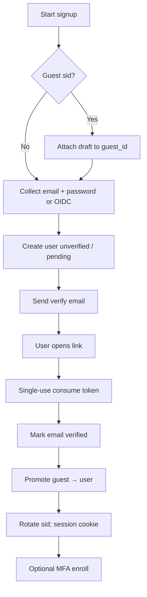

# Signup, Email Verification, and Magic Links

Account **creation** and **passwordless email links** are high-abuse surfaces: enumeration, inbox flooding, token theft via Referer, and fixation if you reuse guest cookies. Treat verify and magic-link tokens like recovery tokens — short TTL(Time To Live), single-use, bound to purpose.

> **Scope:** Signup funnel, email/phone verify, magic-link login, continuation after guest flows. Password hashing / lockout → [§5](05-login-security-playbook.md). Guest promote → [§4b](04B-anonymous-and-guest-sessions.md). OIDC(OpenID Connect) social/enterprise signup → [§2b](02B-sso-integration-playbook.md). Session rotation → [§4](04-cookie-session-and-csrf.md).

> **Related:** Auth tests → [§5a](05A-auth-testing-checklist.md) · Audit → [enterprise-security §6](../../enterprise-security-compliance/includes/06-audit-logging-and-retention.md)

---

## At a glance

| Step | Practice |
|------|----------|
| **Signup** | Generic errors; rate-limit; create unverified user or hold draft until verify |
| **Verify email** | Opaque token ≤15–60 min; single-use; HTTPS landing; POST consume |
| **Magic link login** | Same token hygiene; one link = one session; rotate `sid` |
| **After success** | Promote guest if any; establish session; optional MFA(Multi-Factor Authentication) enroll |
| **Enumeration** | Same response for “email sent” whether or not the address exists (for login magic link) |

**Rule of thumb:** Anything that arrives by email is **bearer capability** — assume the inbox and URL logs are hostile.

---

## Signup funnel (step-by-step)



| Step | Detail |
|------|--------|
| 1. Collect | Email + password (Argon2id — [§5](05-login-security-playbook.md)) **or** OIDC subject |
| 2. Persist | Unverified account **or** signup draft only — product choice |
| 3. Send verify | Token in DB/Redis hashed; email contains opaque id only |
| 4. Consume | HTTPS page; prefer POST; invalidate token; set `email_verified` |
| 5. Session | Issue authenticated `sid`; **rotate** off any guest cookie — [§4b](04B-anonymous-and-guest-sessions.md) |
| 6. Link accounts | If OIDC email matches existing, require proof — [§2b](02B-sso-integration-playbook.md) |

Block signup with known-breached passwords; throttle per IP and per email.

---

## Email verification tokens

| Property | Requirement |
|----------|-------------|
| Entropy | ≥128 bits random; store **hash** server-side |
| TTL | 15–60 minutes (shorter for high risk) |
| Use | Single-use; delete on success |
| Bind | `user_id` + purpose=`verify_email` (+ old email if change) |
| Transport | HTTPS link; no tokens in query for third-party assets on page |
| Resend | Rate-limit; invalidate previous or allow only latest |

Changing email: verify **new** (and ideally prove control of **old** or MFA).

---

## Magic links (passwordless email)

One-time link that **logs the user in** (or completes signup) without a password.

```mermaid
sequenceDiagram
    participant U as User
    participant App as App / BFF
    participant M as Mail
    participant S as Token store

    U->>App: POST /login/magic { email }
    App->>S: Store hash(token), user_id, exp, purpose=magic_login
    App->>M: Send link with token id
    App->>U: Generic “If account exists, we sent email”
    U->>App: GET/POST /magic/consume
    App->>S: Lookup; single-use delete
    App->>App: Create session; rotate sid
    App->>U: Set-Cookie session
```

### Security practices

| Control | Why |
|---------|-----|
| Generic response on request | Anti-enumeration |
| Short TTL (5–15 min typical) | Inbox delay vs theft window |
| Bind to IP/UA optional soft signal | Step-up if mismatch — don’t hard-fail VPNs blindly |
| One session per consume | No multi-redeem |
| CSRF(Cross-Site Request Forgery) on request endpoint | Attackers must not trigger floods from victim browser without care — rate-limit anyway |
| Prefer open-in-same-browser guidance | Link opened in different client still OK if token is enough; document UX |
| After consume | Same session flags as password login; consider “email factor only” ACR |

Magic link ≠ strong MFA. For admin / finance require WebAuthn(Web Authentication) or TOTP(Time-based One-Time Password) — [§5c](05C-webauthn-and-passkeys.md).

---

## OTP codes vs links

| Factor | Fit |
|--------|-----|
| **Email magic link** | Low-friction login / verify |
| **Email OTP(One-Time Password) code** | Same device UX; shorter codes need stricter rate limits |
| **SMS OTP** | Convenience; SIM-swap risk — backup only for high value |

Store OTP hashed; limit attempts; invalidate on success.

---

## Guest + signup

| Moment | Action |
|--------|--------|
| Start signup with guest cookie | Keep `guest_id` on draft |
| Verify / magic success | Merge draft/cart → `user_id` |
| Always | Rotate `sid` — [§4b](04B-anonymous-and-guest-sessions.md) |

---

## Implementation checklist

- [ ] Signup / magic request rate limits (IP + email)  
- [ ] Tokens hashed at rest; single-use; TTL  
- [ ] Generic messaging for magic-link request  
- [ ] Consume over HTTPS; avoid leaking token to `Referer`  
- [ ] Session fixation: new `sid` on success  
- [ ] Guest promote + merge policy  
- [ ] Audit: signup, verify, magic request/consume, fail reasons (no secrets)  
- [ ] Tests: reused token → fail; expired → fail; enumeration timing  

---

## Common mistakes

| Mistake | Why it hurts | Fix |
|---------|---------------|-----|
| “Email already registered” on signup | Enumeration | Generic error / login hint carefully |
| Long-lived verify links (days) | Stolen link takeover | Minutes–hour TTL |
| Token in logs / analytics | Account takeover | Strip query; hash at rest |
| Magic link without rate limits | Mail bomb / cost | Throttle + CAPTCHA after threshold |
| No session rotate on consume | Fixation | Always new `sid` |
| Treating magic link as MFA | Weak for privileged actions | Step-up — [§5c](05C-webauthn-and-passkeys.md) |

---

## Pros and cons

| Approach | Pros | Cons |
|----------|------|------|
| Password + verify email | Familiar; works offline-ish later | Stuffing + recovery complexity |
| Magic link only | No password DB for login | Inbox dependency; phishing of links |
| OIDC social/enterprise | Less credential ownership | Linking and claim trust — [§2b](02B-sso-integration-playbook.md) |

**Bottom line:** verify and magic-link tokens are **one-shot secrets**; combine with **guest promote + `sid` rotation** and never confuse email proof with phishing-resistant MFA.