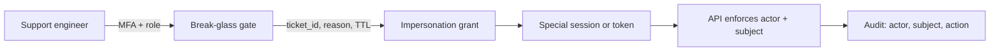

# Impersonation and Support Access

**Impersonation** (“login as user”, “view as customer”) lets support or admins act with another principal’s AuthZ. It is powerful and dangerous: audit gaps, CSRF(Cross-Site Request Forgery) confusion, and accidental lasting privilege. Prefer **read-only break-glass** with dual control over silent full-power impersonation.

> **Scope:** Support access patterns, token/session shape, audit, time limits, bans. Concurrent sessions → [§3e](03E-concurrent-sessions-and-devices.md). Force logout → [§3b](03B-revoke-logout-denylist.md). Login recovery override → [§5](05-login-security-playbook.md). RBAC(Role-Based Access Control) → [api-design §12](../../api-design-and-protection/includes/12-identity-rbac-iam-ad.md).

> **Related:** Enterprise audit → [enterprise-security §6](../../enterprise-security-compliance/includes/06-audit-logging-and-retention.md)

---

## At a glance

| Pattern | Risk | Prefer when |
|---------|------|-------------|
| **Read-only support view** | Lower | Most tickets |
| **Time-boxed impersonation session** | High | Must reproduce user-only bugs |
| **Shared “god” password** | Critical — ban | Never |
| **Silent long-lived impersonation JWT(JSON Web Token)** | Critical | Never |

**Rule of thumb:** actor ≠ subject. Every request records **who** (support user) acted **as** (customer), with **why** (ticket id).

---

## Safe design

| Control | Practice |
|---------|----------|
| **Who can start** | Narrow role; MFA(Multi-Factor Authentication) / WebAuthn(Web Authentication) step-up — [§5c](05C-webauthn-and-passkeys.md) |
| **Dual control** | Second approver for high-value tenants / production write |
| **Ticket binding** | Require incident/ticket id; store on grant |
| **TTL** | Minutes (e.g. 15–60); no refresh or one-shot refresh |
| **Scope** | Default read-only; explicit elevate to write |
| **Banner UX** | Persistent “Acting as user X — End” in UI |
| **End** | One click → delete impersonation sid; back to support session |

---

## Session / token shape

Do **not** mint a normal user session that is indistinguishable from the customer’s.

| Approach | Detail |
|----------|--------|
| **Composite session** | `sid` with `actor_id`, `subject_id`, `impersonation=true`, `ticket_id`, `exp` |
| **Token claims** | `act` / `may_act` style (RFC 8693 delegation) — [§1a](01A-client-auth-and-token-exchange.md); resource servers must understand |
| **Separate cookie name** | e.g. `__Host-support-act` vs user `__Host-session` — avoids clobbering user devices |
| **AuthZ** | Check both actor permission *to impersonate* and subject permission *for the action* |

Block impersonation from spawning OAuth(Open Authorization) consents, password changes, or MFA resets unless explicitly allowed and audited.

---

## What to forbid

| Action during impersonation | Why |
|-----------------------------|-----|
| Change subject password / email / MFA | Account takeover via support path |
| Add OAuth clients / export all data unchecked | Blast radius |
| Disable audit or “do not log” | Compliance failure |
| Persist after browser close without TTL | Forgotten god mode |
| Appear in subject’s “active devices” as them | Confuses [§3e](03E-concurrent-sessions-and-devices.md) — label as support |

---

## Logout and revoke

| Event | Action |
|-------|--------|
| Support clicks End | Delete impersonation sid immediately |
| TTL expiry | Auto delete |
| Subject password reset / logout-all | End impersonation grants for that user |
| Support user disabled | Kill all their actor sessions |
| Suspicious use | Revoke + alert |

Force-logout tooling — [§3b](03B-revoke-logout-denylist.md).

---

## Audit checklist (minimum fields)

- `actor_user_id`, `subject_user_id`
- `ticket_id` / reason
- `started_at`, `ended_at`, `ttl`
- Per mutating request: route, object ids, outcome
- No secrets, raw cookies, or tokens in logs — [enterprise-security §6](../../enterprise-security-compliance/includes/06-audit-logging-and-retention.md)

---

## Implementation checklist

- [ ] Step-up to start impersonation  
- [ ] Ticket/reason required  
- [ ] Short TTL; visible banner; easy End  
- [ ] Distinct session/token from normal user login  
- [ ] AuthZ checks actor + subject  
- [ ] Block credential/MFA changes while impersonating  
- [ ] Full audit trail; alert on write elevate  
- [ ] Tests: expired grant → 401; non-role → 403; subject logout-all ends grant  

---

## Common mistakes

| Mistake | Why it hurts | Fix |
|---------|---------------|-----|
| Mint normal user JWT for support | Indistinguishable abuse | Composite actor/subject |
| No ticket id | Cannot investigate | Mandatory binding |
| Impersonation refresh like user | Lasts forever | No/long-deny refresh; short absolute |
| Hidden from audit | Insider threat | Mandatory logs + review |
| Shared support password to “become user” | Undeniable compromise | Ban pattern |

---

## Pros and cons

| Pros | Cons |
|------|------|
| Faster support / repro | High insider + tooling risk |
| Better than sharing passwords | Still tempting to over-scope |

**Bottom line:** impersonation is a **break-glass grant** with **actor ≠ subject**, **short TTL**, **ticket binding**, and **heavy audit** — never a silent alias for the customer’s real session.