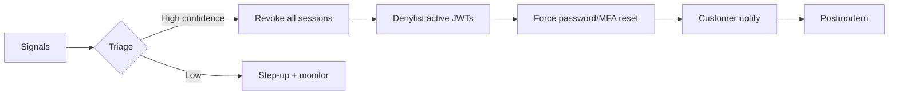

# Account Takeover Response

ATO(Account Takeover) is confirmed or strongly suspected when credentials, sessions, or payout paths behave like an attacker owns the account. Response is a **timed playbook**: contain, recover, communicate, and learn — not ad-hoc password resets.

> **Scope:** Post-detection response — force logout, denylist, step-up, customer comms, postmortem. Prevention and login controls → [§5](05-login-security-playbook.md). Revoke mechanics → [§3B](03B-revoke-logout-denylist.md). Step-up AuthN(Authentication) → [§2A](02A-oidc-logout-and-step-up.md). Edge abuse signals → [api-design §2A](../../api-design-and-protection/includes/02A-edge-abuse-waf-and-bots.md). Customer comms templates → [sre §6A](../../sre-and-incidents/includes/06A-incident-communications.md).
>
> **Related:** Token validation → [§3](03-token-lifecycle-and-validation.md) · Concurrent sessions → [§3E](03E-concurrent-sessions-and-devices.md) · Audit → [ESC §6](../../enterprise-security-compliance/includes/06-audit-logging-and-retention.md) · Tenant security suspend → [architecture §10B](../../architecture-decisions/includes/10B-tenant-lifecycle-provision-suspend-delete.md)

---

## At a glance

| Phase | Timebox | Owner |
|-------|---------|-------|
| **Detect** | Continuous | Fraud + auth + support signals |
| **Contain** | Minutes | On-call / security — revoke all sessions |
| **Verify** | Hours | Step-up; review recent changes |
| **Communicate** | Same day | Comms + support macros — [sre §6A](../../sre-and-incidents/includes/06A-incident-communications.md) |
| **Postmortem** | 5 business days | IC(Incident Commander)-style review |

**Rule of thumb:** **Revoke first, investigate second** for high-confidence ATO. A live attacker with a refresh token beats a polite email asking them to log out.

---

## Response flow

| Signal class | Examples |
|--------------|----------|
| **Auth anomalies** | Impossible travel, new device flood, MFA(Multi-Factor Authentication) disable |
| **Account changes** | Email/password/payout update from new IP |
| **Edge / API(Application Programming Interface)** | Credential stuffing success — [api §2A](../../api-design-and-protection/includes/02A-edge-abuse-waf-and-bots.md) |
| **Customer report** | "I didn't do this" with corroborating audit |

---

## Contain — logout and denylist

| Action | Mechanism |
|--------|-----------|
| **Logout all devices** | Delete sessions + refresh families — [§3B](03B-revoke-logout-denylist.md) |
| **Denylist outstanding JWTs(JSON Web Tokens)** | `jti` until `exp` for access tokens in flight |
| **Disable account flag** | Block login until recovery completes |
| **Invalidate recovery tokens** | Single-use links from pre-compromise window |
| **Payout / billing lock** | Hold transfers; notify finance |

Redis denylist patterns → [§3C](03C-denylist-redis-patterns.md). Do not rely on short TTL(Time To Live) alone when refresh tokens remain valid.

---

## Step-up and recovery

| Step | Requirement |
|------|-------------|
| **Identity proof** | WebAuthn(Web Authentication) or verified channel to old email/phone |
| **MFA re-enroll** | New TOTP(Time-based One-Time Password) seed; revoke old WebAuthn credentials if unknown |
| **Review audit** | Last 30 days: logins, API keys, SCIM(System for Cross-domain Identity Management) changes |
| **Rotate secrets** | API keys, webhooks, OAuth(Open Authorization) clients owned by user |
| **Support access** | No impersonation during active ATO — [§5D](05D-impersonation-and-support-access.md) |

Enterprise SSO(Single Sign-On) tenants: coordinate with customer IdP(Identity Provider) admin — [§2D](02D-multi-tenant-oidc-and-b2b-sso.md).

---

## Customer and communications

| Audience | Message |
|----------|---------|
| **Affected user** | What happened (facts only), actions taken, required steps |
| **Org admin (B2B)** | Scope, users touched, audit export offer |
| **Support** | Macro with verify-before-unlock steps |
| **Regulatory** | If PII(Personally Identifiable Information) exfil suspected — legal owns |

Use [sre §6A](../../sre-and-incidents/includes/06A-incident-communications.md) cadence. Comms does not speculate on attacker identity.

---

## Postmortem essentials

- [ ] Timeline from first signal to contain
- [ ] Entry vector (stuffing, session theft, support social eng)
- [ ] Blast radius: data read/changed, money moved
- [ ] Control gaps vs [§5](05-login-security-playbook.md)
- [ ] Customer follow-up completed
- [ ] Tickets for detection rules and UX fixes

---

## Common mistakes

| Mistake | Fix |
|---------|-----|
| Password reset only | Revoke sessions + refresh — [§3B](03B-revoke-logout-denylist.md) |
| Long-lived JWT(JSON Web Token) during incident | Denylist `jti` or shorten access TTL temporarily |
| Support unlocks without verify | Step-up playbook |
| Silent fix | Notify per [sre §6A](../../sre-and-incidents/includes/06A-incident-communications.md) |
| Ignore API keys | Rotate all credentials for user/org |
| No tenant-level suspend for org-wide ATO | [architecture §10B](../../architecture-decisions/includes/10B-tenant-lifecycle-provision-suspend-delete.md) |

---

## Pros and cons

| Approach | Pros | Cons |
|----------|------|------|
| **Automated contain on score** | Fast; scales | False positives need undo path |
| **Manual security ticket only** | Fewer false locks | Attacker window grows |
| **Global password reset** | Simple comms | Overkill; misses token theft |
