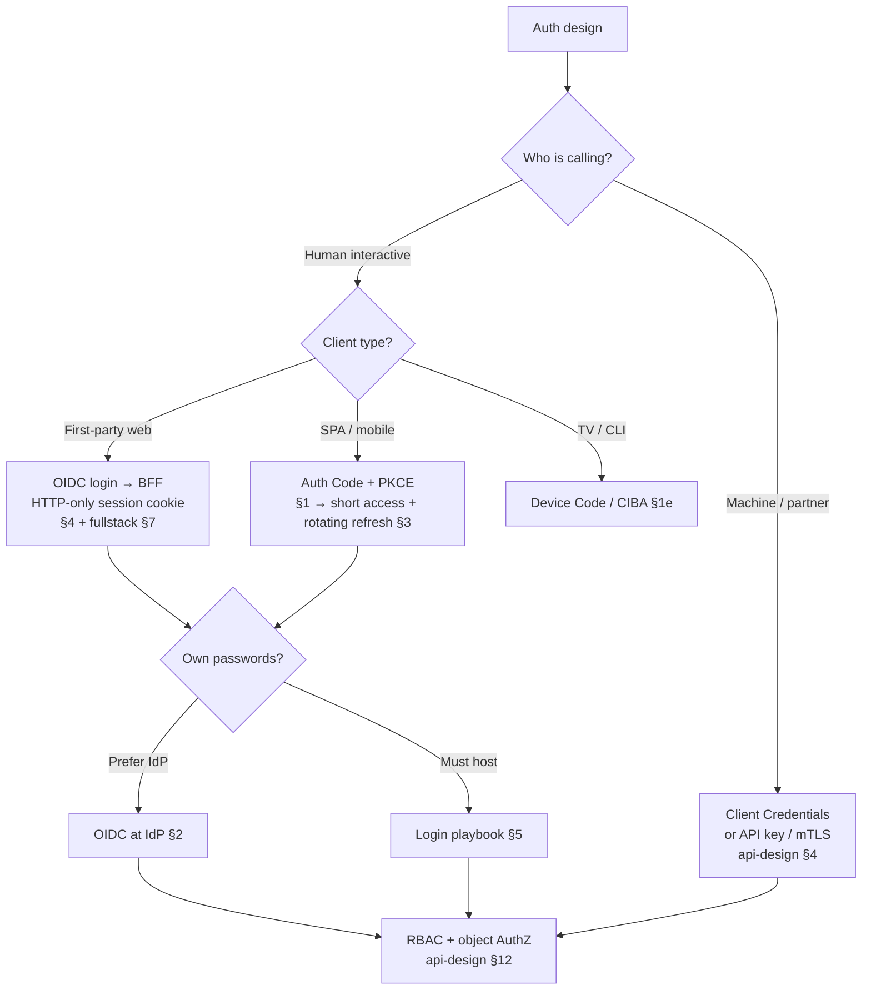

# Decision Guide — OAuth, OIDC & Login Security

Pick a grant, a token/session pattern, and a login hardening level without re-litigating the whole protocol each time.

> **Related:** Overview → [00-overview.md](00-overview.md) · Grants → [§1](01-oauth2-grants-and-flows.md) · Client auth / exchange → [§1a](01A-client-auth-and-token-exchange.md) · Scopes → [§1b](01B-scopes-and-consent.md) · PAR(Pushed Authorization Requests) → [§1c](01C-pushed-authorization-requests.md) · Resource indicators → [§1d](01D-resource-indicators.md) · Device / CIBA(Client-Initiated Backchannel Authentication) → [§1e](01E-device-authorization-and-ciba.md) · JAR(JWT-secured Authorization Request) / RAR(Rich Authorization Requests) → [§1f](01F-jar-and-rar.md) · OIDC(OpenID Connect) → [§2](02-oidc-discovery-and-tokens.md) · Logout / step-up → [§2a](02A-oidc-logout-and-step-up.md) · SSO(Single Sign-On) → [§2b](02B-sso-integration-playbook.md) · SAML(Security Assertion Markup Language) → [§2c](02C-saml-protocol.md) · Multi-tenant OIDC / B2B(Business-to-Business) SSO → [§2d](02D-multi-tenant-oidc-and-b2b-sso.md) · Tokens → [§3](03-token-lifecycle-and-validation.md) · Integrity → [§3a](03A-token-cookie-integrity.md) · Revoke / logout → [§3b](03B-revoke-logout-denylist.md) · Redis denylist → [§3c](03C-denylist-redis-patterns.md) · Lifetimes → [§3d](03D-lifetimes-and-sliding-sessions.md) · Concurrent devices → [§3e](03E-concurrent-sessions-and-devices.md) · Cookies → [§4](04-cookie-session-and-csrf.md) · Third-party / mobile → [§4a](04A-third-party-cookies-and-mobile-redirects.md) · Guest → [§4b](04B-anonymous-and-guest-sessions.md) · Login → [§5](05-login-security-playbook.md) · Auth tests → [§5a](05A-auth-testing-checklist.md) · Signup / magic → [§5b](05B-signup-verify-and-magic-links.md) · WebAuthn(Web Authentication) → [§5c](05C-webauthn-and-passkeys.md) · Impersonation → [§5d](05D-impersonation-and-support-access.md) · Client matrix → [api-design §4](../../api-design-and-protection/includes/04-auth-model.md) · SCIM(System for Cross-domain Identity Management)/JML(Joiner-Mover-Leaver) → [api-design §12C](../../api-design-and-protection/includes/12C-scim-and-jml-provisioning.md) · Fine AuthZ(Authorization) → [api-design §12D](../../api-design-and-protection/includes/12D-fine-grained-authz.md)

---

## Master decision flow

---

## Scenario recommendations

| Scenario | Recommended approach |
|----------|----------------------|
| New SaaS(Software as a Service) web app | OIDC(OpenID Connect) via IdP(Identity Provider) → BFF(Backend for Frontend) session cookie + CSRF(Cross-Site Request Forgery) — [§4](04-cookie-session-and-csrf.md); avoid third-party cookie SSO(Single Sign-On) — [§4a](04A-third-party-cookies-and-mobile-redirects.md) |
| Cart / wizard before login | Guest session + promote on register — [§4b](04B-anonymous-and-guest-sessions.md), [§5b](05B-signup-verify-and-magic-links.md) |
| React SPA calling public API(Application Programming Interface) | Auth Code + PKCE(Proof Key for Code Exchange); access in memory; refresh via HTTP(Hypertext Transfer Protocol)-only cookie or native secure store — [§1](01-oauth2-grants-and-flows.md), [§3](03-token-lifecycle-and-validation.md); no IdP iframe silent renew — [§4a](04A-third-party-cookies-and-mobile-redirects.md) |
| Mobile app | System browser + HTTPS App/Universal Links + Auth Code + PKCE — [§4a](04A-third-party-cookies-and-mobile-redirects.md); no embedded password webview |
| TV / CLI | Device Authorization — [§1e](01E-device-authorization-and-ciba.md) |
| Bank-style decoupled AuthN(Authentication) | CIBA(Client-Initiated Backchannel Authentication) — [§1e](01E-device-authorization-and-ciba.md) |
| BFF calling domain APIs as the user | Token exchange (RFC 8693) or BFF-held refresh — [§1a](01A-client-auth-and-token-exchange.md) |
| Multi-app SSO logout | App revoke + RP-initiated + back-channel — [§2a](02A-oidc-logout-and-step-up.md) |
| App session expired, IdP SSO still alive | Idle → top-level OIDC; absolute → interactive — [§3d](03D-lifetimes-and-sliding-sessions.md) |
| Customer requires SAML | Broker SAML→OIDC or native SP(Savings Plan) — [§2c](02C-saml-protocol.md), [§2b](02B-sso-integration-playbook.md) |
| Customer brings Entra / Okta (BYO IdP) | Per-tenant issuer allowlist + membership — [§2d](02D-multi-tenant-oidc-and-b2b-sso.md); data isolation — [api-design §16](../../api-design-and-protection/includes/16-multi-tenant-apis.md) |
| Email-domain / subdomain SSO | Home-realm discovery then authorize — [§2d](02D-multi-tenant-oidc-and-b2b-sso.md) |
| User in multiple orgs | Memberships + `active_tenant_id`; switch re-binds tokens — [§2d](02D-multi-tenant-oidc-and-b2b-sso.md) |
| Designing partner scopes | [§1b](01B-scopes-and-consent.md) |
| Fat authorize URLs / high-assurance authorize | PAR(Pushed Authorization Requests) — [§1c](01C-pushed-authorization-requests.md); JAR/RAR if required — [§1f](01F-jar-and-rar.md) |
| One AS, many APIs | Resource indicators + per-API `aud` — [§1d](01D-resource-indicators.md) |
| Open banking–style fine consent | RAR(Rich Authorization Requests) — [§1f](01F-jar-and-rar.md) |
| Internal employee tools | Enterprise IdP SSO(Single Sign-On) + groups→roles — [api-design §12](../../api-design-and-protection/includes/12-identity-rbac-iam-ad.md) |
| Service-to-service | Client credentials or workload identity / mTLS(Mutual Transport Layer Security) — [api-design §4](../../api-design-and-protection/includes/04-auth-model.md) |
| Need instant logout everywhere | Server session or refresh store; don't rely on access JWT(JSON Web Token) expiry alone — [§3b](03B-revoke-logout-denylist.md) |
| Ban / disable a user | Disable principal + revoke all sessions/refreshes (+ optional `jti` denylist) — [§3b](03B-revoke-logout-denylist.md) |
| Logout other devices / session list | [§3e](03E-concurrent-sessions-and-devices.md) |
| Password login still required | Argon2id + throttling + MFA(Multi-Factor Authentication) — [§5](05-login-security-playbook.md) |
| Passwordless email login | Magic link hygiene — [§5b](05B-signup-verify-and-magic-links.md) |
| Admin / finance actions | Step-up MFA; short absolute session; WebAuthn(Web Authentication) preferred — [§5c](05C-webauthn-and-passkeys.md) |
| Support must reproduce user-only bug | Time-boxed impersonation — [§5d](05D-impersonation-and-support-access.md) |
| Partner integration | Scoped API keys or OAuth client credentials; not end-user password grant |
| CI(Continuous Integration) → cloud | OIDC federation, not long-lived PATs — [cicd §3](../../cicd-and-environments/includes/03-config-vs-secrets.md) |

---

## Priority checklist

- [ ] Interactive clients use **Authorization Code + PKCE**; Implicit and Password grants banned
- [ ] Confidential clients use proper client auth (secret / private_key_jwt / mTLS) — [§1a](01A-client-auth-and-token-exchange.md)
- [ ] OIDC discovery + JWKS(JSON Web Key Set) used; ID token `iss`/`aud`/`nonce` verified
- [ ] B2B multi-tenant: tenant resolved before authorize; `iss` allowlisted per tenant; membership bound — [§2d](02D-multi-tenant-oidc-and-b2b-sso.md)
- [ ] Multi-app SSO: back-channel logout planned; not front-channel-only — [§2a](02A-oidc-logout-and-step-up.md)
- [ ] Access tokens short-lived; refresh **rotates** with reuse detection
- [ ] Altered credentials fail closed (JWT sig / opaque lookup / session `sid`) — [§3a](03A-token-cookie-integrity.md)
- [ ] Logout deletes server session/refresh (not cookie-only); logout-all by `user_id` — [§3b](03B-revoke-logout-denylist.md)
- [ ] Enterprise offboarding: SCIM/JML deactivate + revoke — [api-design §12C](../../api-design-and-protection/includes/12C-scim-and-jml-provisioning.md), [§3b](03B-revoke-logout-denylist.md)
- [ ] APIs validate signature, `iss`, `aud`, `exp`, then **object-level AuthZ** — [api-design §12D](../../api-design-and-protection/includes/12D-fine-grained-authz.md)
- [ ] First-party web: HTTP-only Secure SameSite cookies; CSRF on mutations; no third-party-cookie silent renew — [§4a](04A-third-party-cookies-and-mobile-redirects.md)
- [ ] Mobile: HTTPS App/Universal Links + system browser — [§4a](04A-third-party-cookies-and-mobile-redirects.md)
- [ ] No refresh tokens in `localStorage`
- [ ] Passwords (if any): Argon2id/bcrypt, generic errors, per-account + per-IP limits
- [ ] MFA for privileged roles; step-up on sensitive changes — [§2a](02A-oidc-logout-and-step-up.md), [§5](05-login-security-playbook.md), [§5c](05C-webauthn-and-passkeys.md)
- [ ] Recovery / magic / verify tokens single-use, short TTL(Time To Live); revoke sessions after reset — [§5b](05B-signup-verify-and-magic-links.md)
- [ ] Guest funnels: narrow caps + promote + rotate `sid` — [§4b](04B-anonymous-and-guest-sessions.md)
- [ ] Support impersonation: actor≠subject, TTL, ticket, audit — [§5d](05D-impersonation-and-support-access.md)
- [ ] Auth events audited without logging secrets — [enterprise-security §6](../../enterprise-security-compliance/includes/06-audit-logging-and-retention.md)

---

## Common mistakes

| Mistake | Why it hurts | Fix |
|---------|---------------|-----|
| Implicit / password grant | Token or password exposure | Auth Code + PKCE — [§1](01-oauth2-grants-and-flows.md) |
| Access token and ID token confused | Wrong audience, broken AuthZ | [§2](02-oidc-discovery-and-tokens.md) |
| Any valid JWT accepted across tenants | Cross-tenant AuthZ | Per-tenant `iss` allowlist — [§2d](02D-multi-tenant-oidc-and-b2b-sso.md) |
| “HttpOnly stops clients rewriting the session” | HttpOnly only blocks JS read; integrity is sig/lookup | [§3a](03A-token-cookie-integrity.md) |
| Days-long access JWT | Theft window huge | Minutes TTL + refresh — [§3](03-token-lifecycle-and-validation.md) |
| Cookie JWT without CSRF | Cross-site action as user | [§4](04-cookie-session-and-csrf.md) |
| Refresh in localStorage | XSS(Cross-Site Scripting) = account takeover | HTTP-only / secure storage |
| Weak password hash + no stuffing defense | Mass account takeover | [§5](05-login-security-playbook.md) |
| AuthN only at gateway, no object AuthZ | BOLA(Broken Object-Level Authorization) | [api-design §4](../../api-design-and-protection/includes/04-auth-model.md) / [§12B](../../api-design-and-protection/includes/12B-identity-enterprise-api.md) / [§12D](../../api-design-and-protection/includes/12D-fine-grained-authz.md) |
| Disable in IdP but sessions live on | Leaver keeps access | SCIM deactivate + revoke — [api-design §12C](../../api-design-and-protection/includes/12C-scim-and-jml-provisioning.md), [§3b](03B-revoke-logout-denylist.md) |

---

## Quick decision summary

| Question | Default answer |
|----------|----------------|
| Which OAuth(Open Authorization) grant for users? | Authorization Code + PKCE |
| Which grant for machines? | Client credentials (or API key / mTLS) |
| How should a BFF call APIs as the user? | Token exchange or BFF-held refresh — [§1a](01A-client-auth-and-token-exchange.md) |
| ID token to APIs? | No — access token only |
| Multi-app SSO logout? | Back-channel (+ RP-initiated); not front-channel alone — [§2a](02A-oidc-logout-and-step-up.md) |
| B2B per-customer IdP? | Resolve tenant → allowlist `iss` → membership — [§2d](02D-multi-tenant-oidc-and-b2b-sso.md) |
| Enterprise provision / offboard? | SCIM (or sync) + revoke — [api-design §12C](../../api-design-and-protection/includes/12C-scim-and-jml-provisioning.md) |
| Sharing / object AuthZ? | AuthZ store or ReBAC(Relationship-Based Access Control) — not giant JWTs — [api-design §12D](../../api-design-and-protection/includes/12D-fine-grained-authz.md) |
| Can the client safely edit the token/cookie? | No — design for detect-and-reject ([§3a](03A-token-cookie-integrity.md)) |
| First-party web credential? | HTTP-only session cookie via BFF |
| SPA refresh storage? | HTTP-only cookie or platform secure store — not localStorage; no IdP iframe renew — [§4a](04A-third-party-cookies-and-mobile-redirects.md) |
| Mobile OAuth redirect? | HTTPS App/Universal Links + system browser — [§4a](04A-third-party-cookies-and-mobile-redirects.md) |
| Access token TTL? | ~5–15 minutes |
| Need instant revoke? | Session/refresh store (or denylist + short TTL) — [§3b](03B-revoke-logout-denylist.md) |
| Password algorithm? | Argon2id (bcrypt acceptable) |
| Admin MFA? | Mandatory; prefer WebAuthn(Web Authentication) — [§5c](05C-webauthn-and-passkeys.md) |
| Guest before login? | Guest `sid` + promote — [§4b](04B-anonymous-and-guest-sessions.md) |
| Support login-as? | Time-boxed impersonation — [§5d](05D-impersonation-and-support-access.md) |

---

## See also

| Guide | Topics |
|-------|--------|
| [api-design §4 Auth model](../../api-design-and-protection/includes/04-auth-model.md) | Client-type matrix |
| [api-design §12 Identity](../../api-design-and-protection/includes/12-identity-rbac-iam-ad.md) | RBAC(Role-Based Access Control), IAM(Identity and Access Management), AD(Active Directory) |
| [fullstack §7 Auth UX](../../fullstack-bff-and-clients/includes/07-auth-ux.md) | Browser UX for session/expiry |
| [enterprise-security-compliance](../../enterprise-security-compliance/README.md) | OWASP(Open Worldwide Application Security Project), secrets, audit |
| [api-design §11A](../../api-design-and-protection/includes/11A-stateless-auth-operations.md) | Stateless tiers vs session store |