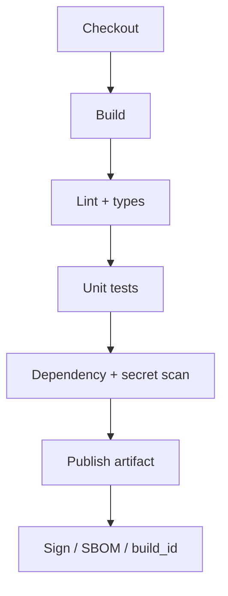

# CI Pipeline Design

Continuous Integration should make every merge a **known-good candidate** for promotion — not a hope. Keep the default path fast; park heavy work behind labels or nightlies.

> **Related:** Promotion → [§2](02-cd-and-promotion.md) · Contract tests → [api-design §15](../../api-design-and-protection/includes/15-contract-and-schema-testing.md) · Synthetics → [sre §10](../../sre-and-incidents/includes/10-synthetic-monitoring.md) · Overview → [§0](00-overview.md)

---

## At a glance

| Stage | Purpose | Fail means |
|-------|---------|------------|
| **Build** | Compile / bundle / image | Artifact unusable |
| **Unit / component tests** | Fast correctness | Logic wrong |
| **Lint / format** | Consistency | Style/policy debt |
| **Typecheck** | API(Application Programming Interface) boundaries | Contract drift |
| **Security scan** | Known CVEs / secrets | Supply-chain risk |
| **Package** | Immutable artifact + metadata | Cannot promote safely |

**Rule of thumb:** If CI is routinely skipped or “re-run until green,” the pipeline is broken — fix flakes, do not normalize ignores.

---

## Recommended default pipeline

| Job | Notes |
|-----|-------|
| **Build** | Deterministic; lockfiles committed |
| **Tests** | Parallel shards; cache deps |
| **Lint** | Same rules as editor |
| **SAST(Static Application Security Testing) / deps** | Block critical; warn high with SLA(Service Level Agreement) |
| **Secret scan** | Pre-receive or CI; never merge keys |
| **Artifact** | OCI image or package with digest |
| **SBOM(Software Bill of Materials)** | Attach for prod promote policy |

---

## Test layers in CI

| Layer | In default CI? | Elsewhere |
|-------|----------------|-----------|
| Unit | Yes | — |
| Component / API contract | Yes if fast | [api-design §15](../../api-design-and-protection/includes/15-contract-and-schema-testing.md) |
| Integration (Testcontainers) | Yes if < budget | Nightly if slow |
| E2E browser | Selective / nightly | Staging synthetics |
| Load | Rarely on PR | [sre §3](../../sre-and-incidents/includes/03-capacity-and-load-testing.md) |

Keep PR signal **actionable in minutes**. Move expensive suites to merge queue, nightly, or staging gates ([§2](02-cd-and-promotion.md)).

---

## Artifacts and provenance

| Metadata | Why |
|----------|-----|
| **Digest / checksum** | Promote exact bits |
| **build_id / git SHA** | Correlate metrics and incidents |
| **SBOM** | Vulnerability response |
| **Signature** | Verify publisher in CD(Continuous Delivery) |
| **Base image digest** | Reproducible rebuilds |

Never promote “latest” floating tags to production.

---

## Caching and speed

| Lever | Caution |
|-------|---------|
| Dependency cache | Invalidate on lockfile change |
| Build cache | Do not cache secrets |
| Parallel jobs | Watch flaky shared DBs |
| Path filters | Do not skip security on “docs-only” if hooks change |

---

## Common mistakes

| Mistake | Fix |
|---------|-----|
| Only green main, broken PRs | Require CI on PR |
| Flaky tests muted forever | Quarantine with expiry |
| Scanning only yearly | Every build + periodic deep |
| Mutable `latest` in prod | Digest pins |
| 60-minute default CI | Split required vs optional |