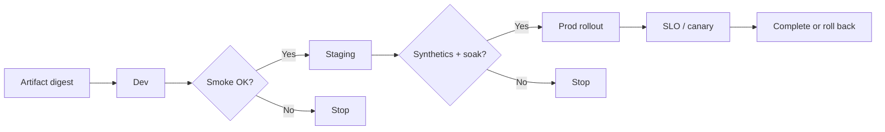

# CD and Promotion

Continuous Delivery promotes a **tested artifact** through environments with rising confidence. How the runtime shifts traffic (rolling, canary, blue-green) is covered in deployment-strategies — here we own **gates and parity**.

> **Related:** CI(Continuous Integration) artifacts → [§1](01-ci-pipeline-design.md) · Config parity → [§3](03-config-vs-secrets.md) · GitOps(Git Operations) → [deployment §9](../../deployment-strategies/includes/09-gitops.md) · Progressive delivery → [deployment §10](../../deployment-strategies/includes/10-progressive-delivery.md) · SLO(Service Level Objective) rollback → [deployment §13](../../deployment-strategies/includes/13-slo-rollback-triggers.md)

---

## At a glance

| Promote to | Minimum gate |
|------------|--------------|
| **Dev** | CI green + digest exists |
| **Staging** | Smoke / contract + migrations expand-safe |
| **Prod** | Staging soak + approval policy + SLO-aware rollout |

**Rule of thumb:** Same image digest in every env; only config, secrets, replicas, and flags differ.

---

## Promotion flow

| Gate type | Examples |
|-----------|----------|
| **Automated** | Tests, scans, image signature, schema expand check |
| **Synthetic** | Critical journey ([sre §10](../../sre-and-incidents/includes/10-synthetic-monitoring.md)) |
| **Human** | Change advisory for high-risk; two-person prod |
| **Runtime** | Canary SLO burn ([deployment §13](../../deployment-strategies/includes/13-slo-rollback-triggers.md)) |

---

## Environment promotion policies

| Policy | Use when |
|--------|----------|
| **Fully automated to staging** | High CI trust |
| **Manual prod button** | Regulated / low deploy frequency |
| **Progressive auto-prod** | Strong SLOs + canary |
| **GitOps sync** | Desired state in git ([deployment §9](../../deployment-strategies/includes/09-gitops.md)) |

Document who can promote, freeze windows, and how error budgets pause releases ([sre §2](../../sre-and-incidents/includes/02-error-budgets.md)).

---

## Migrations and promotes

| Rule | Why |
|------|-----|
| Expand before code that needs new schema | Rollback-friendly |
| Contract after code no longer reads old | Avoid break on undo |
| Never expand+contract in one promote | Couples undo paths |

Details → [deployment §12](../../deployment-strategies/includes/12-schema-migrations-and-deploy.md), [postgresql-performance §15](../../postgresql-performance/includes/15-schema-migration-checklist.md).

---

## Mapping to deploy strategies

| Promotion question | Answer lives in |
|--------------------|-----------------|
| Rolling vs canary vs blue-green | [deployment overview](../../deployment-strategies/includes/00-overview.md) |
| When to auto-rollback | [deployment §13](../../deployment-strategies/includes/13-slo-rollback-triggers.md) |
| Flag vs traffic % | [§4](04-feature-flags-as-control.md), [deployment §7](../../deployment-strategies/includes/07-feature-flags.md) |

---

## Common mistakes

| Mistake | Fix |
|---------|-----|
| Rebuild for prod with “prod Dockerfile” | One artifact |
| Hotfix only in prod | Hotfix through same pipeline |
| Staging with different feature set | Flag parity ([§3](03-config-vs-secrets.md)) |
| Promote during SEV1 | Freeze policy |
| No soak on staging | Time-box soak for risky changes |