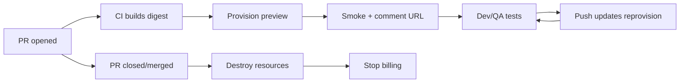

# Preview and Ephemeral Environments

PR(Pull Request) previews are **short-lived, isolated runtimes** tied to a branch — they shorten feedback loops before staging promotion. Lifecycle (create → test → destroy) matters as much as the Helm chart.

> **Scope:** Ephemeral env provisioning, data/secrets policy, cost guards, and teardown for PR previews. Promotion gates after preview → [§2](02-cd-and-promotion.md). Platform module for previews → [§8A](08A-paved-road-catalog.md) · boundaries → [§8](08-platform-boundaries.md).
>
> **Related:** CI(Continuous Integration) artifacts → [§1](01-ci-pipeline-design.md) · Config vs secrets → [§3](03-config-vs-secrets.md) · Contract tests → [testing §3](../../testing-strategy/includes/03-contract-testing-boundaries.md) · Progressive prod → [deployment §10](../../deployment-strategies/includes/10-progressive-delivery.md)

---

## At a glance

| Property | Preview default |
|----------|-----------------|
| **Trigger** | PR open / sync; optional label |
| **Lifetime** | TTL(Time To Live) 24–72 h or close/merge |
| **URL** | `{pr}-{app}.{preview-domain}` |
| **Data** | Synthetic seed; no prod PII(Personally Identifiable Information) |
| **Parity** | Same image digest as CI; scaled-down replicas |
| **Cost guard** | Max concurrent previews per repo/team |

**Rule of thumb:** A preview proves **“this digest runs and passes smoke”** — not full prod soak. Staging owns integration depth — [§2](02-cd-and-promotion.md).

---

## Lifecycle

| Event | Action |
|-------|--------|
| **PR open** | Provision namespace, DB branch, ingress |
| **Push to branch** | Redeploy same env with new digest |
| **PR idle** | TTL warning → auto-destroy |
| **Merge/close** | Immediate teardown + DB drop |

---

## Paved-road module

Offer previews as a **catalog module** — [§8A](08A-paved-road-catalog.md):

| Module contract | Include |
|-----------------|---------|
| **Inputs** | Repo, PR number, digest, tier |
| **Outputs** | URL, kube context, DB connection (sandbox) |
| **SLO(Service Level Objective)** | Provision p95 < 10 min |
| **Support** | Platform owns template; app owns smoke |

Teams should not fork Terraform per service — consume the versioned module and document exceptions via ADR(Architecture Decision Record).

---

## Data and secrets

| Rule | Why |
|------|-----|
| **Seed script** in repo | Repeatable empty state |
| **No prod secrets** in preview | Leak via PR forks |
| **Scrubbed fixtures** | GDPR(General Data Protection Regulation) / PCI DSS(Payment Card Industry Data Security Standard) scope |
| **External deps mocked or sandbox** | Processors, webhooks — [api-design §7 portal sandboxes](../../api-design-and-protection/includes/07A-developer-portal.md) |
| **Migrations expand-safe** | Preview DB applies same migrations as staging |

Optional **DB branch per preview** (Neon, PlanetScale pattern): fast clone; destroy on PR close.

---

## What to run in preview

| Gate | In preview? |
|------|-------------|
| Unit + contract (CI) | Already on PR |
| Smoke (health, one journey) | Yes — block comment on fail |
| E2E(End-to-End) full suite | Optional; often nightly on staging |
| Load / soak | No — staging/prod paths |
| Synthetics | Staging+ — [sre §10](../../sre-and-incidents/includes/10-synthetic-monitoring.md) |

Post preview URL as PR comment with **digest**, **TTL**, and **seed credentials** (sandbox only).

---

## Cost and abuse controls

- [ ] Max previews per org/repo; queue excess PRs
- [ ] Auto-sleep after N hours idle (scale to zero)
- [ ] Label-gated previews for expensive deps (GPU, large DB)
- [ ] Destroy on merge even if pipeline green
- [ ] Metrics: `$ / preview-day`, provision failures

---

## Common mistakes

| Mistake | Why it hurts | Fix |
|---------|--------------|-----|
| Previews never destroyed | Runaway cloud bill | TTL + close hook |
| Prod data in preview | Fork leak | Synthetic seed only |
| Different image than CI | “Works in preview, fails in prod” | Same digest |
| Preview = staging substitute | Missing soak/synthetics | Promote path in [§2](02-cd-and-promotion.md) |
| Manual URL sharing | Orphan envs | Automated comment + DNS(Domain Name System) |

---

## Pros and cons

| Approach | Pros | Cons |
|----------|------|------|
| **Per-PR preview** | Fast feedback | Cost + platform work |
| **Shared dev only** | Cheap | Queue contention |
| **Manual QA env** | Simple | Stale; not branch-accurate |
