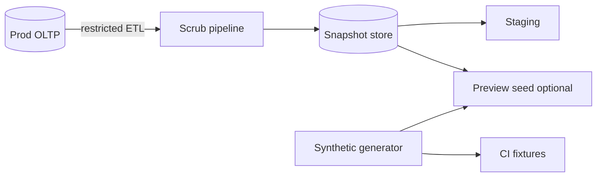

# Test Data and Scrubbed Snapshots

Non-prod environments need **realistic shape without real PII(Personally Identifiable Information)** — scrubbed snapshots, synthetic seeds, subsetting, and refresh SLAs(Service Level Agreements) are platform products, not one-off SQL(Structured Query Language) scripts.

> **Scope:** Test data strategy — scrubbing, subsetting, refresh cadence, access controls. Preview/ephemeral envs → [§2A](02A-preview-and-ephemeral-environments.md). Partner sandboxes → [api-design §7B](../../api-design-and-protection/includes/07B-partner-sandbox-and-api-keys.md). Classification → [ESC §7](../../enterprise-security-compliance/includes/07-pii-and-data-classification.md). DSAR(Data Subject Access Request) → [ESC §7A](../../enterprise-security-compliance/includes/07A-erasure-and-dsar.md).
>
> **Related:** CD(Continuous Delivery) promotion → [§2](02-cd-and-promotion.md) · Config vs secrets → [§3](03-config-vs-secrets.md) · Pipeline design → [§1](01-ci-pipeline-design.md) · Data quality → [data-platforms §5B](../../data-platforms/includes/05B-data-quality-and-pipeline-testing.md)

---

## At a glance

| Strategy | Fit |
|----------|-----|
| **Synthetic seed** | Previews, CI(Continuous Integration), demos — default |
| **Scrubbed snapshot** | Staging integration depth |
| **Subset** | Large prod corpus; tenant-scoped QA(Quality Assurance) |
| **On-demand refresh** | Weekly staging; daily optional for core teams |

**Rule of thumb:** **No prod PII in previews** — [§2A](02A-preview-and-ephemeral-environments.md). Staging scrub failures are SEV-worthy data leaks.

---

## Data flow

| Control | Requirement |
|---------|-------------|
| **Prod access** | Break-glass only; audited |
| **Scrub proof** | Automated scan for email/phone/token patterns |
| **Encryption** | At rest for snapshot buckets — [ESC §8](../../enterprise-security-compliance/includes/08-encryption-policy.md) |
| **TTL(Time To Live)** | Destroy ephemeral copies on teardown |

---

## Scrubbing rules

| Field class | Transform |
|-------------|-----------|
| **Email / phone** | Deterministic fake (`user_{id}@example.test`) |
| **Names / addresses** | Faker with stable seed per row |
| **Payment / secrets** | Remove or replace; never copy PAN(Primary Account Number) — [payments §1](../../payments-and-fintech/includes/01-pci-scope-reduction.md) |
| **Tokens / API(Application Programming Interface) keys** | Null or rotate to known test values |
| **Free text** | Redact or truncate if PII risk — [ESC §7](../../enterprise-security-compliance/includes/07-pii-and-data-classification.md) |

Preserve **referential integrity** and **distribution** (cardinality, null rates) for realistic queries.

---

## Subsetting and refresh

| Knob | Guidance |
|------|----------|
| **Tenant slice** | One enterprise fixture tenant for B2B(Business-to-Business) tests |
| **Time window** | Last N days for event-heavy tables |
| **Size cap** | Fit staging DB budget — [PG ops](../../postgresql-performance/includes/16-backup-restore-and-pitr.md) |
| **Refresh SLA(Service Level Agreement)** | Document: staging weekly, previews synthetic-only |
| **Version pin** | Snapshot tagged with schema migration version |

Partner sandboxes stay synthetic — [api-design §7B](../../api-design-and-protection/includes/07B-partner-sandbox-and-api-keys.md).

---

## Operational checklist

- [ ] Scrub pipeline in CI with regression tests on sample rows
- [ ] PII scanner gate before snapshot publish
- [ ] RBAC(Role-Based Access Control) on snapshot buckets; no public URLs
- [ ] Preview envs cannot mount prod snapshots — [§2A](02A-preview-and-ephemeral-environments.md)
- [ ] Runbook for scrub bug / leak response

---

## Common mistakes

| Mistake | Fix |
|---------|-----|
| `pg_dump` prod to laptop | Scrub pipeline + access controls |
| Scrub once, schema adds new PII column | Contract test on column list |
| Shared staging credentials | Per-env secrets — [§3](03-config-vs-secrets.md) |
| Stale staging blocks releases | Refresh SLA + ownership |
| Real webhooks from staging | Point to mock/sandbox endpoints |
| Deterministic scrub re-identifies users | Hash salts; avoid real domains |

---

## Pros and cons

| Approach | Pros | Cons |
|----------|------|------|
| **Fully synthetic** | Safest; fast reset | Misses prod edge cases |
| **Scrubbed snapshot** | Realistic joins | Pipeline to maintain |
| **Prod read replica in staging** | Fresh | Unacceptable PII risk |
