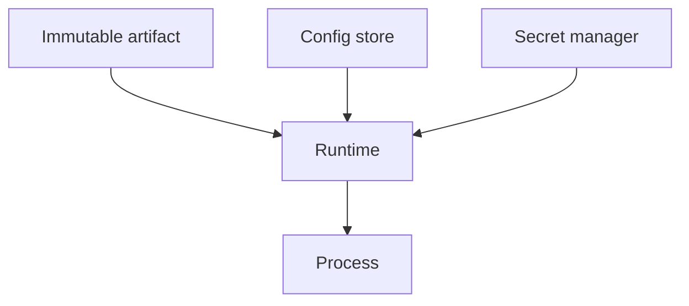

# Config vs Secrets

Twelve-factor discipline keeps environments **alike in behavior** and **different only where they must**. Config is not secret; secrets are not checked into git.

> **Related:** Promotion parity → [§2](02-cd-and-promotion.md) · DB secrets / rotation → [database-connection-and-security](../../database-connection-and-security/README.md) · Vault patterns → [database-connection §5](../../database-connection-and-security/includes/05-secret-manager-password.md) · Overview → [§0](00-overview.md)

---

## At a glance

| Kind | Examples | Storage |
|------|----------|---------|
| **Config** | Feature defaults, timeouts, pool size, log level | Env / config map / sane defaults in code |
| **Secrets** | DB passwords, API(Application Programming Interface) keys, private keys | Secret manager / KMS(Key Management Service); injected at runtime |
| **Identity** | Cloud IAM(Identity and Access Management) roles, workload identity | Prefer roles over long-lived keys |

**Rule of thumb:** If leaking it requires a rotation and an incident, it is a **secret** — not an `.env` committed “just for staging.”

---

## Twelve-factor highlights (delivery lens)

| Practice | Delivery impact |
|----------|-----------------|
| **Config in env** | Same artifact; different bindings |
| **Strict separation** | Dev cannot use prod credentials |
| **No build-time secrets** | Rebuilds do not bake keys into layers |
| **Disposable processes** | Restart picks up rotated secrets |

---

## Environment parity

| Dimension | Keep similar | May differ |
|-----------|--------------|------------|
| **Code / image** | Same digest | — |
| **Feature flags defaults** | Same keys | Values / % |
| **Timeouts / limits** | Same order of magnitude | Tuned for size |
| **Dependencies** | Same major versions | Scale / HA |
| **Data** | Schema compatible | Volume / PII(Personally Identifiable Information) |

“Works in staging” failures are often **hidden config drift** — different flag defaults, shorter timeouts, or mock auth that skips the gateway.

---

## Secret handling checklist

| Step | Practice |
|------|----------|
| **Create** | In vault / cloud SM; ACL(Access Control List) by env |
| **Inject** | Sidecar, CSI, or sealed at deploy — not Dockerfile `ENV` |
| **Rotate** | Dual-active then revoke ([DB §12](../../database-connection-and-security/includes/12-credential-rotation-and-dr.md)) |
| **Audit** | Who read/changed secrets |
| **CI(Continuous Integration)** | Short-lived OIDC(OpenID Connect) to cloud; no PATs in plaintext |

Scan for accidental commits in CI ([§1](01-ci-pipeline-design.md)).

---

## Config anti-patterns

| Anti-pattern | Fix |
|--------------|-----|
| `if env == "prod"` deep in code | Capability flags / config |
| Prod-only config never tested | Exercise prod-like config in staging |
| Secrets in CI logs | Masking + least privilege |
| Copy-paste `.env` in Slack | Vault + break-glass procedure |
| One mega-config for all services | Per-service ownership |

---

## Common mistakes

| Mistake | Fix |
|---------|-----|
| Baking secrets into images | Runtime inject |
| Different code paths per env | Config + flags |
| Shared “god” credentials | Per-app IAM |
| No staging secret rotation drill | Include in game days ([sre §9](../../sre-and-incidents/includes/09-game-days-and-drills.md)) |
| Documenting secrets in wikis | Document *references*, not values |