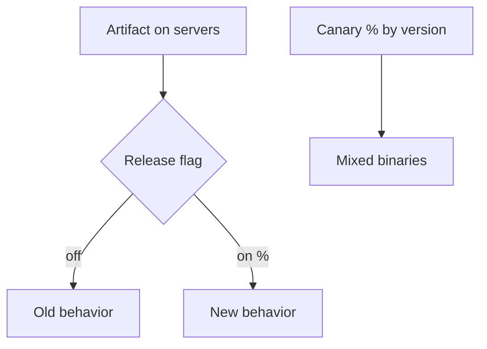

# Feature Flags as Control

Flags let you **ship dark** and **expose deliberately**. Used well they are an operational control plane; used poorly they become permanent branching in production.

> **Scope:** **Product and ops usage** — kill switches, progressive exposure, ownership, and debt. Deploy-strategy mechanics and flag service failure modes → [deployment-strategies §7 Feature flags](../../deployment-strategies/includes/07-feature-flags.md).
>
> **Related:** Progressive delivery → [deployment §10](../../deployment-strategies/includes/10-progressive-delivery.md) · Rollback → [§6](06-rollback-vs-forward-fix.md) · Error budgets → [sre §2](../../sre-and-incidents/includes/02-error-budgets.md) · A/B vs canary → [deployment §5](../../deployment-strategies/includes/05-ab-testing.md)

---

## At a glance

| Flag type | Purpose | Lifetime |
|-----------|---------|----------|
| **Release** | Decouple deploy from expose | Days–weeks; delete at 100% |
| **Ops / kill switch** | Instant mitigate | Long-lived; rarely toggled |
| **Experiment** | Product learning | Bound to experiment end |
| **Permission** | Entitlement | Product-owned; not a deploy tool |

**Rule of thumb:** Release flags should be **boring and temporary**. If a flag is older than one quarter, schedule its removal or reclassify it.

---

## Control vs traffic strategies

| Mechanism | Controls |
|-----------|----------|
| **Canary / progressive** | Which **binary version** sees traffic |
| **Release flag** | Which **code path** inside a version |
| **A/B** | Which **experience** for learning metrics |

Do not treat A/B as your only safety net ([deployment §5](../../deployment-strategies/includes/05-ab-testing.md)).

---

## Ops playbook

| Situation | Flag action |
|-----------|-------------|
| SEV from new path | Kill switch / set release to 0% |
| Error budget freeze | Block 0→100% without TL sign-off |
| Partial rollout pain | Hold %; fix forward behind flag |
| Migration read path | Flag old vs new reader; expand/contract |

Wire flag changes into incident timelines ([sre §6](../../sre-and-incidents/includes/06-incident-command.md)) and dashboards (`flag_key` markers).

---

## Ownership and process

| Concern | Practice |
|---------|----------|
| **Who toggles prod** | RBAC(Role-Based Access Control); audit log |
| **Default on flag service outage** | Fail to last-known safe / old path ([deployment §7](../../deployment-strategies/includes/07-feature-flags.md)) |
| **CI(Continuous Integration)** | Test flag on and off |
| **Cleanup** | Ticket on creation; delete code + config together |
| **Naming** | `team_feature_intent_date` — searchable |

---

## When not to use flags

| Prefer instead | Why |
|----------------|-----|
| Config for timeouts | Not a product exposure question |
| Standard authZ | Entitlements ≠ release flags |
| Separate services | Huge divergent stacks |
| Trunk + short PR | Flag overhead not worth it for tiny changes |

---

## Common mistakes

| Mistake | Fix |
|---------|-----|
| Flags forever | Inventory and burn-down |
| Nested flag soup | One concern per flag |
| No audit | Require logged changes in prod |
| Testing only flag=on | Matrix in CI |
| Using flags instead of canary | Pair both for high risk |