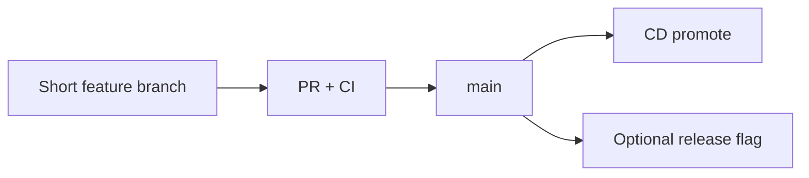

# Branching and Release Trains

Branching policy determines how fast you integrate and how painful releases feel. Prefer **short-lived branches** and frequent mainline integration; add trains when coordination or compliance demands a cadence.

> **Related:** CI(Continuous Integration) design → [§1](01-ci-pipeline-design.md) · Promotion → [§2](02-cd-and-promotion.md) · Flags → [§4](04-feature-flags-as-control.md) · GitOps(Git Operations) → [deployment §9](../../deployment-strategies/includes/09-gitops.md)

---

## At a glance

| Model | Best for | Risk |
|-------|----------|------|
| **Trunk-based** | Most product teams | Needs solid CI + flags |
| **GitHub Flow** | Small teams, continuous deploy | Long-lived PRs still hurt |
| **Release train** | Multi-team cadence, mobile, regulated | Batching delays learning |
| **Git Flow** | Rarely ideal for SaaS | Merge debt, hotfix confusion |

**Rule of thumb:** If a feature branch lives >2–3 days, you are batching risk — split work or hide unfinished behavior behind flags.

---

## Trunk-based (default recommendation)

| Practice | Detail |
|----------|--------|
| **main always releasable** | Broken main is a SEV for the team |
| **Small PRs** | Reviewable; fast CI |
| **Hide incomplete features** | Flags ([§4](04-feature-flags-as-control.md)) |
| **Protect main** | Required checks + code owners |

---

## Release trains

A **train** leaves on a schedule (e.g. weekly). Work merges to a release branch or main cut; stragglers wait for the next train.

| Pros | Cons |
|------|------|
| Predictable QA / change windows | Slower feedback |
| Easier multi-service coordination | Large diffs at cut |
| Clear marketing versioning | Pressure to “make the train” poorly tested |

| Train hygiene | Practice |
|---------------|----------|
| Cut criteria | CI green + critical synthetics |
| Late joins | Only P0 with TL approval |
| Hotfixes | Separate fast path back to main **and** train branch |
| After release | Merge back; delete release branch soon |

---

## Hotfix and patch lanes

| Path | Use |
|------|-----|
| **Forward on main + cherry-pick** | Preferred when train exists |
| **Direct prod hotfix** | Break-glass only; still run CI subset |
| **Flag off** | Prefer over emergency code if possible |

Every hotfix must return to main the same day to avoid drift.

---

## Versioning and tags

| Artifact | Tag |
|----------|-----|
| **Immutable image** | git SHA or semver+SHA |
| **Release notes** | User-facing train version |
| **Metrics** | `build_id` = SHA |

Do not conflate marketing version with digest used in promote ([§2](02-cd-and-promotion.md)).

---

## Common mistakes

| Mistake | Fix |
|---------|-----|
| Long-lived feature branches | Trunk + flags |
| Untested release branch | Same CI as main |
| Hotfix only on prod branch | Merge back immediately |
| “Freeze main” for weeks | Smaller trains or continuous with flags |
| Skipping reviews to catch train | Miss the train — protect quality |