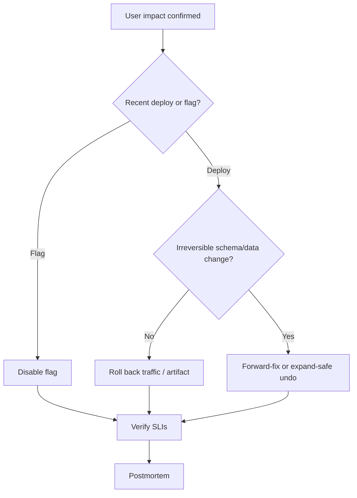

# Rollback vs Forward-Fix

When production hurts, choose **mitigation first**. Rollback restores a known state quickly; forward-fix ships a correction when rollback is unsafe or impossible.

> **Related:** SLO(Service Level Objective) rollback triggers → [deployment-strategies §13](../../deployment-strategies/includes/13-slo-rollback-triggers.md) · Schema coupling → [deployment §12](../../deployment-strategies/includes/12-schema-migrations-and-deploy.md) · Flags → [§4](04-feature-flags-as-control.md) · Incident command → [sre §6](../../sre-and-incidents/includes/06-incident-command.md) · Runbooks → [RUNBOOK-TEMPLATE.md](../../RUNBOOK-TEMPLATE.md)

---

## At a glance

| Option | Best when | Watch out |
|--------|-----------|-----------|
| **Roll back artifact / traffic** | Bad binary; schema still compatible | Data written by new code |
| **Flag off / kill switch** | Bad path; good binary | Flag debt / cache lag |
| **Forward-fix** | Migration irreversible; data shape new | Longer TTR if CI(Continuous Integration) slow |
| **Scale / shed load** | Capacity incident, not bad code | Masks real bug |

**Rule of thumb:** Prefer the **fastest safe mitigation**. Optimize root cause after users are stable.

---

## Decision flow

Automated gates and metric correlation → [deployment §13](../../deployment-strategies/includes/13-slo-rollback-triggers.md).

---

## Rollback by mechanism

| Mechanism | Action | Speed |
|-----------|--------|-------|
| **Blue-green** | Switch pointer to previous env | Seconds–minutes |
| **Canary / progressive** | Shift weight to prior version | Minutes |
| **Rolling** | Redeploy previous digest | Minutes |
| **GitOps(Git Operations)** | Revert desired-state commit | Minutes + sync |
| **Flag** | Toggle | Seconds |

Record previous digest in the promote system **before** each prod change.

---

## When forward-fix is mandatory

| Situation | Why rollback fails |
|-----------|--------------------|
| **Contract migration already dropped columns** | Old code cannot run |
| **Data rewritten incompatible** | Old binary misreads |
| **External side effects** | Emails/charges already sent — compensate |
| **Multi-service partial rollout** | Need coordinated fix |

Prevent these with expand/contract ([deployment §12](../../deployment-strategies/includes/12-schema-migrations-and-deploy.md)) so rollback stays available.

---

## SLO-linked policy

| Signal | Default mitigation |
|--------|--------------------|
| Fast error-budget burn on new `build_id` | Auto or one-click rollback |
| Business metric drop with flag on | Flag off |
| Burn without version correlation | Investigate infra; do not blind rollback |
| Schema deploy mid-incident | Follow schema runbook, not naive app rollback |

Tie pages to runbooks ([sre §5](../../sre-and-incidents/includes/05-alerting-and-paging.md)).

---

## Common mistakes

| Mistake | Fix |
|---------|-----|
| Debating root cause for an hour | Mitigate first |
| Rolling back past breaking migration | Forward-fix / dual-write plan |
| No previous digest recorded | Pin every promote |
| Forward-fix without CI | Minimum pipeline + pair |
| Declaring victory without SLI(Service Level Indicator) check | Verify budget burn stops |