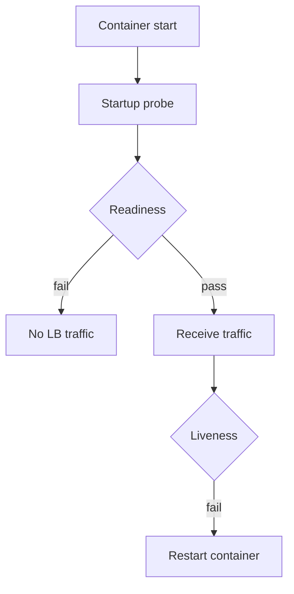

# Containers and Health

Containers make artifacts portable; **health contracts** make them operable. This section stays at decision level — enough for tech leads to demand the right checks and resources without a deep Kubernetes digression.

> **Related:** Promotion → [§2](02-cd-and-promotion.md) · Rollback → [§6](06-rollback-vs-forward-fix.md) · Stateless apps → [api-design §11](../../api-design-and-protection/includes/11-stateless-architecture.md) · Deploy strategies → [deployment-strategies](../../deployment-strategies/README.md) · Graceful drain → [resilience-patterns §14](../../resilience-patterns/includes/14-graceful-shutdown-and-drain.md) · Liveness vs bulkheads → [resilience-patterns §4](../../resilience-patterns/includes/04-bulkheads.md)

---

## At a glance

| Concern | Decision |
|---------|----------|
| **Image** | Minimal base, non-root, pinned digest |
| **Liveness** | Process stuck? restart |
| **Readiness** | Ready for traffic? remove from LB |
| **Startup** | Slow boot grace without false kill |
| **Resources** | Requests/limits matched to SLO(Service Level Objective) load tests |

**Rule of thumb:** Readiness fails **closed** (no traffic); liveness fails only when restart helps — never point liveness at a dependency outage.

---

## Image policy

| Practice | Why |
|----------|-----|
| **Pin base digest** | Reproducible, scannable |
| **Multi-stage build** | Smaller attack surface |
| **Non-root user** | Blast radius |
| **No secrets in layers** | [§3](03-config-vs-secrets.md) |
| **SBOM(Software Bill of Materials) + scan in CI(Continuous Integration)** | [§1](01-ci-pipeline-design.md) |
| **One process mindset** | Clear health and logs |

Prefer distroless/slim only when your debug story (ephemeral debug container) is real.

---

## Health check semantics

| Probe | Checks | Do not |
|-------|--------|--------|
| **Startup** | App finished init | Share with liveness blindly |
| **Readiness** | Can serve *this* instance | Fail entire dep mesh forever without care |
| **Liveness** | Deadlock / wedged process | `SELECT 1` to remote DB as only check |

Dependency failures should make instance **not ready** (or return 503 from gateway), not infinite restart storms.

---

## Resources and SLO

| Setting | Guidance |
|---------|----------|
| **Requests** | What scheduler can rely on |
| **Limits** | Cap noisy neighbors; avoid silent throttle surprises |
| **HPA signals** | Prefer saturation + RPS/SLO-aware metrics over CPU-only ([HTS §10](../../high-throughput-systems/includes/10-scale-and-deploy.md)) |
| **Disruption** | PodDisruptionBudgets for rolling safety |

Validate sizing with capacity tests ([sre §3](../../sre-and-incidents/includes/03-capacity-and-load-testing.md)).

---

## Rolling safety checklist

| Check | Ready? |
|-------|--------|
| Readiness on before receiving traffic | |
| Graceful shutdown drains in-flight | |
| PreStop ≥ LB propagation | |
| Migrations expand-safe | |
| Previous image digest known | |

Pairs with rolling/canary mechanics in [deployment-strategies](../../deployment-strategies/README.md).

---

## Common mistakes

| Mistake | Fix |
|---------|-----|
| Liveness = deep dependency check | Shallow process check |
| No readiness | Traffic to booting pods |
| `latest` tags in prod | Digests |
| Huge images with build tools | Multi-stage |
| Limits without requests | Schedule unpredictably |
| Ignoring shutdown hooks | Truncated requests on roll |