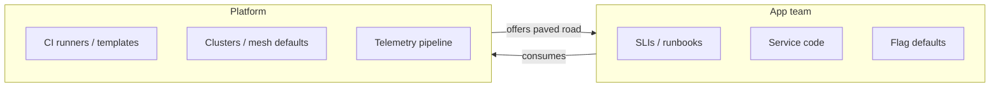

# Platform Boundaries

Clear boundaries stop every outage from becoming an identity crisis. Tech leads own **service outcomes**; platform owns **shared leverage** — with an explicit handoff list.

> **Related:** Overview → [§0](00-overview.md) · Paved-road catalog (modules, platform SLOs, exception ADR) → [§8A](08A-paved-road-catalog.md) · Observability ownership → [sre §4](../../sre-and-incidents/includes/04-observability-practice.md) · On-call → [sre §8](../../sre-and-incidents/includes/08-on-call-design.md) · Secrets platform → [database-connection-and-security](../../database-connection-and-security/README.md)

---

## At a glance

| Domain | Tech lead / app team | Platform |
|--------|----------------------|----------|
| **CI(Continuous Integration) template** | Pipeline content, tests | Reusable workflows, runners |
| **CD(Continuous Delivery) / envs** | Promote approval, app config | Cluster, registries, GitOps(Git Operations) agents |
| **Secrets** | App roles, rotation participation | Vault/SM, policies |
| **Observability** | SLIs, dashboards, alerts | Agents, storage, defaults |
| **Incident** | Service IC(Incident Commander), runbooks | Infra IC for shared plane |
| **Gold paths** | Adopt and give feedback | Paved road modules |

**Rule of thumb:** If only one team can fix it, they own the page — not “everyone in the channel.”

---

## RACI-style split

| Decision | Responsible | Consulted |
|----------|-------------|-----------|
| Service SLO(Service Level Objective) targets | App TL | Product, SRE(Site Reliability Engineering) |
| Cluster upgrade window | Platform | App TLs |
| Prod promote policy | App TL + security | Platform |
| New CI required check | Platform (org) / App (repo) | Security |
| Sev routing for gateway | Platform if shared edge | App if bad deploy |

---

## What app teams must still own

| Item | Why it cannot be fully centralized |
|------|-------------------------------------|
| **User-journey SLIs** | Business meaning |
| **Runbooks** | Service-specific mitigate steps |
| **Feature flags** | Product exposure |
| **Schema migrations** | Data correctness |
| **Alert noise** | Only they know false positives |
| **Capacity of their path** | Domain load shape |

Platform can provide **templates**; app teams fill **content**.

---

## What platform should own

| Item | Why |
|------|-----|
| **Runner / build cache security** | Shared risk |
| **Image registry + signing** | Supply chain |
| **Ingress / cert defaults** | Consistent TLS(Transport Layer Security) |
| **Telemetry pipeline** | Cost and cardinality guardrails |
| **Paved modules** (Helm/Terraform) | Self-service speed |
| **Org policy-as-code** | Baseline compliance |

Avoid platform owning every YAML line — that creates a ticket bottleneck and silent shadow IT.

---

## Escalation contract

| Symptom | First on-call |
|---------|---------------|
| App 5xx / bad deploy | App |
| Node / control plane / registry down | Platform |
| Unclear | App starts IC; escalate with evidence ([sre §6](../../sre-and-incidents/includes/06-incident-command.md)) |

Document this in the team README and pager policies ([sre §5](../../sre-and-incidents/includes/05-alerting-and-paging.md)).

---

## Common mistakes

| Mistake | Fix |
|---------|-----|
| Platform pages for every 5xx | Symptom routing by ownership |
| App invents one-off clusters | Paved road + exceptions process |
| No intake for paved-road gaps | Office hours / RFC |
| “Shared ownership” of secrets | Named admins + audit |
| Central SRE writes all runbooks | Templates + app fill-in |