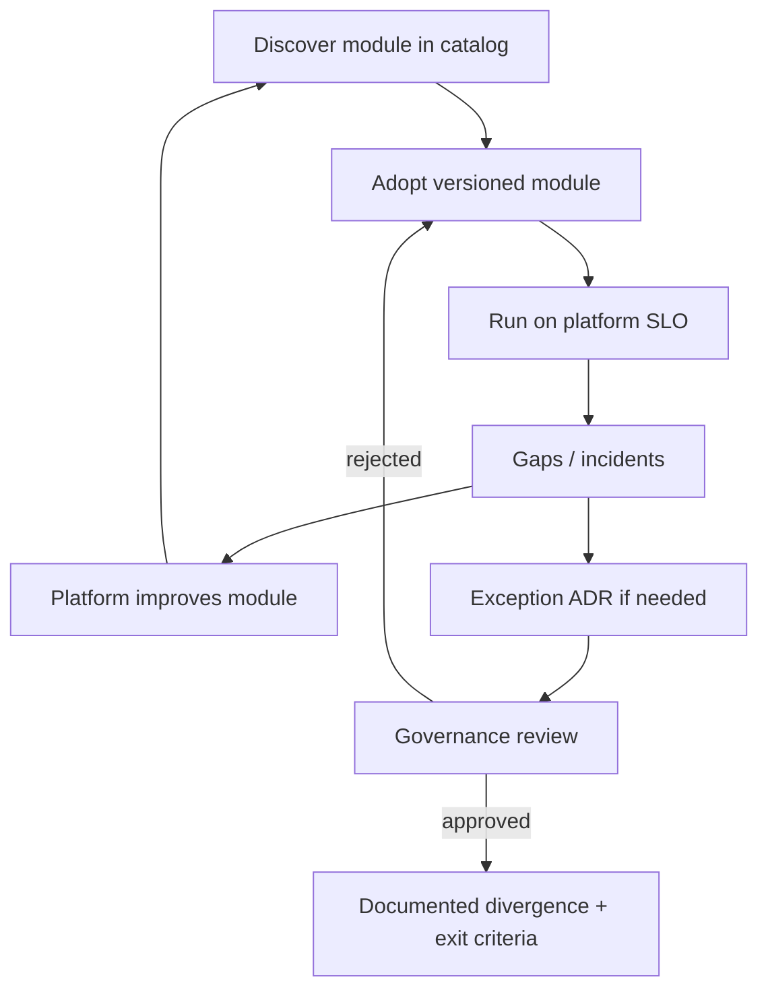

# Paved-Road Catalog

A paved-road catalog is the **product surface** of a platform team: versioned modules, published SLOs(Service Level Objectives), and an explicit exception path when a product team cannot use the gold path. Boundaries in [§8](08-platform-boundaries.md) say *who owns what*; this section says *what is offered, at what quality, and how to diverge safely*.

> **Scope:** Catalog shape, module contracts, platform SLOs, and exception ADR(Architecture Decision Record) path. Day-to-day ownership split → [§8](08-platform-boundaries.md). Org topology that makes a platform team viable → [architecture §1A Team Topologies](../../architecture-decisions/includes/01A-team-topologies.md). Decision rights for exceptions → [architecture §5A](../../architecture-decisions/includes/05A-architecture-governance.md). Stage/pricing fit for how much platform to build → [architecture §14](../../architecture-decisions/includes/14-org-stage-and-pricing-fit.md).
>
> **Related:** [§8 Platform boundaries](08-platform-boundaries.md) · Decision guide → [§9](09-decision-guide.md) · Team Topologies → [arch §1A](../../architecture-decisions/includes/01A-team-topologies.md) · Governance / ARB(Architecture Review Board) → [arch §5A](../../architecture-decisions/includes/05A-architecture-governance.md) · Org fit → [arch §14](../../architecture-decisions/includes/14-org-stage-and-pricing-fit.md) · Observability as platform → [sre §4A](../../sre-and-incidents/includes/04A-observability-platform.md)

---

## At a glance

| Catalog element | Meaning |
|-----------------|---------|
| **Module** | Reusable paved path (CI(Continuous Integration) workflow, Helm/Terraform module, runtime baseline) with version and owner |
| **Contract** | Inputs, outputs, upgrade window, deprecation policy |
| **Platform SLO(Service Level Objective)** | User-facing reliability of the *module* (not each app's product SLO) |
| **Support model** | Office hours, intake, severity for platform pages |
| **Exception path** | Time-boxed ADR + review; no silent forks |

**Rule of thumb:** If app teams cannot discover, adopt, and upgrade a path without a ticket to the platform team for every change, you have a **ticket queue**, not a paved road.

---

## Catalog as a product

| Product practice | Platform analog |
|------------------|-----------------|
| Changelog | Module release notes + migration guides |
| SemVer | Breaking module changes are major; apps pin and upgrade deliberately |
| Support tiers | Self-serve docs vs office hours vs shared on-call for shared plane |
| Deprecation | Sunset date, dual-run period, forced upgrade gate in CI(Continuous Integration) |

Team interaction modes (collaboration / X-as-a-Service / facilitating) → [arch §1A](../../architecture-decisions/includes/01A-team-topologies.md). Prefer **X-as-a-Service** for mature modules; collaborate while a path is still forming.

---

## Module inventory (minimum)

| Area | Example modules | App team still owns |
|------|-----------------|---------------------|
| **CI** | Reusable workflows, required checks, runners | Test content, coverage bar for their code |
| **CD(Continuous Delivery)** | Promote digest, env overlays, GitOps(Git Operations) app-of-apps | Promote approval, app config values |
| **Runtime** | Base image, mesh/ingress defaults, health probes | Service ports, readiness meaning |
| **Secrets** | Sidecar / CSI(Container Storage Interface) patterns | Roles and rotation participation — [§3](03-config-vs-secrets.md) |
| **Observability** | Collector, golden dashboard template, cardinality defaults | SLIs and alert content — [sre §4A](../../sre-and-incidents/includes/04A-observability-platform.md) |
| **Flags** | SDK + control-plane defaults | Flag definitions and cleanup — [§4](04-feature-flags-as-control.md) |

Publish each module with: owner, version, SLO link, “how to upgrade,” “how to file a gap,” and “when not to use.”

---

## Platform SLOs

Platform SLOs measure the **shared plane**, not product journeys.

| Example SLI(Service Level Indicator) | Platform SLO idea |
|--------------------------------------|-------------------|
| CI template start success | Workflows start within N seconds / fail for infra reasons under X% |
| Artifact publish | Digest available in registry within N minutes of green CI |
| GitOps reconcile | Desired → live lag under budget |
| Telemetry ingest | Collector accept success; drop rate under budget |
| Secrets fetch | Sidecar/API(Application Programming Interface) availability for injection path |

Page platform on-call when **platform SLOs** burn; page app on-call when **product SLIs** burn — [§8](08-platform-boundaries.md) · [sre §1](../../sre-and-incidents/includes/01-sli-slo-sla.md).

---

## Exception ADR path

Divergence without process becomes unmaintainable snowflakes. Divergence with process is how early-stage orgs avoid overbuilding — [arch §14](../../architecture-decisions/includes/14-org-stage-and-pricing-fit.md).

| Step | Action |
|------|--------|
| 1 | App team drafts short ADR: why paved road fails, options, blast radius, exit criteria |
| 2 | Platform consults (cost, supportability, security) |
| 3 | Governance / ARB decides by blast radius — [arch §5A](../../architecture-decisions/includes/05A-architecture-governance.md) |
| 4 | If approved: time-box, named owner, review date, plan to rejoin paved road or graduate a new module |
| 5 | Catalog lists the exception so others do not invent a second fork |

**Fail closed on security-sensitive skips** (unsigned images, bypassed secret injection, open ingress). Those need explicit security + platform approval, not a quiet YAML edit.

---

## Catalog UX checklist

- [ ] Single discoverable index (portal or repo README) with status: stable / beta / deprecated
- [ ] Every module has owner, SLO, changelog, upgrade guide
- [ ] CI can pin module versions; breaking changes are majors
- [ ] Intake for gaps; office hours for adoption help
- [ ] Exception ADR template linked from catalog
- [ ] Quarterly prune: unused modules, overdue exceptions, stale owners

---

## Common mistakes

| Mistake | Fix |
|---------|-----|
| Platform = ticket desk for every YAML change | Publish versioned modules; self-serve |
| No platform SLOs | Measure CI/registry/GitOps/telemetry like a product |
| Silent forks “just this once” | Exception ADR + catalog entry |
| Infinite collaboration mode | Graduate mature paths to X-as-a-Service — [arch §1A](../../architecture-decisions/includes/01A-team-topologies.md) |
| Building a huge platform before product-market fit | Match investment to stage — [arch §14](../../architecture-decisions/includes/14-org-stage-and-pricing-fit.md) |
| Catalog without deprecation | Dual-run + sunset dates |

---

## Pros and cons

### Published paved-road catalog

**Pros:** Faster delivery, consistent security baseline, clear support boundaries.

**Cons:** Requires product discipline from platform (docs, versions, SLOs); exceptions still need governance.

### Ad-hoc “ask platform”

**Pros:** Flexible early on.

**Cons:** Bottleneck, inconsistent baselines, no measurable platform quality.