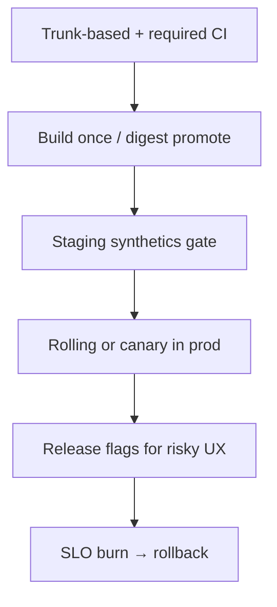

# Decision Guide

Pick delivery defaults that match risk, team size, and reliability maturity — and know which sibling guide owns the next click.

> **Related:** Overview → [§0](00-overview.md) · Deploy chooser → [deployment §11](../../deployment-strategies/includes/11-choosing-and-practices.md) · SRE(Site Reliability Engineering) adoption → [sre §11](../../sre-and-incidents/includes/11-decision-guide.md) · Secrets → [database-connection-and-security](../../database-connection-and-security/README.md)

---

## Quick picker

| Situation | Start here |
|-----------|------------|
| Slow or flaky PR signal | [§1 CI pipeline](01-ci-pipeline-design.md) |
| “Works in staging” prod fails | [§2 Promotion](02-cd-and-promotion.md) + [§3 Config](03-config-vs-secrets.md) |
| Need instant expose/disable | [§4 Flags](04-feature-flags-as-control.md) |
| Merge pain / long branches | [§5 Branching](05-branching-and-release-trains.md) |
| Bad release in prod now | [§6 Rollback vs forward-fix](06-rollback-vs-forward-fix.md) |
| CrashLoop / traffic to cold pods | [§7 Containers and health](07-containers-and-health.md) |
| Ticket ping-pong app vs platform | [§8 Platform boundaries](08-platform-boundaries.md) |
| How to shift traffic | [deployment-strategies](../../deployment-strategies/README.md) |
| What to page on | [sre-and-incidents](../../sre-and-incidents/README.md) |

---

## Recommended defaults

| Default | Upgrade when |
|---------|--------------|
| Rolling deploy | Error budget tight → canary ([deployment §4](../../deployment-strategies/includes/04-canary.md)) |
| Manual prod click | High trust + SLOs → progressive auto |
| Few flags | Many parallel features → flag platform |
| Weekly train | SaaS(Software as a Service) continuous → shorten or drop train |
| Shared platform templates | Org scale → policy-as-code |

---

## Pairing matrix

| Delivery need | This guide | Sibling |
|---------------|------------|---------|
| Artifact correctness | §1 | — |
| Traffic shift | links | [deployment overview](../../deployment-strategies/includes/00-overview.md) |
| Auto rollback | §6 | [deployment §13](../../deployment-strategies/includes/13-slo-rollback-triggers.md) |
| Schema + deploy | §2 | [deployment §12](../../deployment-strategies/includes/12-schema-migrations-and-deploy.md) |
| Secret injection | §3 | [database-connection](../../database-connection-and-security/README.md) |
| Budget freeze | §2 / §4 | [sre §2](../../sre-and-incidents/includes/02-error-budgets.md) |
| Health probes | §7 | [api-design §11](../../api-design-and-protection/includes/11-stateless-architecture.md) |

---

## Maturity stages

| Stage | Delivery posture |
|-------|------------------|
| **0** | Manual SSH/FTP — replace first |
| **1** | CI(Continuous Integration) on PR + deploy script | 
| **2** | Artifact promote + health checks |
| **3** | Canary/flags + SLO(Service Level Objective) rollback |
| **4** | GitOps(Git Operations) + progressive + error-budget gates |

Jumping to stage 4 without stage 2 controls usually increases outage sophistication, not safety.

---

## Pros and cons of strict promotion

| Pros | Cons |
|------|------|
| Reproducible incidents (“which digest?”) | More pipeline engineering |
| Faster rollback | Requires artifact discipline |
| Env parity | Staging cost |

---

## Common mistakes

| Mistake | Fix |
|---------|-----|
| Choosing canary before CI is trustworthy | Fix §1 first |
| Flags without cleanup | §4 burn-down |
| Platform owns app SLOs | §8 + [sre §1](../../sre-and-incidents/includes/01-sli-slo-sla.md) |
| Rollback runbook missing | [RUNBOOK-TEMPLATE.md](../../RUNBOOK-TEMPLATE.md) |
| Treating CD(Continuous Delivery) as only “kubectl apply” | Gates + observe + undo |