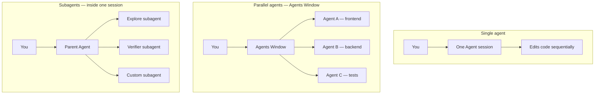

# Overview — Cursor Agents

Cursor supports two ways to run AI coding work: **single agent** (one session, one thread) and **multi agent** (several agents in parallel, or subagents delegated from a parent).

> **Related:** Single agent → [§1](01-single-agent.md) · Multi agent → [§2](02-multi-agent.md) · Auto-delegation → [§3](03-subagents-and-auto-delegation.md) · When to pick → [§4](04-decision-guide.md)

---

## At a glance

| | **Single agent** | **Multi agent** |
|--|------------------|-----------------|
| **Model** | One conversation, one task at a time | Several agents or subagents working in parallel or as specialists |
| **Context** | Everything in one thread | Isolated per agent; parent sees summaries from subagents |
| **Best for** | Focused, sequential work | Independent tasks, heavy exploration, verification, background work |
| **Complexity** | Low — default workflow | Higher — more to manage |
| **Cost** | Lower token use | Higher — each agent has its own context window |

---

## Two multi-agent patterns

Cursor implements multi-agent work in two distinct ways:

| Pattern | What it is | Where it lives |
|---------|------------|----------------|
| **Parallel agents** | Independent agent sessions, each with its own task | Agents Window (`Cmd+Shift+P` → Open Agents Window) |
| **Subagents** | Specialists spawned by the parent agent inside one session | Editor Agent (`Cmd+I`), CLI, Cloud Agents |

Built-in subagents (**Explore**, **Bash**, **Browser**) run automatically inside a single-agent session when the parent agent needs them — no setup required.

---

## Rule of thumb

Start with **single agent**. Move to **multi agent** when the task is clearly splittable, one thread is getting overloaded, or you want verification/exploration isolated from the main conversation.
