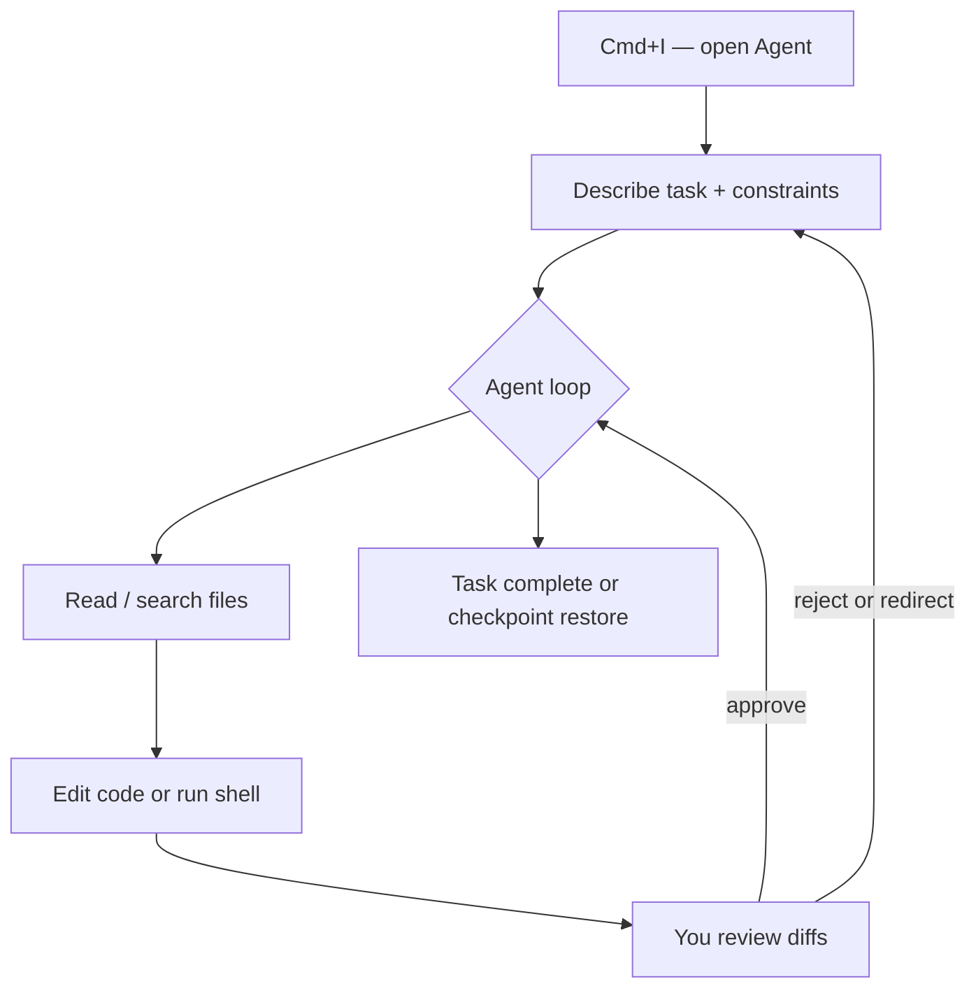

# Single Agent

**Single agent** means one Agent session, one conversation, one task at a time. You open Agent, give it a prompt, and it reads files, edits code, runs commands, and finishes in that same thread.

> **Related:** Multi agent → [§2](02-multi-agent.md) · Decision guide → [§4](04-decision-guide.md)



---

## What it is

The default Cursor workflow:

1. Open **Agent** in the side panel (`Cmd+I` in the editor)
2. Describe the task (goal, files, constraints)
3. Review diffs and approve changes as they come
4. Queue follow-ups or redirect with `Cmd+Enter`

All context stays in one place. The agent uses tools (file edit, search, shell, browser, MCP) in a loop until the task is done or you stop it.

---

## Good for

| Scenario | Why single agent fits |
|----------|----------------------|
| Fix a bug | Steps depend on each other; one thread keeps full history |
| Add a feature in one area | Focused scope, no coordination overhead |
| Refactor one module | Sequential edits with shared context |
| Smaller jobs | Parallel overhead is not worth the cost |

---

## How to use

### Basic flow

```text
Cmd+I  →  describe task  →  review diffs  →  approve or reject  →  follow up
```

### While the agent is working

| Action | Shortcut / method |
|--------|-------------------|
| Queue next instruction | Type and press **Enter** — waits until current work finishes |
| Send immediately (interrupt/redirect) | **Cmd+Enter** — attaches to current turn, bypasses queue |
| Undo a bad turn | Click a **checkpoint** in the chat timeline and restore |

### Tips

- Be specific: goal, affected files, constraints, and what “done” looks like
- Use **checkpoints** for exploratory refactors — restore without touching Git
- Keep one thread for one coherent task; start a new agent for unrelated work

---

## Built-in subagents still run automatically

Even in single-agent mode, Cursor may spawn **Explore**, **Bash**, or **Browser** subagents when search output, shell logs, or browser DOM would bloat the main context. You do not configure these — they are part of the single-agent harness.

For custom specialists (verifier, debugger, security auditor), see [§3 Subagents and auto-delegation](03-subagents-and-auto-delegation.md).