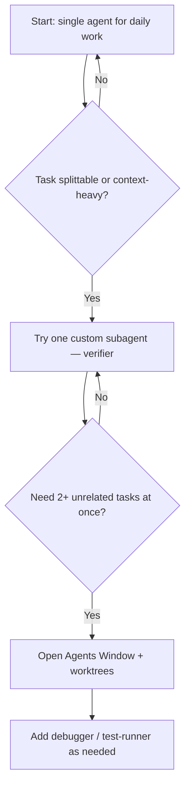

# Decision Guide

When to use single agent, parallel agents, or subagents — plus trade-offs and a practical rollout path.

> **Related:** Overview → [§0](00-overview.md) · Auto-delegation → [§3](03-subagents-and-auto-delegation.md)

---

## Quick picker

| Situation | Use |
|-----------|-----|
| One bug, one feature, one refactor | **Single agent** |
| 2–3 independent tasks at once | **Parallel agents** (Agents Window + worktrees) |
| Huge codebase search / noisy shell output | **Built-in subagents** (automatic) |
| Verify work is really done | **Verifier subagent** (custom) |
| Simple one-shot action (format, changelog) | **Skill or slash command** — not a subagent |
| Long cloud/CI(Continuous Integration) work while you code locally | **Cloud agent** (`/in-cloud`, `/babysit`) |
| Auth, payments, security-sensitive changes | **Security-auditor subagent** + explicit review |

---

## Single vs multi — full comparison

| | Single agent | Multi agent |
|--|-------------|-------------|
| **Simplicity** | Easy; one thread | More to manage |
| **Speed (parallel work)** | Sequential | Faster for independent tasks |
| **Cost** | Lower token use | Higher — each agent/subagent has its own context |
| **Context** | Everything in one place | Isolated; parent sees subagent summaries only |
| **Risk** | One agent can lose focus on huge tasks | Parallel writers can conflict without worktrees |

---

## When multi-agent is worth the overhead

Use multi-agent when **any** of these apply:

- Tasks are **independent** (different files, different concerns)
- One thread is **context-heavy** (large exploration, verbose logs)
- You want **independent verification** (verifier did not write the code it checks)
- Work can run **in the background** (cloud, CI, PR babysitting)

Stay on single agent when:

- Steps **depend on each other** sequentially
- Scope is **small and focused**
- Parallel token cost is **not justified**

---

## Subagent auto-delegation checklist

| Step | Action |
|------|--------|
| 1 | Create 2–3 focused files in `.cursor/agents/` |
| 2 | Write **specific** `description` fields with trigger phrases |
| 3 | Add `Use proactively` or `Always use for …` where appropriate |
| 4 | Optional: add `.cursor/rules/` entry for delegation policy |
| 5 | Commit agents to Git for team sharing |
| 6 | Test with natural prompts; use `/name` when you need certainty |

### Description anti-patterns

| Avoid | Prefer |
|-------|--------|
| `Use for general tasks` | `Use when implementing OAuth authentication flows` |
| 50+ generic subagents | 2–3 specialists with clear triggers |
| Duplicating a slash command as a subagent | Skill or command for one-shot actions |
| 2000-word prompts | Concise, focused system prompt |

---

## Recommended rollout

If you are new to multi-agent workflows:

1. **Default:** single agent for normal tasks
2. **First upgrade:** one subagent — `/verifier` after implementations
3. **Parallel work:** Agents Window when you have 2+ unrelated tasks
4. **Team scale:** 2–3 custom subagents in `.cursor/agents/` + delegation rule

---

## Cost and performance notes

- Each subagent consumes tokens **independently** — five parallel subagents ≈ five times the tokens of one agent
- Subagents add **startup overhead** (fresh context gathering) — not always faster for simple tasks
- Built-in **Explore** uses a faster model by default for parallel search — good cost/perf trade-off
- Cap parallel **writing** agents at two; use read-only agents for research and review

---

## Official references

| Topic | URL |
|-------|-----|
| Agent overview | https://cursor.com/docs/agent/overview |
| Subagents | https://cursor.com/docs/agent/subagents |
| Agents Window | https://cursor.com/docs/agent/agents-window |