# Overview

> **Related:** Solution design → [§1](01-solution-design.md) · EPIC/FEATURE/USER_STORY templates → [§1A](01A-epic-feature-user-story-templates.md) · Architecture → [§2](02-solution-architecture.md) · Coding → [§3](03-coding.md) · Reviews → [§4](04-code-reviews.md) · Ship to PROD → [§5](05-ship-to-prod.md) · Operate and learn → [§6](06-operate-and-learn.md)

## At a glance

| Phase | Cursor mode | Primary artifacts | Stop condition |
|-------|-------------|-------------------|----------------|
| **Solution design** | Plan | Problem brief, options, risks | EPIC/FEATURE/USER_STORY backlog drafted and reviewed |
| **Solution architecture** | Plan → Agent (spikes) | ADR, diagrams, API(Application Programming Interface) contracts, mock data | Buildable interfaces + NFR(Non-Functional Requirement) sign-off |
| **Coding** | Agent | Code, tests, PR | Acceptance criteria met; CI(Continuous Integration) green |
| **Code review** | Agent + subagents | Review table, fix list | No Critical/Blocker findings |
| **Ship to PROD** | Plan → Agent + CD(Continuous Delivery)/observability | Promote plan, canary/flag, abort triggers | Ramped or clean abort; runbook updated |
| **Operate and learn** | Plan → Agent + observability | Cleanup PRs, postmortems, drill plan, next backlog | Reliability OK to ship again; next FEATURE scoped |

**Rule of thumb:** Use **Plan mode** when the answer is not obvious; switch to **Agent mode** only when you are ready to produce or change files. Treat **merge** as the start of [§5 Ship to PROD](05-ship-to-prod.md); treat **ramp complete** as the start of [§6 Operate and learn](06-operate-and-learn.md).

## The delivery loop in Cursor

```mermaid
flowchart LR
    subgraph design [Solution design]
        P[Problem + constraints]
        O[Options + recommendation]
        B[EPIC / FEATURE / USER_STORY]
    end
    subgraph arch [Solution architecture]
        ADR[ADR + boundaries]
        API[API contract + mocks]
        NFR[NFR checklist]
    end
    subgraph build [Coding]
        R[Rules + exemplars]
        I[Implement + test]
        PR[Pull request]
    end
    subgraph review [Code review]
        BB[Bugbot]
        SR[Security review]
        FIX[Fix + re-review]
    end
    subgraph ship [Ship to PROD]
        PROMO[Promote digest]
        CANARY[Canary / flag]
        WATCH[Observe / abort]
        CLOSE[Runbook + drill]
    end
    subgraph operate [Operate and learn]
        STEADY[Watch SLOs]
        CLEAN[Cleanup]
        LEARN[Backlog from signal]
    end
    P --> O --> B --> ADR --> API --> NFR --> R --> I --> PR --> BB --> SR --> FIX --> PROMO --> CANARY --> WATCH --> CLOSE --> STEADY --> CLEAN --> LEARN --> P
```

## What to configure once

| Layer | Location | Purpose |
|-------|----------|---------|
| **User rules** | Cursor Settings → Rules | Your role, output style, when to use Plan vs Agent |
| **Project rules** | `.cursor/rules/*.mdc` | Architecture and coding conventions per file glob |
| **Skills** | `~/.cursor/skills/` or `.cursor/skills/` | Repeatable workflows (design doc template, review checklist) |
| **Custom subagents** | `.cursor/agents/` | Team-specific verifier, doc-reviewer, domain experts |
| **Hooks** | `.cursor/hooks.json` | Format on edit, gate risky shell commands |
| **MCP servers** | Cursor Settings → MCP or `.cursor/mcp.json` | GitHub, Linear, observability, Context7 docs |

## Context you should attach every session

| Input | When | How |
|-------|------|-----|
| Ticket / EPIC text | Design through coding | Paste or `@` Linear/Jira via MCP |
| ADR or design doc | Architecture + coding | `@path/to/adr.md` |
| API spec | Architecture + frontend/backend | `@openapi.yaml` or `@schema.graphql` |
| Exemplar file | Coding | “Match patterns in `@src/foo/BarService.ts`” |
| Non-goals | Any phase | Explicit “do not …” list |
| Release playbook + dashboards | Ship to PROD | `@` [deployment §14](../../deployment-strategies/includes/14-feature-to-prod-playbook.md) + SLO(Service Level Objective) links |
| Runbook + error budget + postmortems | Operate and learn | `@` runbook path + [sre](../../sre-and-incidents/README.md) links |

## Common mistakes

| Mistake | Fix |
|---------|-----|
| Jumping to code during ambiguous design | Stay in Plan mode until options are compared |
| One giant rule file | Split into focused `.mdc` rules under 50 lines each |
| Review without diff scope | Say `branch changes` vs `uncommitted changes` |
| Generic “follow best practices” | Point at a gold-standard file or stack-specific rule |
| Skipping mock/contract step | Generate OpenAPI + mock server before parallel FE/BE work |
| Stopping at merge | Continue with [§5 Ship to PROD](05-ship-to-prod.md) |
| Stopping at ramp | Continue with [§6 Operate and learn](06-operate-and-learn.md) |