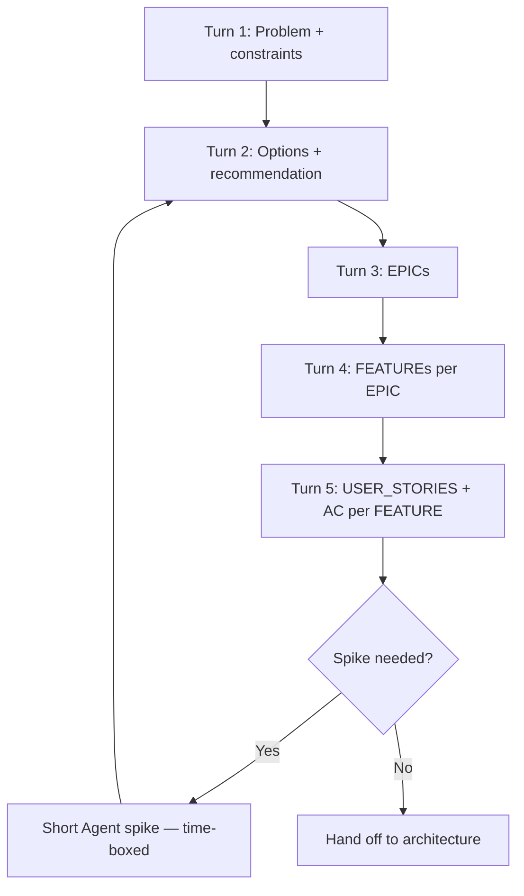

# Solution Design

> **Related:** Product discovery (before this) → [tech-lead §1A](../../tech-lead-practice/includes/01A-product-discovery.md) · EPIC/FEATURE/USER_STORY templates → [§1A](01A-epic-feature-user-story-templates.md) · Architecture → [§2](02-solution-architecture.md) · Tech lead practice → [../../tech-lead-practice/README.md](../../tech-lead-practice/README.md) · Architecture decisions → [../../architecture-decisions/README.md](../../architecture-decisions/README.md)

## At a glance

| Step | You provide | Agent produces | Gate before next step |
|------|-------------|----------------|----------------------|
| 1. Frame | Problem, users, constraints | Problem statement + success metrics | Stakeholders agree on the problem |
| 2. Explore | Options, non-goals, assumptions | 2+ approaches with tradeoffs | One option recommended |
| 3. Decompose | Scope boundaries | EPIC list with outcomes | Each EPIC has measurable value |
| 4. Detail | EPIC acceptance themes | FEATURE breakdown | FEATUREs are independently shippable |
| 5. Specify | FEATURE details | USER_STORY + AC(Acceptance Criteria) | Stories are INVEST(Independent, Negotiable, Valuable, Estimable, Small, Testable)-sized |

**Rule of thumb:** Do not write production code in this phase. Use **Plan mode** until EPIC → FEATURE → USER_STORY structure is stable.

---

## What to do in Cursor

### 1. Start in Plan mode

Switch to **Plan** when:

- Requirements are fuzzy or conflicting
- You need to compare build vs buy, sync vs async, or scope cuts
- Multiple teams or systems are involved

Prompt opener:

```text
Plan mode. I need solution design only — no code.

Problem: …
Users/personas: …
Constraints: … (budget, timeline, compliance, existing stack)
Non-goals: …
Success metrics: …

Produce: problem statement, assumptions, 2+ options, recommendation, risks, open questions.
```

### 2. Run the design loop (inputs per turn)

Use one focused turn per layer. Attach prior output as context (`@` previous chat export, pasted summary, or a design doc file).



#### Turn 1 — Problem framing (your input)

| Field | Example prompt fragment |
|-------|-------------------------|
| **Problem** | “Merchants cannot reconcile payouts across regions” |
| **Who is affected** | Finance ops, merchant admins |
| **Current pain** | Manual CSV, 3-day lag, 12% error rate |
| **Constraints** | Must use existing PostgreSQL; GA in Q3; PCI scope unchanged |
| **Non-goals** | No new mobile app; no real-time ledger in v1 |
| **Success metrics** | Reconciliation time &lt; 1h; error rate &lt; 1% |

#### Turn 2 — Options (your input)

Add:

- Known integrations (Stripe, internal billing API(Application Programming Interface))
- Team skills (strong in Java, weak in Kafka)
- Hard deadlines or regulatory dates

Ask for:

- Option A / B / C with pros, cons, cost, operability
- Explicit **recommendation** and **what we would validate in a spike**

#### Turn 3 — EPICs (your input)

Provide the **approved recommendation** and any scope cuts.

Ask for EPICs using the [§1A templates](01A-epic-feature-user-story-templates.md) (Outcome, Value, Success metrics, Non-goals, Dependencies, Risks).

#### Turn 4 — FEATUREs (your input)

Pick one EPIC at a time. Provide:

- MVP vs later phases
- Integration points already decided

Ask for FEATUREs that are **independently demonstrable** and map to the EPIC outcome. Use the [FEATURE template](01A-epic-feature-user-story-templates.md#feature-template) (Description, In scope, Out of scope / non-goals, Demo / done when, Dependencies).

#### Turn 5 — USER_STORIES (your input)

Per FEATURE, provide:

- Persona
- Edge cases you already know
- Definition of Done for the team (tests, docs, observability)

Ask for stories using the [USER_STORY template](01A-epic-feature-user-story-templates.md#user_story-template): As / I want / So that + Given/When/Then AC + Notes (out of scope, dependencies).

### 3. Use Canvas for comparisons (optional)

When options or EPIC dependencies are complex, ask for a **canvas** side artifact:

- Option comparison matrix (cost, latency, operability, team fit)
- EPIC dependency timeline

Canvas is for **standalone analytical output** — not for the final Jira/Linear paste.

### 4. Store the design artifact

| Artifact | Suggested location |
|----------|-------------------|
| Problem + options | `docs/design/YYYY-MM-feature-name.md` or Linear doc |
| EPIC / FEATURE / USER_STORY | Issue tracker (Linear, Jira) — agent drafts, you paste |
| Decisions | `docs/adr/NNNN-title.md` → see [architecture-decisions](../../architecture-decisions/README.md) |

### 5. Create a reusable skill (recommended)

Personal skill `~/.cursor/skills/solution-design/SKILL.md` with:

- Point at [§1A EPIC/FEATURE/USER_STORY templates](01A-epic-feature-user-story-templates.md)
- INVEST checklist
- Required sections (risks, metrics, non-goals)

Trigger: “solution design”, “write epics”, “break down feature”.

---

## Inputs checklist (before final backlog)

Use this checklist **before** treating EPIC/FEATURE/USER_STORY as final:

| # | Check | Your input if missing |
|---|-------|------------------------|
| 1 | Problem statement is one paragraph, testable | Rewrite with agent |
| 2 | Success metrics are numeric or binary | Add targets |
| 3 | Non-goals are explicit | List what v1 will **not** do |
| 4 | Assumptions are listed | “We assume billing API v2 is stable” |
| 5 | One recommended option with rejected alternatives | Challenge with “what breaks if we pick B?” |
| 6 | Each EPIC has outcome + value, not just activity | Cut activity-only epics |
| 7 | FEATUREs are shippable slices | Merge or split until demo-able |
| 8 | USER_STORIES have Given/When/Then AC | Add edge-case AC |
| 9 | Dependencies between stories are marked | Sequence or parallelize |
| 10 | Open questions have owners | Assign spike or decision date |

---

## Example session prompts

**EPIC breakdown**

```text
From the approved option in @docs/design/payout-reconciliation.md,
produce EPICs only. Each EPIC needs Outcome, Value, Dependencies, Risks.
MVP is Q3; manual CSV export stays for one region only.
```

**USER_STORIES for one FEATURE**

```text
For FEATURE "Automated payout matching" in EPIC "Reconciliation",
write USER_STORIES for persona Finance Analyst.
Include negative paths: missing FX rate, duplicate payout id, partial batch.
Format: As/I want/So that + Given/When/Then AC. No implementation detail.
```

---

## When to leave design and go to architecture

| Signal | Next step |
|--------|-----------|
| Backlog reviewed with PM/EM | → [§2 Solution architecture](02-solution-architecture.md) |
| Unknown feasibility (latency, vendor limit) | Time-boxed **Agent spike** (1–2 days), return to Plan |
| Security/compliance unclear | Add security architect review before EPIC lock |

---

## Common mistakes

| Mistake | Fix |
|---------|-----|
| One-shot “design the whole product” | One turn per layer (EPIC → FEATURE → story) |
| Stories with implementation tasks | Reframe as user-visible outcomes |
| No non-goals | Agent over-builds scope |
| Skipping metrics | Cannot prioritize FEATUREs later |
| Coding too early | Plan mode until backlog checklist passes |