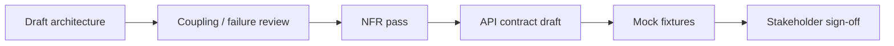

# Solution Architecture

> **Related:** Solution design → [§1](01-solution-design.md) · API(Application Programming Interface) contracts → [../../api-design-and-protection/includes/15-contract-and-schema-testing.md](../../api-design-and-protection/includes/15-contract-and-schema-testing.md) · Architecture decisions → [../../architecture-decisions/README.md](../../architecture-decisions/README.md)

## At a glance

| Step | You provide | Agent produces | Gate |
|------|-------------|----------------|------|
| Context | EPIC, NFRs, existing system map | Architecture summary | Boundaries agreed |
| Structure | Domains, integration list | Component diagram, data flows | Coupling reviewed |
| Contracts | Resources, operations | OpenAPI / GraphQL schema draft | Consumer review |
| Mocks | Sample payloads, error cases | Mock server config + fixtures | FE/BE can develop in parallel |
| ADR | Decision under debate | ADR with tradeoffs | Recorded decision |

**Rule of thumb:** Architecture in Cursor is **Plan-first**, then **short Agent spikes** for proof — not full implementation.

---

## What to do in Cursor

### 1. Open with Plan mode + system context

Attach:

- Approved design doc or EPIC from [§1](01-solution-design.md)
- Existing `AGENTS.md` or service README if present
- Related ADRs from `docs/adr/`

```text
Plan mode. Solution architecture for EPIC: …

NFRs: p99 latency, RPO/RTO, compliance, multi-region, …
Existing services: @docs/system-map.md
Integration constraints: …

Deliver: context diagram, container breakdown, key data flows,
failure domains, observability hooks, open risks. No code yet.
```

### 2. Produce architecture artifacts

| Artifact | Tool in Cursor | Storage |
|----------|----------------|---------|
| Context / container diagram | Plan + mermaid in chat or Canvas | Design doc or ADR appendix |
| Sequence flows | mermaid in markdown | `docs/design/` or ADR |
| API contract | Agent generates OpenAPI/GraphQL | `api/openapi.yaml`, `schema.graphql` |
| ADR | Plan or Agent | `docs/adr/NNNN-title.md` |
| NFR(Non-Functional Requirement) checklist | Plan | Same design doc |

Use **Canvas** when you need a side-by-side view: option comparison, service dependency matrix, or NFR traceability table.

### 3. Run architecture review loop



**Your input each iteration:**

- “What breaks if service X is down for 30 minutes?”
- “Where is the consistency boundary?”
- “What is the rollback plan for this API version?”

### 4. Hand off to coding

Exit architecture when:

- [ ] ADR recorded for major forks
- [ ] OpenAPI or GraphQL schema committed
- [ ] Mock server or fixtures runnable locally
- [ ] NFR checklist has owner per item (observability, security, capacity)

→ Continue to [§3 Coding](03-coding.md)

---

## MCP servers useful for solution architecture

Configure in **Cursor Settings → MCP** or project `.cursor/mcp.json`. Prefer **read** integrations during design; write actions (comments, tickets) after sign-off.

| MCP / integration | Use in SA(Solution Architecture) | Example prompts |
|-------------------|----------------------------------|-----------------|
| **GitHub** | Repo layout, existing services, open PRs affecting boundaries | “List services in `services/` and their deployment configs” |
| **Linear / Jira** | EPIC scope, linked stories, acceptance criteria | “Summarize AC for FEATURE-123” |
| **Context7** | Up-to-date library/framework docs when evaluating options | “Compare Apollo Federation vs schema stitching — current docs” |
| **Datadog / Grafana** | Ground capacity and latency assumptions in prod data | “p95 latency for `checkout-api` last 30 days” |
| **Sentry** | Error hotspots informing failure-domain design | “Top issues in payment service this week” |
| **PagerDuty** | Incident history for resilience requirements | “Recurring alerts for dependency X” |
| **Slack** (read) | Design thread context, incident postmortems | “Summarize #platform-architecture thread on caching” |
| **Databricks / warehouse** | Data volume, retention, pipeline ownership | “Daily row count for `orders_fact`” |

**Auth tip:** Authenticate MCP servers in chat **before** long design sessions — OAuth(Open Authorization) redirects mid-session can lose draft context.

### MCP setup in this repo

Example project config (extend as you connect integrations):

```json
{
  "mcpServers": {
    "context7": {
      "url": "https://mcp.context7.com/mcp"
    }
  }
}
```

Add team servers via Cursor dashboard; use `serverName` from MCP catalog when referencing in Automations.

---

## API mock data for testing

Architecture should deliver **contracts + mocks** so frontend, BFF(Backend for Frontend), and partners can proceed before the real service is done.

### Recommended approach by stack

| Approach | Best for | Cursor workflow |
|----------|----------|-----------------|
| **OpenAPI + Prism** | REST(Representational State Transfer) services | Agent generates `openapi.yaml` + example payloads; run Prism mock in CI(Continuous Integration)/local |
| **GraphQL + MSW(Mock Service Worker)** | Apollo Client apps | Agent generates schema + `mocks/handlers.ts` with realistic fixtures |
| **WireMock** | JVM(Spring Boot) teams, partner simulations | Agent writes `mappings/*.json` + `__files/*.json` |
| **Postman / Bruno collections** | Manual exploratory + shared examples | Agent exports collection from OpenAPI |
| **Contract fixtures in repo** | All stacks | `fixtures/` JSON committed next to spec |

See also: [contract and schema testing](../../api-design-and-protection/includes/15-contract-and-schema-testing.md) · [integration and E2E](../../testing-strategy/includes/04-integration-and-e2e.md).

### What to ask the agent to generate

```text
From @api/openapi.yaml, create:
1. Realistic mock fixtures for happy path + 3 error cases (400, 404, 409)
2. Prism docker-compose service for local mock on :4010
3. MSW handlers for React integration tests (if frontend exists)
4. WireMock stubs for Spring Boot integration tests

Use domain-realistic data (IDs, dates, money as string decimal).
Document how to refresh mocks when the spec changes.
```

### Mock data quality checklist

| # | Check |
|---|-------|
| 1 | Fixtures match OpenAPI/GraphQL types exactly |
| 2 | Error responses use the same envelope as production |
| 3 | IDs and timestamps are stable for snapshot tests |
| 4 | Pagination cursors included where API paginates |
| 5 | Auth failures (401/403) represented |
| 6 | Mock server regenerated in CI when spec changes |

### Folder layout (suggested)

```
api/
├── openapi.yaml
├── graphql/
│   └── schema.graphql
fixtures/
├── orders/
│   ├── get-order-200.json
│   └── create-order-409-duplicate.json
mocks/
├── prism-docker-compose.yml
├── wiremock/mappings/
└── msw/handlers.ts
```

---

## Architecture skill (recommended)

Create `.cursor/skills/architecture-review/SKILL.md` (project) or personal copy with:

- NFR checklist template
- Required ADR sections
- “Coupling / failure / observability” review questions
- Mock deliverable checklist

---

## Common mistakes

| Mistake | Fix |
|---------|-----|
| Diagrams without failure domains | Add blast-radius and degradation behavior |
| API spec after coding started | Contract + mocks before parallel implementation |
| Mocks with random lorem data | Use typed, domain-realistic fixtures |
| No ADR for reversible decisions | ADR for anything costly to undo |
| Ignoring prod signals | Pull Datadog/Sentry via MCP before capacity claims |