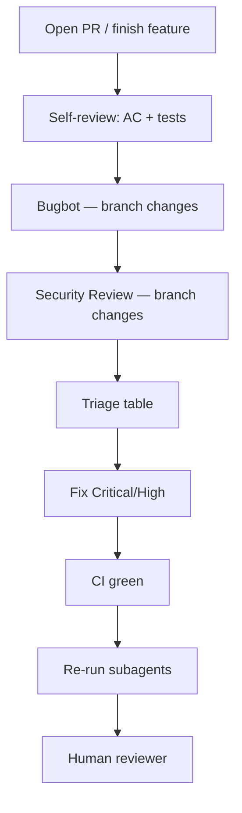

# Code Reviews

> **Related:** Coding → [§3](03-coding.md) · Ship to PROD → [§5](05-ship-to-prod.md) · Cursor subagents → [../../cursor-agents/includes/03-subagents-and-auto-delegation.md](../../cursor-agents/includes/03-subagents-and-auto-delegation.md) · Enterprise security → [../../enterprise-security-compliance/README.md](../../enterprise-security-compliance/README.md)

## At a glance

| Review type | Tool | Best for | Default diff scope |
|-------------|------|----------|-------------------|
| **Logic / bugs** | Bugbot subagent | Regressions, edge cases, incorrect behavior | `branch changes` |
| **Security** | Security Review subagent | AuthZ, injection, secrets, unsafe defaults | `branch changes` |
| **Standards** | Custom skill + project rules | Team conventions, API(Application Programming Interface) compatibility | `branch changes` |
| **Pre-commit** | Bugbot | Quick pass before push | `uncommitted changes` |

**Rule of thumb:** Run **Bugbot** and **Security Review** as separate passes — do not ask one prompt to do both; each subagent is tuned for its domain.

---

## What to do in Cursor

### 1. Choose diff scope

| Scope | When to use | Prompt phrase |
|-------|-------------|---------------|
| `branch changes` | PR review, merge readiness | “Review branch changes against main” |
| `uncommitted changes` | Pre-commit sanity check | “Review uncommitted changes only” |

Default to **`branch changes`** unless you only want local dirty files.

### 2. Run Bugbot (logic review)

Ask explicitly:

```text
Run Bugbot on branch changes.

Focus: correctness, edge cases, regressions, error handling, test gaps.
Ignore style nits unless they hide bugs.

Output: table with Severity | Location (file:line) | Finding.
```

Or use slash command: `/review-bugbot`

**Bugbot prompt shape** (for manual Task launch):

```text
Full Repository Path: /absolute/path/to/repo
Diff: branch changes
```

Optional when not comparing to default base:

```text
Base Branch: develop
```

### 3. Run Security Review (security pass)

Separate turn after Bugbot:

```text
Run Security Review on branch changes.

Focus: auth/authz, input validation, injection, secrets in code,
unsafe crypto, SSRF, path traversal, dependency risk.

Output: table with Severity | Location | Finding | Remediation hint.
```

Use slash command or security-review skill when available.

### 4. Triage findings

| Severity | Action |
|----------|--------|
| **Critical / Blocker** | Fix before merge |
| **High** | Fix before merge or documented accept with ticket |
| **Medium / Suggestion** | Fix or backlog |
| **Low / Nit** | Optional |

Ask agent to fix **only Critical/High** unless you want full cleanup:

```text
Fix Bugbot Critical and High findings only. Minimal diff.
Re-run tests for touched files.
```

### 5. Re-review after fixes

```text
Run Bugbot on branch changes again.
Confirm previous Critical/High items are resolved.
```

---

## Recommended review workflow



---

## Subagent comparison

| | Bugbot | Security Review |
|--|--------|-----------------|
| **Primary lens** | Correctness, bugs, regressions | Threats, misuse, data exposure |
| **Catches well** | Wrong null handling, race hints, missing tests | BOLA(Broken Object-Level Authorization), SQLi, hardcoded secrets |
| **Poor substitute for** | Security pass | Logic/unit test review |
| **Run when** | Every PR | Auth, payments, PII(Personally Identifiable Information), new endpoints, deps |
| **readonly** | Yes (default) | Yes (default) |

---

## Custom review skill (team standards)

Add `.cursor/skills/code-review/SKILL.md`:

```markdown
---
name: code-review
description: Reviews code for quality and team standards. Use when reviewing pull requests, diffs, or when the user asks for a code review.
---

# Code review

## Checklist
- [ ] Matches ticket acceptance criteria
- [ ] API backward compatible or versioned
- [ ] Errors logged with correlation id
- [ ] Tests cover failure paths
- [ ] No N+1 / unbounded queries

## Feedback format
- **Critical** — must fix before merge
- **Suggestion** — consider improving
- **Nit** — optional

## After Bugbot + Security
Summarize remaining human-review items only.
```

---

## Automations (optional)

In **Agents Window**, create automations for:

| Trigger | Action |
|---------|--------|
| PR opened | Summarize diff; note missing tests/docs; post PR comment |
| PR pushed | Summarize new commits; flag CI(Continuous Integration) failures |
| Label `needs-security` | Run security-focused review instructions |

Pair with GitHub integration for `prComment`. Authenticate MCP before drafting automations.

---

## Prompt templates

### Standard PR review

```text
Review branch changes for PR #123.

1. Run Bugbot — correctness and regressions
2. Run Security Review — auth and data handling
3. Merge tables; sort by severity
4. List acceptance-criteria gaps vs @linear-issue-XYZ

Do not fix code unless I ask.
```

### Pre-commit quick pass

```text
Review uncommitted changes only with Bugbot.
Critical/High only — one-line summary if clean.
```

### Targeted review

```text
Run Bugbot on branch changes.
Custom Instructions: Only review files under src/payments/.
Pay attention to idempotency and double-charge scenarios.
```

### Natural-language fallback

If diff computation fails, retry with:

```text
Full Repository Path: …
Diff: natural language
Change Description:
  src/payments/ChargeService.ts (modified):
  - added idempotency key check (L40-58)
  …
```

---

## Human + agent division

| Owner | Responsibility |
|-------|----------------|
| **Bugbot** | Logic bugs, edge cases, obvious test gaps |
| **Security Review** | Threat modeling at code level |
| **Agent + rules** | Convention, API shape, naming |
| **Human** | Product fit, UX, domain judgment, approve merge |

Subagents **do not replace** human review for nuanced product or domain decisions.

---

## Repo-level review config

This `documents/` repo includes examples:

| File | Purpose |
|------|---------|
| [`.cursor/BUGBOT.md`](../../.cursor/BUGBOT.md) | Bugbot context for doc changes |
| [`.cursor/agents/doc-reviewer.md`](../../.cursor/agents/doc-reviewer.md) | Custom doc reviewer subagent |
| [`.cursor/rules/engineering-guides.mdc`](../../.cursor/rules/engineering-guides.mdc) | Validation expectations |

Mirror that pattern in application repos: `BUGBOT.md` at root with domain-specific review focus.

---

## Common mistakes

| Mistake | Fix |
|---------|-----|
| “Review my code” without scope | Specify `branch changes` or `uncommitted changes` |
| One prompt for security + style + product | Separate Bugbot, Security, human passes |
| Fix every nit before re-review | Re-run subagents after Critical/High only |
| Skip re-review after fixes | Second Bugbot pass on same scope |
| Security review only at release | Run on every auth/payment/PII touch |