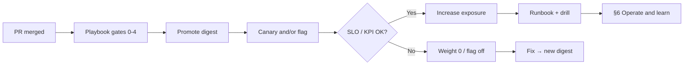

# Ship to PROD

> **Scope:** **Post-merge delivery in Cursor** — promote, canary/flag, observe, abort — not deploy-strategy theory.
>
> **Related:** Full ordered checklist → [deployment §14 feature-to-PROD playbook](../../deployment-strategies/includes/14-feature-to-prod-playbook.md) · Code review → [§4](04-code-reviews.md) · Operate and learn → [§6](06-operate-and-learn.md) · Canary → [deployment §4](../../deployment-strategies/includes/04-canary.md) · Flags → [deployment §7](../../deployment-strategies/includes/07-feature-flags.md) · SLO(Service Level Objective) rollback → [deployment §13](../../deployment-strategies/includes/13-slo-rollback-triggers.md) · Game days → [sre §9](../../sre-and-incidents/includes/09-game-days-and-drills.md)

Merge is not the finish line. This phase turns a green PR into a controlled production exposure.

**Rule of thumb:** Do not ask Cursor to “deploy to prod” without pasting the **Gate 5–6** checks from the [feature-to-PROD playbook](../../deployment-strategies/includes/14-feature-to-prod-playbook.md) and the **rollback trigger** for this release.

---

## At a glance

| Step | Cursor mode | Artifact | Stop condition |
|------|-------------|----------|----------------|
| **Pre-promote checklist** | Plan or Agent (read-only) | Filled Gate 0–4 from playbook | Gaps listed or accepted in writing |
| **Promote digest** | Agent + CI(Continuous Integration)/CD(Continuous Delivery) MCP or CLI | Same image/digest in staging → prod | Staging smoke/synthetics green |
| **Progressive expose** | Agent (config/flag PR) or platform UI | Canary weight and/or flag | Bake time elapsed; metrics OK |
| **Watch / abort** | Agent + observability MCP | Dashboard links, abort decision | Ramp complete **or** rolled back |
| **Close out** | Agent | Runbook diff + drill ticket | Runbook merged; next drill dated |

---

## Where this sits in the loop



---

## Hand-off to operate

When ramp succeeds (or after a clean abort + fix), continue with [§6 Operate and learn](06-operate-and-learn.md): steady-state watch, cleanup, incidents/drills, then the next FEATURE via [§1](01-solution-design.md).

---

## What to do in Cursor

### 1. Attach release context

Every ship session, `@` or paste:

| Input | Why |
|-------|-----|
| Release ticket / FEATURE | Scope and owners |
| [Playbook §14](../../deployment-strategies/includes/14-feature-to-prod-playbook.md) | Ordered gates |
| OpenAPI / migration PR links | Contract and schema coupling |
| Dashboard / SLO links | What “bad” means |
| Runbook path | Update target after ship |

### 2. Pre-promote pass (Plan mode)

```text
Using @deployment-strategies/includes/14-feature-to-prod-playbook.md,
audit this FEATURE for Gates 0–4.

Output: table Gate | Status (pass/gap/N/A) | Evidence or missing item.
Do not invent green checks — mark gaps explicitly.
```

Fix gaps or record an explicit risk accept before promote.

### 3. Promote (Agent + your CD tool)

Prefer your platform’s safe path (GitOps PR, Argo, CodeDeploy, cloud console). In Cursor:

```text
Promote digest <sha> staging → production per our CD docs.
Do not rebuild. List exact commands or GitOps diffs before applying.
Confirm staging synthetics/smoke already passed.
```

Promotion mechanics → [cicd §2](../../cicd-and-environments/includes/02-cd-and-promotion.md).

### 4. Progressive expose

| Mechanism | Prompt focus |
|-----------|--------------|
| **Canary** | Start 1–5%; bake ≥15 min; representative traffic — [deployment §4](../../deployment-strategies/includes/04-canary.md) |
| **Feature flag** | Default off → % or cohort on; kill switch named — [deployment §7](../../deployment-strategies/includes/07-feature-flags.md) |
| **Both** | Auth, payments, irreversible writes |

```text
Draft the canary/flag plan for this release:
- initial exposure
- bake time per step
- metrics to watch (version-tagged)
- abort action (weight 0 / flag off)
Align with @deployment-strategies/includes/13-slo-rollback-triggers.md
```

### 5. Watch and abort

Use observability MCP (Datadog, Grafana, etc.) when configured; otherwise paste dashboard URLs.

```text
Compare canary vs baseline for build_id=<id> over the bake window:
5xx, p99, saturation, and <business KPI>.
Recommend: ramp | hold | abort — cite thresholds from the release plan.
```

If abort: set weight to 0 or kill the flag first; then decide roll back vs forward-fix — [cicd §6](../../cicd-and-environments/includes/06-rollback-vs-forward-fix.md).

### 6. Close out

| Task | Prompt / action |
|------|-----------------|
| Runbook | “Update `@runbooks/...` with symptoms, dashboards, abort steps from this release” |
| Flag cleanup | Ticket to remove permanent canary % / dead flags |
| Drill | “Create a game-day ticket for bad-deploy abort using [sre §9](../../sre-and-incidents/includes/09-game-days-and-drills.md)” |

---

## MCP and tools that help

| Need | Typical MCP / tool |
|------|-------------------|
| Ticket / FEATURE status | Linear, Jira |
| GitOps(Git Operations) / PR promote | GitHub |
| Live metrics during bake | Datadog, Grafana, CloudWatch |
| Library/platform how-to | Context7 |

Ship still depends on **your** CD and traffic-splitting platform — Cursor orchestrates checklist and diffs; it does not replace Flagger/Argo/ALB weights.

---

## Minimal definition of done (ship)

- [ ] Gates 0–4 passed or explicitly accepted
- [ ] Digest promoted (not rebuilt)
- [ ] Canary and/or flag plan executed with bake time
- [ ] Abort triggers defined and usable without debate
- [ ] Ramp complete **or** clean abort
- [ ] Runbook updated; next drill on the calendar

---

## Common mistakes

| Mistake | Fix |
|---------|-----|
| Treating merge as production release | Run this §5 after merge |
| Asking the agent to “just deploy” | Require playbook gate table + abort metrics first |
| Watching only CPU/health | Include version-tagged errors, latency, business KPI(Key Performance Indicator) |
| Skipping runbook because “nothing broke” | Update while context is fresh |
| Never practicing abort | Schedule [sre §9](../../sre-and-incidents/includes/09-game-days-and-drills.md) game day |

---

## Other guides in this repo

| Need | Guide |
|------|-------|
| Full feature → PROD checklist | [deployment §14](../../deployment-strategies/includes/14-feature-to-prod-playbook.md) |
| CI/CD and promotion | [cicd-and-environments](../../cicd-and-environments/README.md) |
| Incidents and drills | [sre-and-incidents](../../sre-and-incidents/README.md) |
| Production verification tests | [testing-strategy §8](../../testing-strategy/includes/08-production-verification.md) |
| After ramp: watch, cleanup, drills | [§6 Operate and learn](06-operate-and-learn.md) |