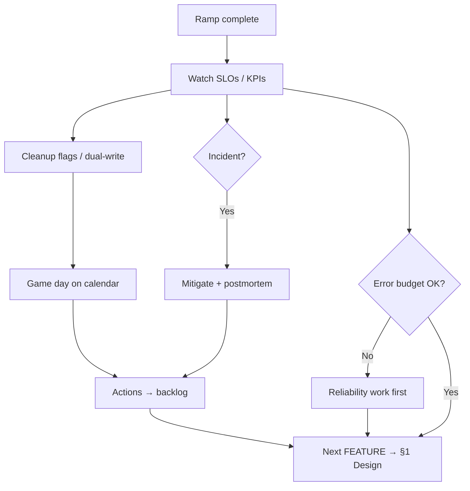

# Operate and Learn

> **Scope:** **After ramp** — steady-state ops, cleanup, incidents, drills, and feeding the next FEATURE — not SRE(Site Reliability Engineering) theory or deploy mechanics.
>
> **Related:** Ship to PROD → [§5](05-ship-to-prod.md) · Playbook Gate 7 → [deployment §14](../../deployment-strategies/includes/14-feature-to-prod-playbook.md) · SLOs / error budgets → [sre §1–2](../../sre-and-incidents/includes/01-sli-slo-sla.md) · Incidents → [sre §6–7](../../sre-and-incidents/includes/06-incident-command.md) · Game days → [sre §9](../../sre-and-incidents/includes/09-game-days-and-drills.md) · Next loop → [§1 Solution design](01-solution-design.md)

Ramp complete is not “done.” This phase keeps the feature healthy, turns production signal into backlog, then restarts design for the next change.

**Rule of thumb:** If error budget is burning or the runbook is wrong, **fix reliability before starting the next FEATURE** — [sre §2](../../sre-and-incidents/includes/02-error-budgets.md).

---

## At a glance

| Activity | Cadence | Cursor mode | Stop / handoff |
|----------|---------|-------------|----------------|
| **Steady-state watch** | First 24–72 h, then ongoing | Agent + observability MCP | Alerts tuned; no mystery pages |
| **Cleanup** | Days–weeks after ramp | Agent | Flags/canary leftovers and dual-write removed |
| **Incident response** | When paged | Plan (triage) → Agent (fixes) | Mitigated; postmortem actions ticketed |
| **Drills** | Monthly / quarterly | Plan + live ops | Timed detect/mitigate; runbook patched |
| **Learn → backlog** | After ship, incident, or drill | Plan | Next EPIC/FEATURE/USER_STORY drafted → [§1](01-solution-design.md) |



---

## What to do in Cursor

### 1. Steady-state watch (first days)

Attach dashboards, SLO(Service Level Objective) links, and the service runbook.

```text
Compare the new feature path vs baseline for the last <N> hours:
errors, p99, saturation, and <business KPI>.
Flag: alert gaps, noisy pages, missing version tags.
Propose alert threshold tweaks — do not silence without a ticket.
```

Signals and triage order → [HTS §11](../../high-throughput-systems/includes/11-observability.md) · [sre §4–5](../../sre-and-incidents/includes/04-observability-practice.md).

### 2. Cleanup

| Cleanup item | Done when |
|--------------|-----------|
| Temporary canary % | 100% stable (or intentional permanent split documented) |
| Release / experiment flags | Removed per [deployment §7 lifecycle](../../deployment-strategies/includes/07-feature-flags.md#lifecycle-and-cleanup) (or reclassified with owner) |
| Expand/contract leftovers | Old columns/paths dropped after observation window — [deployment §12](../../deployment-strategies/includes/12-schema-migrations-and-deploy.md) |
| Dual-write / shadow | Turned off when parity proven |

**Flag debt rule:** release toggles are **days–weeks** after 100%, not months. Inventory anything >90 days.

```text
List leftover flags, canary weights, and dual-write paths from this FEATURE.
For each release/experiment flag, propose cleanup using
@deployment-strategies/includes/07-feature-flags.md (Lifecycle and cleanup):
PR order, bake evidence, and delete-from-service step.
```

### 3. Incidents

| Step | In Cursor |
|------|-----------|
| Triage | Pastestat/dashboard links; ask for likely blast radius and abort options |
| Mitigate | Prefer kill switch / rollback over speculative code — [deployment §13](../../deployment-strategies/includes/13-slo-rollback-triggers.md) |
| Postmortem | Draft timeline + actions from [sre §7](../../sre-and-incidents/includes/07-postmortems.md); human owns blame-free tone |
| Follow-through | Turn P0/P1 actions into USER_STORYs — then [§1](01-solution-design.md) / [§3](03-coding.md) |

```text
Draft a postmortem outline from this timeline and dashboards:
detection, impact, mitigation, root cause hypotheses, action table
(Severity | Owner | Due). Match @sre-and-incidents/includes/07-postmortems.md
```

### 4. Drills (keep muscle memory)

Do not skip because the last ship was calm.

| Drill | Cadence | Link |
|-------|---------|------|
| Runbook dry-run | Monthly / new runbook | [sre §9](../../sre-and-incidents/includes/09-game-days-and-drills.md) |
| Restore / PITR(Point-in-Time Recovery) | Monthly automated + quarterly human | [PG §16](../../postgresql-performance/includes/16-backup-restore-and-pitr.md) |
| Tabletop or live failover / bad deploy | Quarterly | [sre §9](../../sre-and-incidents/includes/09-game-days-and-drills.md) |

```text
Using @sre-and-incidents/includes/09-game-days-and-drills.md,
draft a 90-minute game day for <service>: hypothesis, abort criteria,
roles, success metrics. Output a calendar invite body + runbook gaps to verify.
```

### 5. Learn → next FEATURE

| Input from operate | Becomes |
|--------------------|---------|
| Postmortem actions | USER_STORYs / tech debt — [tech-lead §5](../../tech-lead-practice/includes/05-tech-debt-portfolio.md) |
| SLO burn / cost spike | Reliability or FinOps(Cloud Financial Operations) FEATURE — [finops](../../finops-and-cost/README.md) |
| Product follow-ups | New EPIC/FEATURE — [§1](01-solution-design.md) · [§1A](01A-epic-feature-user-story-templates.md) |
| Error budget exhausted | Freeze risky ships until recovered — [sre §2](../../sre-and-incidents/includes/02-error-budgets.md) |

```text
From this ship’s notes, postmortem, and dashboards, propose the next backlog slice:
EPIC/FEATURE/USER_STORY titles with problem statements.
Separate must-fix reliability from optional product work.
```

Then return to **[§1 Solution design](01-solution-design.md)**.

---

## Minimal definition of done (operate)

- [ ] First 24–72 h watch complete; alert gaps ticketed or fixed
- [ ] Cleanup plan dated (flags, canary, expand/contract)
- [ ] Runbook matches reality (patched after first page or drill)
- [ ] Next game day on the calendar
- [ ] Reliability vs product priority clear for the next design cycle

---

## Common mistakes

| Mistake | Fix |
|---------|-----|
| Closing the FEATURE at 100% ramp | Run this §6 checklist |
| Leaving flags forever | Cleanup stories with owners and due dates |
| Shipping the next big FEATURE while budget burns | Reliability first — [sre §2](../../sre-and-incidents/includes/02-error-budgets.md) |
| Postmortem with no tickets | Every action → backlog item with owner |
| Drills only on slides | Touch prod-like systems; time the recovery |
| Never feeding ops signal into design | Start next loop from real incidents and KPIs |

---

## Other guides in this repo

| Need | Guide |
|------|-------|
| Full release gates including Gate 7 | [deployment §14](../../deployment-strategies/includes/14-feature-to-prod-playbook.md) |
| SLOs, on-call, postmortems, drills | [sre-and-incidents](../../sre-and-incidents/README.md) |
| Debt and stakeholder tradeoffs | [tech-lead-practice](../../tech-lead-practice/README.md) |
| Cost after scale | [finops-and-cost](../../finops-and-cost/README.md) |
| Next design cycle | [§1 Solution design](01-solution-design.md) |