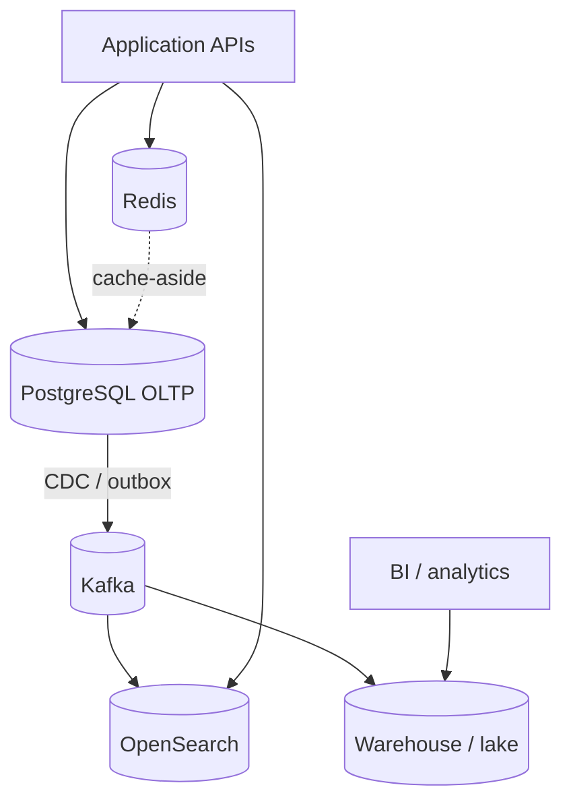

# Overview — Data Platforms

Systems outgrow a single OLTP(Online Transaction Processing) database when reporting, search, fan-out, and hot-path latency compete for the same primary. This guide covers **what to add**, **who owns data**, and **how to keep production safe**.

> **Related:** PostgreSQL tuning → [postgresql-performance](../../postgresql-performance/README.md) · Throughput order → [HTS overview](../../high-throughput-systems/includes/00-overview.md) · Kafka as bus → [apache-kafka](../../apache-kafka/README.md)

---

## At a glance

| Pressure | Symptom on one OLTP DB | Typical next store |
|----------|------------------------|--------------------|
| **Heavy reporting** | Long queries, lock waits, CPU spikes | Warehouse / lake |
| **Full-text / facets** | GIN(Generalized Inverted Index) bloat, slow search | OpenSearch / Elasticsearch |
| **Hot reads** | Same rows hammered | Redis cache |
| **Many consumers** | Dual-writes, lost events | Kafka + CDC(Change Data Capture) / outbox |
| **Session / locks / limits** | DB as lock table | Redis (not a second source of truth) |

**Rule of thumb:** Keep **one system of record** per domain entity. Everything else is a **derived** store with an explicit sync path and freshness promise.

---

## Platform map

| Store | Role | Not for |
|-------|------|---------|
| **PostgreSQL** | Transactions, constraints, source of truth | Ad-hoc BI(Business Intelligence) on hot tables |
| **Warehouse / lake** | Aggregations, history, ML features | Low-latency user-facing writes |
| **Search** | Relevance, facets, fuzzy match | Authoritative inventory counts |
| **Redis** | Cache, session, lock, queue, rate limit | Durable business state without persistence plan |
| **Kafka** | Fan-out, replay, CDC backbone | Primary CRUD store |

---

## Document map

| # | Topic | File |
|---|-------|------|
| 1 | OLTP vs OLAP(Online Analytical Processing) | [01-oltp-vs-olap.md](01-oltp-vs-olap.md) |
| 2 | Search systems | [02-search-systems.md](02-search-systems.md) |
| 3 | Redis and in-memory | [03-redis-and-in-memory.md](03-redis-and-in-memory.md) |
| 4 | Caching end to end | [04-caching-end-to-end.md](04-caching-end-to-end.md) |
| 5 | Ownership, lineage, retention | [05-data-ownership-lineage-retention.md](05-data-ownership-lineage-retention.md) |
| 6 | Migration coordination | [06-migration-coordination.md](06-migration-coordination.md) |
| 7 | Analytics without harming OLTP | [07-analytics-without-harming-oltp.md](07-analytics-without-harming-oltp.md) |
| 8 | Decision guide | [08-decision-guide.md](08-decision-guide.md) |

---

## When to read other guides instead

| Question | Read |
|----------|------|
| How do I tune PostgreSQL indexes/queries? | [postgresql-performance](../../postgresql-performance/README.md) |
| How do I sync search via CDC? | [HTS §15](../../high-throughput-systems/includes/15-cdc-and-search-indexing.md) + [§2](02-search-systems.md) |
| Cache algorithms and stampede control? | [HTS §4](../../high-throughput-systems/includes/04-caching-layers.md) — this guide owns **coherence across CDN(Content Delivery Network)→app→DB** |
| Kafka cluster and schema ops? | [apache-kafka](../../apache-kafka/README.md) |
| Expand/contract DDL steps? | [PG §15](../../postgresql-performance/includes/15-schema-migration-checklist.md) + [§6](06-migration-coordination.md) for org coordination |
| Cost of retention and warehouses? | [finops-and-cost](../../finops-and-cost/README.md) |

---

## Adoption order

1. **Measure** — which queries and tables hurt SLO(Service Level Objective)s ([HTS §1](../../high-throughput-systems/includes/01-measurement-and-slo.md)).
2. **Offload reads** that tolerate staleness — replica, cache, or search ([§3](03-redis-and-in-memory.md), [§4](04-caching-end-to-end.md)).
3. **Stop analytics on primary** — warehouse or replica with guardrails ([§7](07-analytics-without-harming-oltp.md)).
4. **Introduce a bus** when fan-out exceeds dual-write tolerance ([apache-kafka](../../apache-kafka/README.md)).
5. **Name owners and retention** before the third copy of data exists ([§5](05-data-ownership-lineage-retention.md)).

---

## Common mistakes

| Mistake | Fix |
|---------|-----|
| Second "source of truth" in Redis or search | Derive from OLTP; document rebuild path |
| BI tools pointed at primary | Warehouse / replica — [§7](07-analytics-without-harming-oltp.md) |
| Dual-write app → DB + search in one request | CDC or outbox — [HTS §15](../../high-throughput-systems/includes/15-cdc-and-search-indexing.md) |
| Add every store at once | One pressure → one store; revisit [§8](08-decision-guide.md) |